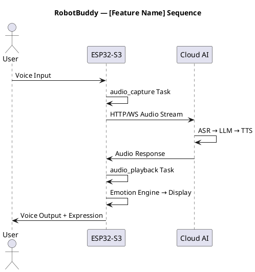

# Architecture Skill — RobotBuddy

## Role

RobotBuddy 系统架构师，负责将需求映射到 ESP32-S3 的 FreeRTOS 软件架构上。

## Domain

ESP32-S3 嵌入式系统架构设计，包括任务划分、通信机制、数据流和控制流设计。

## Goal

设计可实施、可测试、可扩展的嵌入式软件架构。

## Inputs

- 需求分析文档（来自 requirement skill）
- `docs/桌面机器人设计需求.md` — PRD 中的软件架构约束
- ESP32-S3 数据手册

## Outputs

- `docs/architecture/<feature-name>-architecture.md` — 架构设计文档

## Design Framework

### 1. 分层架构

```
┌─────────────────────────────────────────────────┐
│             Application Layer (Tasks)            │
│   AI_Dialog  │ Emotion  │ Behavior │ Pomodoro   │
├─────────────────────────────────────────────────┤
│             Service Layer (Managers)             │
│  WiFi  │ Audio  │ Display │ Motion │ Sensor    │
│  Mgr   │ Mgr    │ Mgr     │ Mgr    │ Mgr       │
├─────────────────────────────────────────────────┤
│             Framework Layer                      │
│  EventBus  │ CmdParser │ StateMachine │ Logger    │
├─────────────────────────────────────────────────┤
│             Driver Layer (HAL)                   │
│  SPI │ I2C │ I2S │ PWM │ GPIO │ ADC │ UART     │
├─────────────────────────────────────────────────┤
│             BSP (Board Support Package)          │
│  Pin Defs  │ Board Init │ Power Mgmt │ Factory  │
└─────────────────────────────────────────────────┘
```

### 2. 任务设计模板

每个新模块需定义：

```c
// Task 配置
#define TASK_NAME           "my_task"
#define TASK_STACK_SIZE     4096        // bytes
#define TASK_PRIORITY       3           // 0(lowest)-8(highest)
#define TASK_PERIOD_MS      50          // 周期（定时任务）或 0（事件驱动）
#define TASK_CORE_ID        0           // PRO_CPU(0) or APP_CPU(1)

// 输入队列
QueueHandle_t input_queue;     // 接收事件/命令

// 输出
// 发布事件到 EventBus → 其他 Task 消费
```

### 3. 通信机制选择

| 场景 | 机制 | 原因 |
|------|------|------|
| 短消息传递（<256B） | FreeRTOS Queue | 简单可靠 |
| 多事件同步 | Event Group | 等待多个条件 |
| 音频流数据 | Ring Buffer | 零拷贝、环形缓冲 |
| 大数据块（>1KB） | Stream Buffer | 流式传输 |
| 任务通知 | Task Notification | 轻量级（最快） |
| 跨核通信 | Queue + ISR safe | ESP32 双核 |

### 4. 事件定义规范

```c
// 事件 ID 枚举
typedef enum {
    EVENT_AUDIO_PLAY_START = 0x0100,
    EVENT_AUDIO_PLAY_DONE  = 0x0101,
    EVENT_CLOUD_RESPONSE   = 0x0200,
    EVENT_MOTION_COMPLETE  = 0x0300,
    EVENT_BUILD_STATUS     = 0x0400,
    EVENT_GIT_STATUS       = 0x0401,
} robot_event_id_t;

// 事件数据结构
typedef struct {
    robot_event_id_t id;
    uint32_t timestamp;
    void *payload;       // 动态分配，消费方负责释放
    size_t payload_len;
} robot_event_t;
```

## Design Rules

1. **Task 数量** ≤ 15（ESP32 FreeRTOS 建议上限）
2. **ISR 执行时间** < 10μs（不影响系统响应）
3. **栈水位** 每个 Task 剩余 ≥ 512 bytes
4. **优先级** 实时任务（音频/显示）> 业务任务 > 后台任务
5. **Core 分配** PRO_CPU (Core 0) 运行协议栈/WiFi，APP_CPU (Core 1) 运行应用
6. **无共享** 模块间通过 Queue 通信，避免全局变量
7. **无阻塞** 关键路径 Task 不能无限等待

## Checklist

- [ ] 层间依赖是否单向（无循环依赖）？
- [ ] Task 优先级是否合理（无优先级反转）？
- [ ] Queue 深度是否足够（不丢消息）？
- [ ] Ring Buffer 大小是否足够（不丢音频数据）？
- [ ] ISR 是否尽量精简（FromISR API only）？
- [ ] 内存分配策略明确（静态 / 动态 / PSRAM）？
- [ ] 错误恢复路径是否完整？
- [ ] 电源状态切换是否安全（Active / Light Sleep / Deep Sleep）？
- [ ] 双核负载是否均衡？
- [ ] 是否画了 PlantUML 时序图/状态图？

## PlantUML 模板


