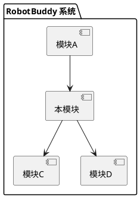
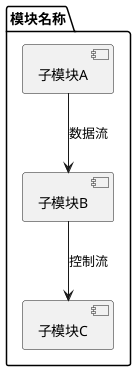
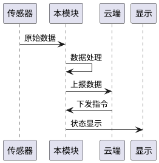
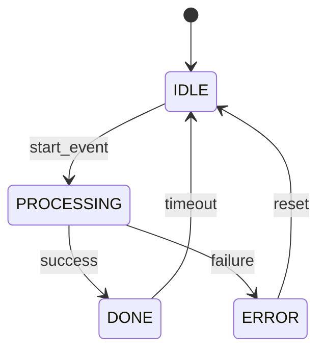

# 架构设计文档模板

> 用途：每个功能模块开发前，使用此模板记录架构设计决策

---

## 1. 概述

| 项目 | 值 |
|------|-----|
| **模块名称** | |
| **版本** | vX.Y.Z |
| **作者** | |
| **日期** | YYYY-MM-DD |
| **状态** | 草案 / 评审中 / 已批准 |

### 1.1 目的

（本模块解决什么问题，满足什么需求）

### 1.2 范围

（本模块覆盖的功能范围，明确不包含的部分）

### 1.3 定义与缩写

| 缩写 | 定义 |
|------|------|
| | |

---

## 2. 系统上下文

### 2.1 模块在系统中的位置



### 2.2 上游依赖

| 依赖模块 | 接口 | 说明 |
|---------|------|------|
| | | |

### 2.3 下游依赖

| 被依赖模块 | 接口 | 说明 |
|-----------|------|------|
| | | |

---

## 3. 架构设计

### 3.1 分层架构

```
┌─────────────────────────────────┐
│         应用层 (App Layer)        │
│   (Task 逻辑 / 业务流程)          │
├─────────────────────────────────┤
│         服务层 (Service Layer)    │
│   (本模块核心服务 / API)          │
├─────────────────────────────────┤
│         驱动层 (Driver Layer)     │
│   (硬件抽象 / 外设驱动)          │
└─────────────────────────────────┘
```

### 3.2 模块内部架构



### 3.3 FreeRTOS 任务设计

| 任务名 | 优先级 | 栈大小 | 运行核心 | 周期 | 职责 |
|--------|--------|--------|---------|------|------|
| | | | | | |

详见 `task-design.md` 模板。

### 3.4 事件总线消息

| 事件 ID | 数据类型 | 发布者 | 订阅者 | 说明 |
|---------|---------|--------|--------|------|
| | | | | |

---

## 4. 数据流

### 4.1 主要数据流



### 4.2 数据结构

```c
// 核心数据结构定义
typedef struct {
    // 主要数据字段
} module_data_t;
```

---

## 5. 状态机设计



| 状态 | 说明 | 入口动作 | 出口动作 |
|------|------|---------|---------|
| IDLE | | | |
| PROCESSING | | | |
| DONE | | | |
| ERROR | | | |

---

## 6. 接口设计

### 6.1 公共 API

```c
/**
 * @brief 模块初始化
 * @param config 配置参数
 * @return ESP_OK / ESP_ERR_*
 */
esp_err_t module_init(const module_config_t *config);

/**
 * @brief 模块去初始化
 */
void module_deinit(void);

/**
 * @brief 获取模块状态
 * @return 当前状态
 */
module_state_t module_get_state(void);
```

### 6.2 回调接口

```c
typedef void (*module_event_cb_t)(module_event_t event, void *data);
esp_err_t module_register_callback(module_event_cb_t cb);
```

---

## 7. 性能预算

| 指标 | 目标值 | 峰值 | 说明 |
|------|--------|------|------|
| CPU 占用率 | < % | % | |
| DRAM 使用 | < KB | KB | |
| PSRAM 使用 | < KB | KB | |
| Flash 使用 | < KB | KB | |
| 响应延迟 | < ms | ms | |

---

## 8. 错误处理

| 错误码 | 说明 | 处理策略 |
|--------|------|---------|
| ESP_ERR_NOT_FOUND | | |
| ESP_ERR_TIMEOUT | | |
| ESP_ERR_NO_MEM | | |

### 降级策略

（当模块出错时的降级行为）

---

## 9. 安全考虑

- **内存安全**: 避免缓冲区溢出，使用安全字符串函数
- **并发安全**: 互斥锁保护共享资源，ISR 使用 FromISR 后缀 API
- **输入验证**: 检查所有外部输入参数
- **资源释放**: 确保所有分配的资源都能正确释放

---

## 10. 测试策略

| 测试级别 | 测试方法 | 覆盖目标 |
|---------|---------|---------|
| L1 单元测试 | Unity + CMock | 所有公共 API |
| L2 HIL 测试 | 真实硬件验证 | 数据流和状态机 |
| L3 集成测试 | 多模块联调 | 事件总线通信 |
| L4 压力测试 | 24h 长时间运行 | 内存泄漏和稳定性 |

---

## 11. 里程碑与交付

| 里程碑 | 预计日期 | 交付物 |
|--------|---------|--------|
| 设计评审完成 | | 本文档 |
| 驱动层开发完成 | | driver 层代码 |
| 服务层开发完成 | | service 层代码 |
| 单元测试通过 | | 测试报告 |
| HIL 测试通过 | | HIL 报告 |
| 集成测试通过 | | 集成报告 |