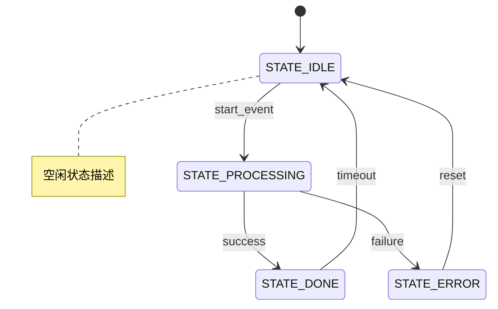
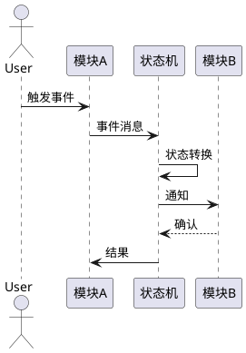

# 状态机设计模板

> 用途：设计模块状态机时，使用此模板记录状态、转换和动作

---

## 基本信息

| 项目 | 值 |
|------|-----|
| **状态机名称** | |
| **所属模块** | |
| **状态数量** | |
| **作者** | |
| **日期** | YYYY-MM-DD |

---

## 状态定义

| 状态 | 描述 | 入口动作 (Entry) | 出口动作 (Exit) | 超时 |
|------|------|-----------------|----------------|------|
| | | | | |

---

## 状态转换表

| 当前状态 | 事件/条件 | 目标状态 | 动作 (Action) | 守卫条件 (Guard) |
|---------|----------|---------|--------------|-----------------|
| | | | | |

---

## Mermaid 状态图



---

## PlantUML 序列图（典型场景）



---

## 事件定义

| 事件 ID | 事件名 | 数据类型 | 数据大小 | 说明 |
|---------|--------|---------|---------|------|
| | | | | |

---

## 数据结构

```c
/**
 * @brief 状态枚举
 */
typedef enum {
    STATE_IDLE = 0,
    STATE_PROCESSING,
    STATE_DONE,
    STATE_ERROR,
} module_state_t;

/**
 * @brief 事件枚举
 */
typedef enum {
    EVENT_START = 0,
    EVENT_SUCCESS,
    EVENT_FAILURE,
    EVENT_TIMEOUT,
    EVENT_RESET,
} module_event_t;

/**
 * @brief 状态机上下文
 */
typedef struct {
    module_state_t current_state;  ///< 当前状态
    TickType_t state_enter_time;   ///< 状态进入时间
    uint32_t error_count;          ///< 错误计数
    // ... 模块特定字段
} module_sm_t;
```

---

## 状态机实现模板

```c
/**
 * @brief 状态机处理函数
 * @param sm 状态机上下文
 * @param event 事件
 * @param data 事件数据
 */
void module_sm_process(module_sm_t *sm, module_event_t event, void *data)
{
    module_state_t next_state = sm->current_state;
    
    switch (sm->current_state) {
        case STATE_IDLE:
            if (event == EVENT_START) {
                // Entry action
                next_state = STATE_PROCESSING;
            }
            break;
            
        case STATE_PROCESSING:
            if (event == EVENT_SUCCESS) {
                next_state = STATE_DONE;
            } else if (event == EVENT_FAILURE) {
                sm->error_count++;
                next_state = STATE_ERROR;
            }
            break;
            
        case STATE_DONE:
            if (event == EVENT_TIMEOUT) {
                next_state = STATE_IDLE;
            }
            break;
            
        case STATE_ERROR:
            if (event == EVENT_RESET) {
                sm->error_count = 0;
                next_state = STATE_IDLE;
            }
            break;
            
        default:
            ESP_LOGE(TAG, "Unknown state: %d", sm->current_state);
            next_state = STATE_IDLE;
            break;
    }
    
    // 状态转换处理
    if (next_state != sm->current_state) {
        // Exit action
        module_on_exit_state(sm, sm->current_state);
        
        // 更新状态
        sm->current_state = next_state;
        sm->state_enter_time = xTaskGetTickCount();
        
        // Entry action
        module_on_enter_state(sm, next_state);
        
        ESP_LOGI(TAG, "State: %d -> %d", sm->current_state, next_state);
    }
}
```

---

## 超时与守护

| 状态 | 超时时间 | 超时后动作 | 守卫条件 |
|------|---------|-----------|---------|
| | ms | | |

---

## 异常处理

| 异常场景 | 处理策略 | 恢复行为 |
|---------|---------|---------|
| 未定义事件 | 忽略 + 日志记录 | 保持当前状态 |
| 未知状态 | 日志错误 + 重置 | 跳转到 IDLE |
| 超时 | 进入 ERROR 状态 | 等待 RESET |
| 连续错误 | 计数器递增 | 超过阈值后降级 |