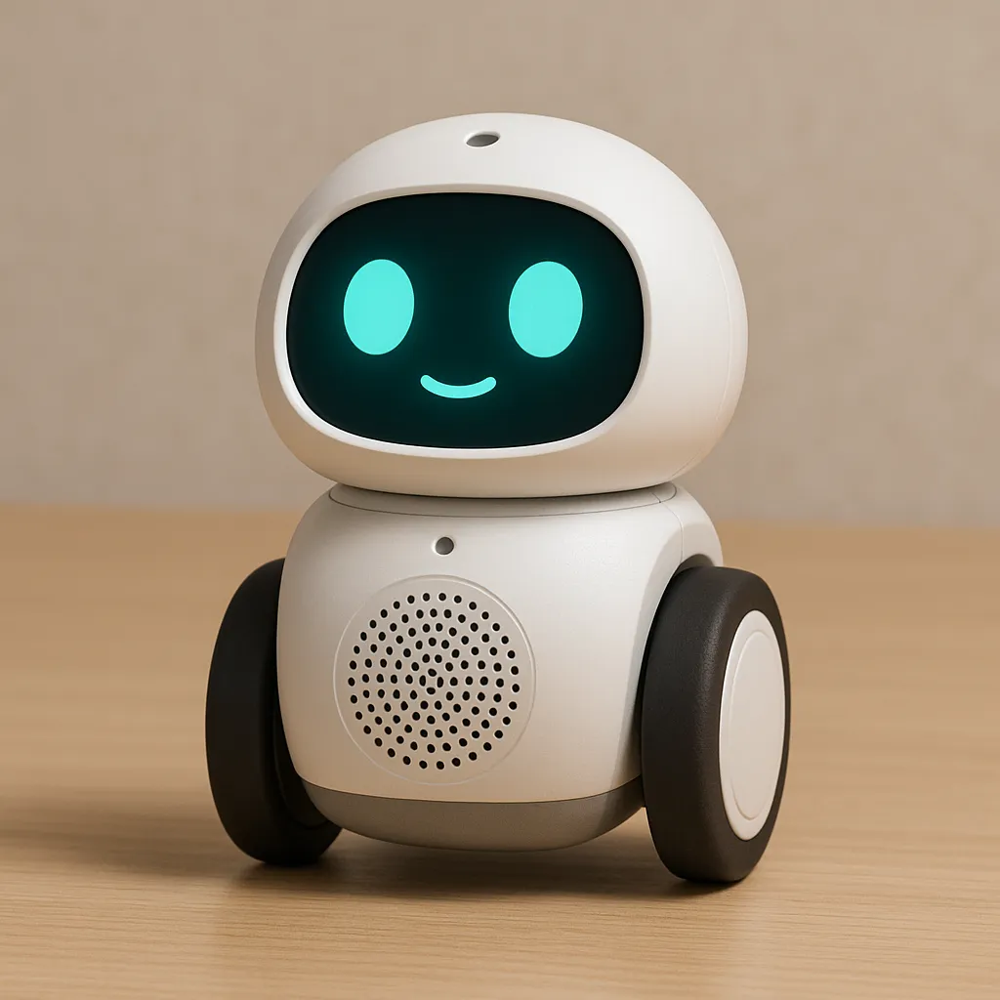

# RobotBuddy 桌面 AI 开发助手机器人

## 外观



## 项目简介

RobotBuddy 是一款基于 ESP32-S3 的桌面 AI 编程助手机器人，融合了表情显示、语音交互、桌面移动和云端 AI 能力。

## 核心功能

### V1.0 MVP

- 🤖 **表情显示** — ST7789 IPS LCD, 240×240, 多种动画表情
- 🎤 **语音交互** — INMP441 麦克风 + MAX98357A 功放, 云端 ASR/LLM/TTS
- 🛞 **桌面移动** — N20 双轮差速 + 红外避障/防跌落
- 🧠 **AI 编程助手** — 对接 Claude/GPT/DeepSeek, 代码理解与 Debug
- 📡 **WiFi 联网** — SmartConfig 配网 + 自动重连
- 🔋 **电池供电** — 18650 锂电池, Type-C 充电

### V2.0 增强版

- 📝 **文本显示** — 滚动消息 + 状态图标（编译结果/Git 状态）
- 🎙️ **本地唤醒词** — ESP-SR 离线唤醒词检测
- 📡 **MQTT 推送** — VS Code 编译结果实时推送
- 🌐 **Web 控制台** — 局域网 HTTP 配置界面
- 📦 **OTA 升级** — 远程固件更新
- ⏰ **番茄钟** — 25 分钟工作计时器
- 🔋 **电源管理** — 自动休眠策略
- 📏 **TOF 测距** — VL53L0X 精确避障
- 👆 **触摸互动** — 单击/双击/长按手势

## 硬件规格

| 模块 | 型号 | 说明 |
|------|------|------|
| MCU | ESP32-S3-WROOM-1-N16R8 | 16MB Flash, 8MB PSRAM |
| 屏幕 | ST7789 IPS 240×240 | SPI 接口 |
| 麦克风 | INMP441 | I2S 数字输出 |
| 功放 | MAX98357A | I2S, 3W D 类 |
| 电机驱动 | DRV8833 | 双路 H 桥 |
| IMU | MPU6050 | 6 轴, I2C |
| 充电 | TP4056 | Type-C, 1A |
| 升压 | MT3608 | 3.7V→5V, 2A |

## 项目结构

```
RobotBuddy/
├── docs/
│   ├── 桌面机器人设计需求.md        — 产品 PRD
│   ├── ESP32_AI_Work_Buddy_PRD_V2.0.md — PRD V2.0
│   ├── requirement/
│   │   └── hardware-schematic.md    — 硬件需求分析
│   ├── architecture/
│   │   └── hardware-architecture.md — 硬件系统架构
│   ├── hardware/
│   │   ├── schematic-notes.md       — 电路原理图说明
│   │   ├── pinout.md                — ESP32-S3 引脚分配表
│   │   ├── bom.md                   — 物料清单 (BOM)
│   │   └── assembly-guide.md        — 组装指南
│   ├── testing/
│   │   └── hardware-design-test-report.md — 设计验证报告
│   └── review/
│       └── hardware-design-review.md — 设计审查报告
├── firmware/
│   ├── main/                        — 主程序
│   ├── components/
│   │   ├── bsp/                     — 板级支持包 (BSP)
│   │   ├── drivers/                 — 硬件驱动
│   │   ├── framework/               — 框架层 (事件总线, 系统监控)
│   │   ├── services/                — 服务层 (WiFi, 音频, 显示, 运动...)
│   │   └── app/                     — 应用层 (AI 对话, 行为系统)
│   └── tests/                       — 测试代码
├── .claude/                         — Claude Code 配置
│   ├── skills/                      — 开发技能定义
│   ├── templates/                   — 文档模板
│   └── standards/                   — 编码规范
├── pictures/                        — 产品图片
└── README.md
```

## 快速开始

### 硬件准备

参考 [组装指南](docs/hardware/assembly-guide.md) 焊接和组装硬件。

### 固件编译

```bash
# 设置 ESP-IDF 环境
. $HOME/esp/v5.1/export.sh  # Linux/macOS

# 编译固件
cd firmware
idf.py build

# 烧录
idf.py -p COMX flash monitor
```

### 引脚分配

参考 [ESP32-S3 引脚分配表](docs/hardware/pinout.md)，所有引脚定义在 `firmware/components/bsp/include/bsp_pinmap.h` 中。

## 文档索引

### 需求与设计

| 文档 | 说明 |
|------|------|
| [产品 PRD](docs/桌面机器人设计需求.md) | 产品需求和功能定义 |
| [V1.0 MVP 需求](docs/requirement/v1.0-mvp-requirements.md) | MVP 功能需求规格 |
| [V2.0 需求分析](docs/requirement/v2-requirement-analysis.md) | 增强版需求分析 |

### 架构设计

| 文档 | 说明 |
|------|------|
| [V1.0 架构](docs/architecture/v1.0-mvp-architecture.md) | MVP 软件架构设计 |
| [V2.0 架构](docs/architecture/v2-enhanced-architecture.md) | 增强版架构设计 |
| [硬件架构](docs/architecture/hardware-architecture.md) | 电源树、信号流、接口设计 |

### 硬件设计

| 文档 | 说明 |
|------|------|
| [原理图说明](docs/hardware/schematic-notes.md) | 各子系统电路详解 |
| [引脚分配表](docs/hardware/pinout.md) | ESP32-S3 完整引脚映射 |
| [物料清单](docs/hardware/bom.md) | BOM 和成本估算 |
| [组装指南](docs/hardware/assembly-guide.md) | 从 PCB 到完整机器人 |

### 测试与审查

| 文档 | 说明 |
|------|------|
| [V1.0 测试计划](docs/testing/v1.0-mvp-test-plan.md) | MVP 测试计划 |
| [V2.0 测试计划](docs/testing/v2-test-plan.md) | 增强版测试计划 |
| [V1.0 代码审查](docs/review/2026-07-11-mvp-code-review.md) | MVP 代码审查报告 |
| [V2.0 代码审查](docs/review/v2-code-review.md) | 增强版代码审查报告 |

## 许可证

MIT License