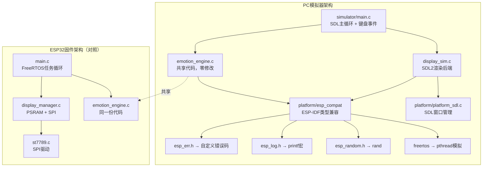
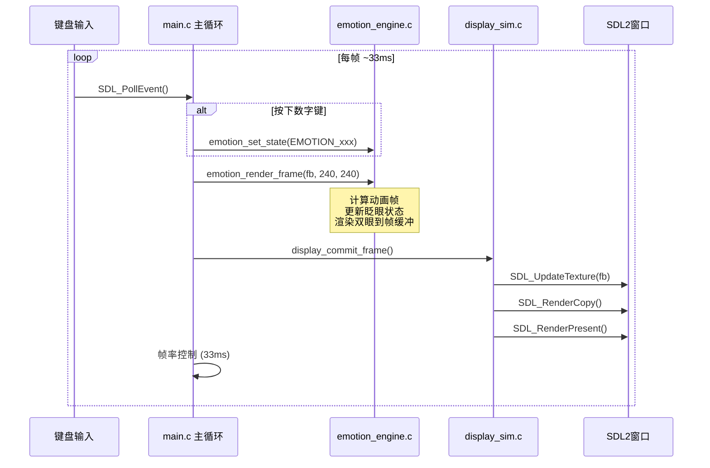
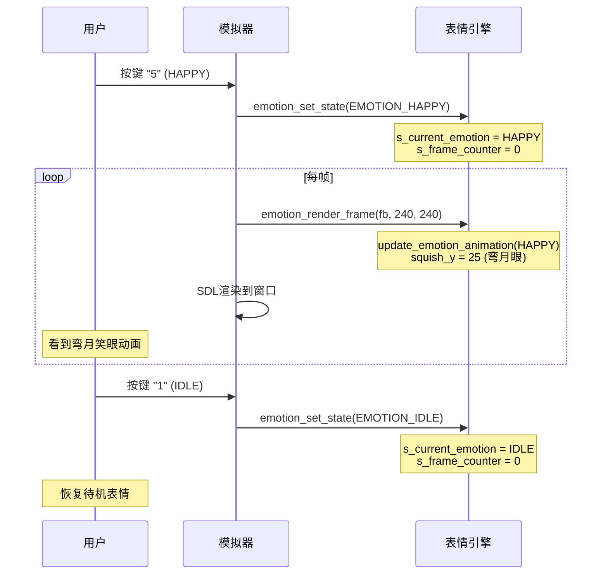

# FR-01 显示系统PC模拟器 — 架构设计

> **版本:** 1.0  
> **日期:** 2026-07-11  
> **基于:** docs/requirement/fr01-pc-simulator-requirements.md  
> **目标:** 在PC上运行RobotBuddy表情引擎，不依赖ESP32硬件  
> **状态:** 架构设计完成  

---

## 目录

1. [设计目标](#1-设计目标)
2. [核心架构决策](#2-核心架构决策)
3. [分层架构](#3-分层架构)
4. [目录结构](#4-目录结构)
5. [ESP-IDF兼容层设计](#5-esp-idf兼容层设计)
6. [SDL2渲染后端设计](#6-sdl2渲染后端设计)
7. [共享代码策略](#7-共享代码策略)
8. [FreeRTOS模拟设计](#8-freertos模拟设计)
9. [交互控制设计](#9-交互控制设计)
10. [数据流与时序](#10-数据流与时序)
11. [构建系统设计](#11-构建系统设计)
12. [内存与性能预算](#12-内存与性能预算)
13. [错误处理与降级](#13-错误处理与降级)
14. [架构检查清单](#14-架构检查清单)

---

## 1. 设计目标

| # | 目标 | 优先级 | 说明 |
|---|------|--------|------|
| G1 | **共享代码零修改** | P0 | `emotion_engine.c/h` 与ESP32版本完全相同 |
| G2 | **三平台编译运行** | P0 | Windows/macOS/Linux均能编译运行 |
| G3 | **30FPS渲染** | P0 | PC上流畅运行表情动画 |
| G4 | **交互控制** | P0 | 键盘切换11种表情，空格触发眨眼 |
| G5 | **独立构建** | P1 | 模拟器有独立CMakeLists.txt，不依赖ESP-IDF |
| G6 | **帧导出** | P2 | 支持保存当前帧为PNG |

---

## 2. 核心架构决策

### 2.1 决策：兼容层 vs 条件编译

**选择：兼容层（Compatibility Layer）**

| 方案 | 优点 | 缺点 |
|------|------|------|
| ❌ `#ifdef SIMULATOR` | 最简单 | 污染共享代码，违反G1目标 |
| ✅ **兼容层头文件** | 共享代码零修改 | 需要编写兼容层，构建稍复杂 |
| ❌ 完整ESP-IDF移植 | 最完整 | 工作量巨大，不符合MVP范围 |

**方案说明：** 创建 `simulator/platform/` 目录，提供与ESP-IDF同名的头文件（`esp_err.h`、`esp_log.h`等），在编译时通过include路径优先级让模拟器代码找到PC版本而非ESP-IDF版本。这样 `emotion_engine.c` 完全不需要任何修改。

### 2.2 决策：显示管理器策略

**选择：双实现（ESP32版 + PC版）**

| 方案 | 优点 | 缺点 |
|------|------|------|
| ❌ 共享display_manager.c | 一份代码 | SPI/PSRAM依赖太深，条件编译不可避免 |
| ✅ **接口相同，实现不同** | 各平台最优 | 两份代码需维护接口一致 |
| ❌ 完全重写显示管线 | 不依赖现有代码 | 丢失帧缓冲逻辑 |

**方案说明：** `display_manager.h` 接口文件共享，但 `display_manager.c` 有两个实现：
- ESP32版：PSRAM分配 + SPI输出（现有代码）
- PC版（`simulator/drivers/display_sim.c`）：`malloc()`分配 + SDL2窗口渲染

### 2.3 决策：表情引擎渲染路径

**选择：共享渲染逻辑 + 不同输出后端**

```
emotion_engine.c (共享，零修改)
       │
       ▼
emotion_render_frame(fb, w, h)  ← 写入帧缓冲（RGB565）
       │
       ├── ESP32: display_commit_frame() → st7789_draw_bitmap() → SPI → LCD
       │
       └── PC:    display_commit_frame() → SDL_UpdateTexture() → SDL_RenderCopy() → 窗口
```

核心渲染逻辑完全在 `emotion_engine.c` 中，它只操作一个 `uint16_t` 帧缓冲数组，不涉及任何硬件调用。两平台的差异仅在帧缓冲如何呈现到"屏幕"上。

---

## 3. 分层架构



### 3.1 依赖关系（PC模拟器）

```
simulator/main.c
    ├── display_sim.c          (显示管理器PC实现)
    │   └── SDL2               (外部依赖)
    ├── emotion_engine.c       (共享，零修改)
    │   └── emotion_engine.h   (共享)
    │       └── robot_events.h (共享)
    ├── display_manager.h      (共享接口)
    └── platform/
        ├── esp_err.h          (ESP-IDF错误码兼容)
        ├── esp_log.h          (ESP_LOG宏兼容)
        ├── esp_random.h       (随机数兼容)
        ├── esp_heap_caps.h    (内存分配兼容)
        ├── esp_timer.h        (定时器兼容)
        ├── freertos/FreeRTOS.h (任务模拟)
        ├── freertos/task.h    (延时模拟)
        └── math_compat.h      (数学函数兼容)
```

---

## 4. 目录结构

```
simulator/                                 # ← 新增：PC模拟器根目录
├── CMakeLists.txt                        # 模拟器顶层构建脚本
├── README.md                              # 编译和使用说明
│
├── main.c                                # 模拟器入口：SDL主循环 + 键盘事件
│
├── platform/                              # ESP-IDF兼容层
│   ├── esp_err.h                         # esp_err_t + ESP_OK/ESP_FAIL等
│   ├── esp_log.h                         # ESP_LOGI/W/E/D宏 → printf
│   ├── esp_random.h                      # esp_random() → rand()
│   ├── esp_heap_caps.h                   # heap_caps_malloc → malloc
│   ├── esp_timer.h                        # esp_timer_get_time → clock_gettime
│   ├── freertos/
│   │   ├── FreeRTOS.h                    # 空头文件
│   │   └── task.h                        # vTaskDelay → SDL_Delay
│   └── math_compat.h                     # sin/cos兼容（MSVC）
│
├── drivers/                              # PC版驱动实现
│   └── display_sim.c                     # 显示管理器PC实现
│
├── shared/                               # 与ESP32共享的源文件
│   └── (CMakeLists引用 ../../firmware/ 下的源文件)
│
└── assets/                               # 资源
    └── icon.bmp                          # 窗口图标（可选）
```

**关键设计原则：**

1. `shared/` 目录不复制源文件，而是通过CMakeLists.txt中的路径引用 `../../firmware/components/` 下的实际源文件
2. `emotion_engine.c` 和 `emotion_engine.h` 在ESP32和PC上编译同一份文件
3. `platform/` 目录提供与ESP-IDF同名的头文件，编译时include路径优先级确保PC版被优先找到

---

## 5. ESP-IDF兼容层设计

### 5.1 esp_err.h — 错误码兼容

```c
// simulator/platform/esp_err.h
#pragma once
#include <stdint.h>

typedef int32_t esp_err_t;

#define ESP_OK          0
#define ESP_FAIL        (-1)
#define ESP_ERR_INVALID_ARG  0x100
#define ESP_ERR_INVALID_STATE 0x101
#define ESP_ERR_NO_MEM   0x102
#define ESP_ERR_NOT_FOUND 0x103
#define ESP_ERR_TIMEOUT  0x104

static inline const char *esp_err_to_name(esp_err_t err) {
    switch (err) {
        case ESP_OK:              return "OK";
        case ESP_FAIL:            return "FAIL";
        case ESP_ERR_INVALID_ARG: return "INVALID_ARG";
        case ESP_ERR_INVALID_STATE: return "INVALID_STATE";
        case ESP_ERR_NO_MEM:      return "NO_MEM";
        case ESP_ERR_NOT_FOUND:   return "NOT_FOUND";
        case ESP_ERR_TIMEOUT:     return "TIMEOUT";
        default:                  return "UNKNOWN";
    }
}
```

### 5.2 esp_log.h — 日志兼容

```c
// simulator/platform/esp_log.h
#pragma once
#include <stdio.h>

#define ESP_LOGE(tag, fmt, ...) fprintf(stderr, "E [%s] " fmt "\n", tag, ##__VA_ARGS__)
#define ESP_LOGW(tag, fmt, ...) fprintf(stderr, "W [%s] " fmt "\n", tag, ##__VA_ARGS__)
#define ESP_LOGI(tag, fmt, ...) fprintf(stdout, "I [%s] " fmt "\n", tag, ##__VA_ARGS__)
#define ESP_LOGD(tag, fmt, ...) fprintf(stdout, "D [%s] " fmt "\n", tag, ##__VA_ARGS__)
#define ESP_LOGV(tag, fmt, ...) /* verbose: disabled */
```

### 5.3 esp_random.h — 随机数兼容

```c
// simulator/platform/esp_random.h
#pragma once
#include <stdlib.h>
#include <time.h>

static inline uint32_t esp_random(void) {
    return (uint32_t)rand();
}

// 初始化随机种子
static inline void esp_random_seed(void) {
    srand((unsigned int)time(NULL));
}
```

### 5.4 esp_heap_caps.h — 内存分配兼容

```c
// simulator/platform/esp_heap_caps.h
#pragma once
#include <stdlib.h>

#define MALLOC_CAP_SPIRAM  0x01
#define MALLOC_CAP_DMA     0x02
#define MALLOC_CAP_INTERNAL 0x04

static inline void *heap_caps_malloc(size_t size, uint32_t caps) {
    (void)caps;  // PC上忽略内存类型标志
    return malloc(size);
}

static inline void heap_caps_free(void *ptr) {
    free(ptr);
}

static inline size_t heap_caps_get_free_size(uint32_t caps) {
    (void)caps;
    return 1024 * 1024 * 100;  // 模拟100MB可用
}
```

### 5.5 esp_timer.h — 定时器兼容

```c
// simulator/platform/esp_timer.h
#pragma once
#include <stdint.h>

// 返回微秒级时间戳
static inline int64_t esp_timer_get_time(void) {
    struct timespec ts;
    clock_gettime(CLOCK_MONOTONIC, &ts);
    return (int64_t)(ts.tv_sec * 1000000LL + ts.tv_nsec / 1000LL);
}
```

### 5.6 freertos/task.h — 任务模拟

```c
// simulator/platform/freertos/task.h
#pragma once
#include <stdint.h>

// FreeRTOS延时模拟
static inline void vTaskDelay(uint32_t ticks) {
    // 假设 tick = 1ms, 简化模拟
    uint32_t ms = ticks;  // pdMS_TO_TICKS在PC上直接用ms值
    SDL_Delay(ms);        // 需要SDL2头文件
}

static inline uint32_t pdMS_TO_TICKS(uint32_t ms) {
    return ms;  // PC上1 tick = 1ms
}

// 任务相关（模拟器不需要真实多任务）
typedef void *TaskHandle_t;
typedef int32_t BaseType_t;
#define pdTRUE 1
#define pdFALSE 0

static inline BaseType_t xTaskCreatePinnedToCore(
    void (*task_func)(void *), const char *name, uint32_t stack_depth,
    void *params, uint32_t priority, TaskHandle_t *handle, int core_id) {
    (void)task_func; (void)name; (void)stack_depth;
    (void)params; (void)priority; (void)handle; (void)core_id;
    return pdTRUE;  // 模拟器中由main loop驱动，不需要真实任务
}
```

### 5.7 freertos/FreeRTOS.h — 空头文件

```c
// simulator/platform/freertos/FreeRTOS.h
#pragma once
// 空文件 — 模拟器不需要FreeRTOS内核定义
```

### 5.8 bsp_pinmap.h — 引脚兼容

模拟器中不需要真实引脚定义，但 `display_manager.c` (ESP32版) 引用了它。PC版 `display_sim.c` 不引用 `bsp_pinmap.h`，所以需要提供一个简化版本：

```c
// simulator/platform/bsp_pinmap.h
#pragma once
// PC模拟器不需要真实引脚定义
// 提供空定义以兼容编译
```

---

## 6. SDL2渲染后端设计

### 6.1 display_sim.c — 显示管理器PC实现

```c
// simulator/drivers/display_sim.c — SDL2渲染后端

#include "display_manager.h"
#include <SDL2/SDL.h>
#include <stdlib.h>
#include <string.h>
#include <stdio.h>

static const char *TAG = "display_sim";

static uint16_t *s_frame_buffer = NULL;
static bool s_initialized = false;
static uint16_t s_width = DISPLAY_WIDTH;
static uint16_t s_height = DISPLAY_HEIGHT;
static float s_fps = 0.0f;
static uint32_t s_frame_count = 0;
static uint32_t s_fps_timestamp = 0;

// SDL2资源
static SDL_Window *s_window = NULL;
static SDL_Renderer *s_renderer = NULL;
static SDL_Texture *s_texture = NULL;
static int s_scale = 2;  // 窗口缩放倍率

// RGB565 → RGB888转换查找表（加速渲染）
static uint8_t s_r_table[65536];
static uint8_t s_g_table[65536];
static uint8_t s_b_table[65536];

static void init_rgb565_lut(void) {
    for (uint32_t i = 0; i < 65536; i++) {
        uint16_t c = (uint16_t)i;
        s_r_table[i] = ((c >> 11) & 0x1F) * 255 / 31;
        s_g_table[i] = ((c >> 5) & 0x3F) * 255 / 63;
        s_b_table[i] = (c & 0x1F) * 255 / 31;
    }
}

esp_err_t display_manager_init(const display_config_t *config) {
    if (s_initialized) return ESP_OK;
    
    if (config) {
        s_width = config->width;
        s_height = config->height;
    }
    
    // 分配帧缓冲（PC上用普通malloc）
    size_t fb_size = (size_t)s_width * s_height * DISPLAY_BPP;
    s_frame_buffer = (uint16_t *)malloc(fb_size);
    if (!s_frame_buffer) return ESP_ERR_NO_MEM;
    memset(s_frame_buffer, 0, fb_size);
    
    // 初始化SDL2
    if (SDL_Init(SDL_INIT_VIDEO) < 0) {
        ESP_LOGE(TAG, "SDL_Init failed: %s", SDL_GetError());
        free(s_frame_buffer);
        return ESP_FAIL;
    }
    
    // 创建窗口（可缩放）
    char title[64];
    snprintf(title, sizeof(title), "RobotBuddy Emotion Simulator - IDLE");
    s_window = SDL_CreateWindow(
        title,
        SDL_WINDOWPOS_CENTERED, SDL_WINDOWPOS_CENTERED,
        s_width * s_scale, s_height * s_scale,
        SDL_WINDOW_SHOWN | SDL_WINDOW_RESIZABLE
    );
    if (!s_window) {
        ESP_LOGE(TAG, "SDL_CreateWindow failed: %s", SDL_GetError());
        free(s_frame_buffer);
        SDL_Quit();
        return ESP_FAIL;
    }
    
    s_renderer = SDL_CreateRenderer(s_window, -1, SDL_RENDERER_ACCELERATED);
    if (!s_renderer) {
        ESP_LOGE(TAG, "SDL_CreateRenderer failed: %s", SDL_GetError());
        SDL_DestroyWindow(s_window);
        free(s_frame_buffer);
        SDL_Quit();
        return ESP_FAIL;
    }
    
    s_texture = SDL_CreateTexture(s_renderer, SDL_PIXELFORMAT_RGB565,
                                   SDL_TEXTUREACCESS_STREAMING,
                                   s_width, s_height);
    if (!s_texture) {
        ESP_LOGE(TAG, "SDL_CreateTexture failed: %s", SDL_GetError());
        SDL_DestroyRenderer(s_renderer);
        SDL_DestroyWindow(s_window);
        free(s_frame_buffer);
        SDL_Quit();
        return ESP_FAIL;
    }
    
    init_rgb565_lut();
    s_fps_timestamp = SDL_GetTicks();
    s_initialized = true;
    
    ESP_LOGI(TAG, "Display simulator initialized (%dx%d, scale=%dx)",
             s_width, s_height, s_scale);
    return ESP_OK;
}

esp_err_t display_manager_deinit(void) { ... }
uint16_t *display_get_framebuffer(void) { ... }

esp_err_t display_commit_frame(void) {
    if (!s_initialized || !s_frame_buffer) return ESP_ERR_INVALID_STATE;
    
    // 更新SDL纹理
    SDL_UpdateTexture(s_texture, NULL, s_frame_buffer, s_width * 2);
    
    // 渲染到窗口
    SDL_RenderClear(s_renderer);
    SDL_RenderCopy(s_renderer, s_texture, NULL, NULL);
    SDL_RenderPresent(s_renderer);
    
    // FPS计算
    s_frame_count++;
    uint32_t now = SDL_GetTicks();
    uint32_t elapsed = now - s_fps_timestamp;
    if (elapsed >= 1000) {
        s_fps = (float)s_frame_count / ((float)elapsed / 1000.0f);
        s_frame_count = 0;
        s_fps_timestamp = now;
    }
    
    return ESP_OK;
}

// 绘图原语（与ESP32版实现相同，操作帧缓冲）
esp_err_t display_clear(uint16_t bg_color) { ... }
void display_draw_pixel(uint16_t x, uint16_t y, uint16_t color) { ... }
void display_draw_filled_circle(...) { ... }
void display_draw_filled_ellipse(...) { ... }
float display_get_fps(void) { ... }
esp_err_t display_set_backlight(uint8_t brightness) { ... }
```

### 6.2 主循环设计

```c
// simulator/main.c — 模拟器入口

#include <SDL2/SDL.h>
#include <stdio.h>
#include <stdlib.h>

#include "display_manager.h"
#include "emotion_engine.h"
#include "robot_events.h"

// 兼容层初始化
#include "esp_log.h"
#include "esp_random.h"

static const char *TAG = "simulator";

// 按键映射表
typedef struct {
    SDL_Keycode key;
    emotion_id_t emotion;
    const char *name;
} key_mapping_t;

static const key_mapping_t s_key_map[] = {
    { SDLK_1, EMOTION_IDLE,       "IDLE" },
    { SDLK_2, EMOTION_LISTENING,  "LISTENING" },
    { SDLK_3, EMOTION_THINKING,   "THINKING" },
    { SDLK_4, EMOTION_ANSWERING,  "ANSWERING" },
    { SDLK_5, EMOTION_HAPPY,      "HAPPY" },
    { SDLK_6, EMOTION_CONFUSED,   "CONFUSED" },
    { SDLK_7, EMOTION_WARNING,    "WARNING" },
    { SDLK_8, EMOTION_ERROR,      "ERROR" },
    { SDLK_9, EMOTION_FOCUS,      "FOCUS" },
    { SDLK_0, EMOTION_SLEEP,      "SLEEP" },
    { SDLK_q, EMOTION_EXCITED,    "EXCITED" },
};

static void update_window_title(emotion_id_t emotion, float fps) {
    char title[128];
    snprintf(title, sizeof(title), 
             "RobotBuddy Emotion Simulator | %s | FPS: %.1f | "
             "Keys: 1-0/Q switch emotion, Space=blink, +/-=scale, S=screenshot, ESC=quit",
             emotion_get_name(emotion), fps);
    SDL_SetWindowTitle(s_window, title);
}

int main(int argc, char *argv[]) {
    esp_random_seed();  // 初始化随机种子
    
    // 初始化显示管理器（SDL2窗口）
    display_config_t cfg = { .width = 240, .height = 240, .target_fps = 30 };
    if (display_manager_init(&cfg) != ESP_OK) {
        fprintf(stderr, "Failed to initialize display\n");
        return 1;
    }
    
    // 初始化表情引擎
    emotion_engine_config_t em_cfg = {
        .display_width = 240, .display_height = 240,
        .left_eye_cx = 80, .left_eye_cy = 120,
        .right_eye_cx = 160, .right_eye_cy = 120,
        .eye_radius = 35,
    };
    emotion_engine_init(&em_cfg);
    emotion_set_state(EMOTION_IDLE);
    
    // 主循环
    bool running = true;
    uint32_t last_frame_time = SDL_GetTicks();
    const uint32_t frame_interval = 1000 / DISPLAY_TARGET_FPS;  // ~33ms
    
    while (running) {
        // 处理SDL事件
        SDL_Event event;
        while (SDL_PollEvent(&event)) {
            if (event.type == SDL_QUIT) {
                running = false;
            }
            else if (event.type == SDL_KEYDOWN) {
                switch (event.key.keysym.sym) {
                    case SDLK_ESCAPE:
                        running = false;
                        break;
                    case SDLK_SPACE:
                        // 触发眨眼（通过模拟眨眼计时器）
                        // 注意：当前API不支持手动触发眨眼
                        break;
                    case SDLK_s:
                        // 截图（V2功能）
                        break;
                    case SDLK_PLUS:
                    case SDLK_EQUALS:
                        // 放大窗口（V2功能）
                        break;
                    case SDLK_MINUS:
                        // 缩小窗口（V2功能）
                        break;
                    default:
                        // 检查表情映射
                        for (size_t i = 0; i < sizeof(s_key_map)/sizeof(s_key_map[0]); i++) {
                            if (event.key.keysym.sym == s_key_map[i].key) {
                                emotion_set_state(s_key_map[i].emotion);
                                ESP_LOGI(TAG, "Switched to: %s", s_key_map[i].name);
                                break;
                            }
                        }
                        break;
                }
            }
        }
        
        // 帧率控制
        uint32_t now = SDL_GetTicks();
        if (now - last_frame_time >= frame_interval) {
            // 渲染表情帧
            uint16_t *fb = display_get_framebuffer();
            if (fb) {
                emotion_render_frame(fb, DISPLAY_WIDTH, DISPLAY_HEIGHT);
                display_commit_frame();
            }
            
            // 更新窗口标题
            update_window_title(emotion_get_state(), display_get_fps());
            last_frame_time = now;
        }
        
        SDL_Delay(1);  // 避免CPU 100%
    }
    
    // 清理
    emotion_engine_deinit();
    display_manager_deinit();
    SDL_Quit();
    
    return 0;
}
```

---

## 7. 共享代码策略

### 7.1 零修改共享文件

以下文件在PC和ESP32上编译**完全相同**的源代码：

| 文件 | 路径 | 说明 |
|------|------|------|
| emotion_engine.c | `firmware/components/services/emotion_engine/` | 表情渲染核心逻辑 |
| emotion_engine.h | `firmware/components/services/emotion_engine/include/` | 表情引擎接口 |
| robot_events.h | `firmware/components/framework/include/` | 事件ID和数据结构定义 |

### 7.2 接口共享、实现不同的文件

| 接口头文件 | ESP32实现 | PC实现 | 说明 |
|-----------|----------|--------|------|
| display_manager.h | `display_manager.c` (PSRAM+SPI) | `display_sim.c` (malloc+SDL2) | 帧缓冲分配和呈现方式不同 |

### 7.3 仅ESP32需要的文件

这些文件在PC模拟器中**不需要编译**：

- `st7789.c/h` — SPI LCD驱动
- `bsp_board.c/h` — 硬件初始化
- `bsp_pinmap.h` — 引脚定义
- `wifi_manager.c/h` — WiFi管理
- `audio_manager.c/h` — 音频管理
- `cloud_manager.c/h` — 云端通信
- `motion_manager.c/h` — 电机控制
- `sensor_manager.c/h` — 传感器管理
- `behavior_system.c/h` — 行为系统
- `ai_dialog.c/h` — AI对话
- 所有驱动（drv8833, mpu6050, inmp441, max98357a, ir_sensor, battery）

---

## 8. FreeRTOS模拟设计

### 8.1 模拟策略

模拟器采用**单线程主循环**设计，不需要真正的多任务：

| FreeRTOS概念 | PC模拟器实现 | 说明 |
|-------------|-------------|------|
| `xTaskCreatePinnedToCore()` | 空函数（返回pdTRUE） | 主循环驱动所有逻辑 |
| `vTaskDelay(ms)` | `SDL_Delay(ms)` | 平台延时 |
| `pdMS_TO_TICKS(ms)` | 直接返回ms值 | PC上1tick=1ms |
| `esp_timer_get_time()` | `clock_gettime(CLOCK_MONOTONIC)` | 微秒级时间戳 |
| `esp_random()` | `rand()` | 伪随机数 |
| `ESP_LOGI/W/E/D` | `printf` | 标准输出 |
| `heap_caps_malloc(SPIRAM)` | `malloc()` | 标准堆分配 |
| `TaskHandle_t` | `void*` | 不使用 |
| `xPortGetCoreID()` | 返回0 | 不区分核心 |

### 8.2 为什么不需要真实多任务

在模拟器中，主循环的执行流程是：

```
while (running) {
    处理键盘事件 →   (替代 behavior_task)
    emotion_render_frame() →  (替代 emotion_task)
    display_commit_frame() →  (替代 display_task)
    帧率控制等待 →    (替代 vTaskDelay)
}
```

这三个步骤在ESP32上由三个不同任务并发执行，但在PC上单线程顺序执行即可实现相同效果——因为帧率控制已经保证了30FPS的时序。

---

## 9. 交互控制设计

### 9.1 键盘映射

| 按键 | 功能 | 实现方式 |
|------|------|---------|
| `1` - `0` | 切换11种表情 | `emotion_set_state()` |
| `Q` | EXCITED表情 | `emotion_set_state(EMOTION_EXCITED)` |
| `Space` | 手动触发眨眼 | 设置 `s_blink_timer`（需新增接口或模拟） |
| `+` / `=` | 放大窗口 | 修改 `s_scale` + 重建窗口 |
| `-` | 缩小窗口 | 修改 `s_scale` + 重建窗口 |
| `S` | 截图保存PNG | `SDL_SaveBMP()` |
| `ESC` | 退出模拟器 | 设置 `running = false` |
| `H` | 显示帮助信息 | printf到控制台 |

### 9.2 窗口标题栏信息

```
RobotBuddy Emotion Simulator | IDLE | FPS: 30.0 | Keys: 1-0/Q switch, Space=blink, +/-=scale, ESC=quit
```

动态更新当前表情名称和FPS数值。

---

## 10. 数据流与时序

### 10.1 PC模拟器数据流



### 10.2 表情切换时序



---

## 11. 构建系统设计

### 11.1 CMakeLists.txt

```cmake
# simulator/CMakeLists.txt
cmake_minimum_required(VERSION 3.16)
project(robotbuddy_simulator C)

# C标准
set(CMAKE_C_STANDARD 99)
set(CMAKE_C_STANDARD_REQUIRED ON)

# 编译警告
add_compile_options(-Wall -Wextra -Wshadow -Wformat=2)

# 查找SDL2
find_package(SDL2 REQUIRED)

# 平台兼容层include路径（优先于ESP-IDF）
set(PLATFORM_DIR ${CMAKE_CURRENT_SOURCE_DIR}/platform)

# 共享代码路径
set(FIRMWARE_DIR ${CMAKE_CURRENT_SOURCE_DIR}/../firmware)

# 源文件
set(SOURCES
    # 模拟器入口
    ${CMAKE_CURRENT_SOURCE_DIR}/main.c
    
    # 显示管理器PC实现
    ${CMAKE_CURRENT_SOURCE_DIR}/drivers/display_sim.c
    
    # 共享代码：表情引擎（零修改编译）
    ${FIRMWARE_DIR}/components/services/emotion_engine/emotion_engine.c
    
    # 兼容层实现
    ${CMAKE_CURRENT_SOURCE_DIR}/platform/esp_timer.c
)

# 可执行文件
add_executable(robotbuddy_sim ${SOURCES})

# Include路径：
# 1. platform/ 优先（覆盖ESP-IDF同名头文件）
# 2. 共享头文件
# 3. SDL2
target_include_directories(robotbuddy_sim PRIVATE
    # 兼容层（最高优先级）
    ${PLATFORM_DIR}
    
    # 共享接口头文件
    ${FIRMWARE_DIR}/components/services/emotion_engine/include
    ${FIRMWARE_DIR}/components/services/display_manager/include
    ${FIRMWARE_DIR}/components/framework/include
    
    # SDL2
    ${SDL2_INCLUDE_DIRS}
)

# 链接库
target_link_libraries(robotbuddy_sim PRIVATE
    ${SDL2_LIBRARIES}
    m  # 数学库（sin/cos）
)

# Windows特殊处理
if(WIN32)
    target_link_libraries(robotbuddy_sim PRIVATE
        mingw32  # MinGW入口点
    )
endif()

# macOS框架
if(APPLE)
    find_library(COREVIDEO CoreVideo)
    target_link_libraries(robotbuddy_sim PRIVATE ${COREVIDEO})
endif()
```

### 11.2 构建命令

```bash
# Linux/macOS
cd simulator
mkdir build && cd build
cmake ..
make -j$(nproc)
./robotbuddy_sim

# Windows (MSVC + vcpkg)
cd simulator
mkdir build && cd build
cmake .. -DCMAKE_TOOLCHAIN_FILE=%VCPKG_ROOT%/scripts/buildsystems/vcpkg.cmake
cmake --build . --config Release
Release\robotbuddy_sim.exe
```

---

## 12. 内存与性能预算

### 12.1 PC模拟器内存使用

| 用途 | 大小 | 说明 |
|------|------|------|
| 帧缓冲 | 115 KB | 240×240×2字节，与ESP32相同 |
| SDL2纹理 | 115 KB | SDL2内部纹理缓冲 |
| SDL2窗口 | ~1 MB | 窗口渲染缓冲 |
| 表情引擎 | ~2 KB | 静态变量 |
| **总计** | **~1.2 MB** | 远小于PC可用内存 |

### 12.2 性能预算

| 指标 | ESP32目标 | PC预期 | 说明 |
|------|----------|--------|------|
| FPS | ≥30 | ≥60 | PC性能远超ESP32 |
| 帧渲染时间 | <15ms | <2ms | GHz级CPU |
| 表情切换延迟 | <50ms | <16ms | 单线程即时响应 |
| 内存占用 | ~120 KB | ~1.2 MB | PC充裕 |

---

## 13. 错误处理与降级

| 异常 | 处理策略 |
|------|---------|
| SDL2初始化失败 | `fprintf(stderr, ...)` + `exit(1)` |
| 帧缓冲分配失败 | `fprintf(stderr, ...)` + `exit(1)` |
| 窗口创建失败 | `fprintf(stderr, ...)` + `exit(1)` |
| 表情ID越界 | `emotion_set_state()`返回 `ESP_ERR_INVALID_ARG`，忽略按键 |
| PNG保存失败 | 控制台打印警告，继续运行 |
| 未知按键 | 忽略，不做任何操作 |

---

## 14. 架构检查清单

### Requirement Skill Checklist

- [x] **层间依赖单向** — 模拟器 → 兼容层 → 共享代码，无循环依赖
- [x] **共享代码零修改** — `emotion_engine.c` 与ESP32版本完全相同
- [x] **三平台编译** — CMake + SDL2，Windows/macOS/Linux均支持
- [x] **接口一致性** — `display_manager.h` 签名在两平台保持一致
- [x] **帧缓冲大小一致** — 240×240×2 = 115,200字节
- [x] **FPS监控** — 窗口标题实时显示
- [x] **错误处理完整** — SDL初始化、帧缓冲、窗口创建均有错误处理
- [x] **不需要硬件** — 无ESP32、无SPI、无PSRAM即可运行
- [x] **构建独立** — 独立CMakeLists.txt，不依赖ESP-IDF
- [x] **交互控制** — 键盘映射覆盖所有11种表情

### Architecture Skill Checklist

- [x] **FreeRTOS任务模拟合理** — 单线程主循环替代3个并发任务
- [x] **Queue模拟简化** — 直接函数调用替代消息队列
- [x] **ISR模拟** — 不需要，键盘事件由SDL事件循环处理
- [x] **内存分配策略** — PC用标准malloc，不需要PSRAM标志
- [x] **双核负载** — 不适用，PC单线程即可
- [x] **电源模式** — 不适用，PC始终全功耗运行
- [x] **时序图** — 已绘制表情渲染和切换时序图

---

> **文档版本:** 1.0  
> **下次审查:** 编码实现完成后更新接口契约  
> **相关文档:**
> - `docs/requirement/fr01-pc-simulator-requirements.md` (需求规格)
> - `docs/requirement/v1.0-mvp-requirements.md` (FR-01显示系统)
> - `docs/architecture/v1.0-mvp-architecture.md` (系统架构)
> - `firmware/components/services/emotion_engine/` (现有表情引擎)