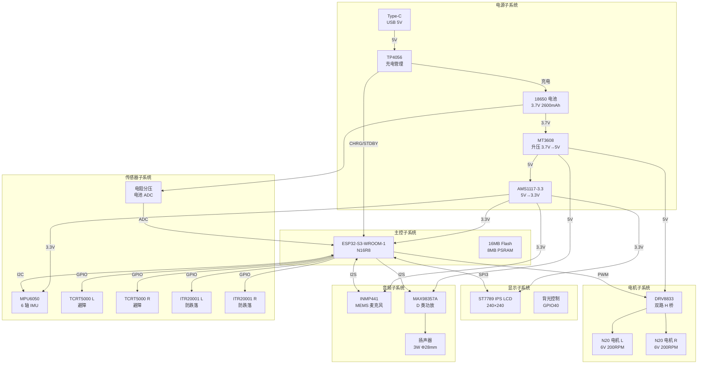
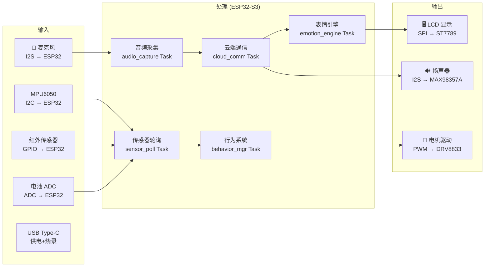
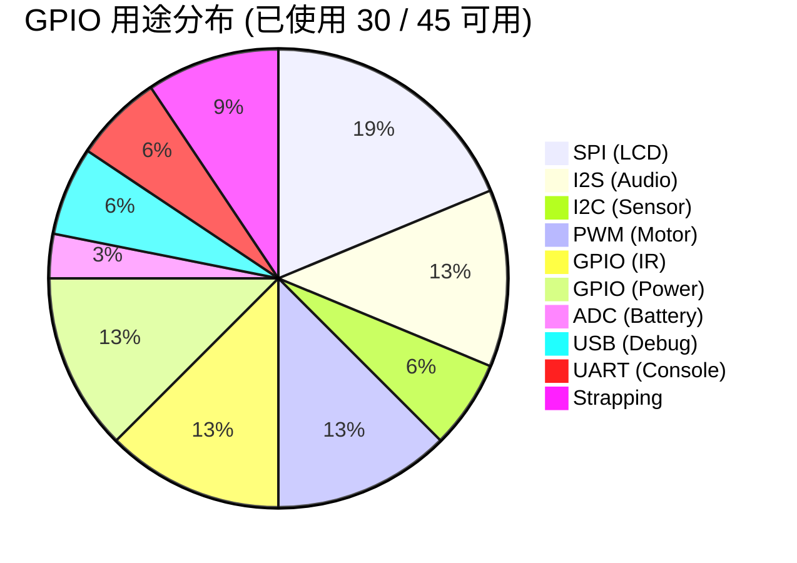
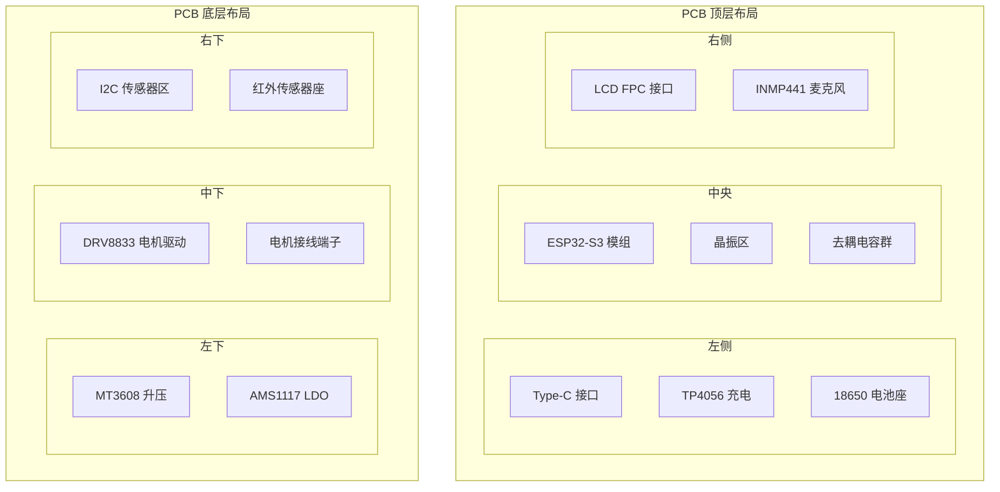

# 硬件系统架构设计 — RobotBuddy V1.0

> 硬件系统整体架构：电源树、信号流、模块间连接、ESP32-S3 引脚复用策略。

**版本:** 1.0.0
**最后更新:** 2026-07-18
**适用范围:** RobotBuddy V1.0 (MVP)

---

## 1. 系统架构总览

### 1.1 硬件系统框图



### 1.2 数据流架构



---

## 2. 电源架构

### 2.1 电源树详细设计

```mermaid
graph TD
    USB5V["Type-C USB<br/>5V / 1A"]
    BAT["18650 锂电池<br/>3.7V / 2600mAh"]

    USB5V -->|"VBUS"| TP4056["TP4056<br/>充电 IC"]
    TP4056 -->|"CHRG ← GPIO18"| ESP32_CHRG["ESP32-S3<br/>充电状态检测"]
    TP4056 -->|"STDBY ← GPIO21"| ESP32_STDBY["ESP32-S3<br/>充满状态检测"]
    TP4056 -->|"VBAT"| BAT

    BAT -->|"3.0~4.2V"| MT3608["MT3608<br/>升压模块"]
    MT3608 -->|"5V / 2A"| PWR5V["5V 电源轨"]

    PWR5V --> DRV8833["DRV8833<br/>电机驱动"]
    PWR5V --> MAX98357A["MAX98357A<br/>音频功放"]
    PWR5V --> AMS1117["AMS1117-3.3<br/>LDO"]

    AMS1117 -->|"3.3V / 1A"| PWR3V3["3.3V 电源轨"]

    PWR3V3 --> ESP32["ESP32-S3<br/>~500mA 峰值"]
    PWR3V3 --> ST7789["ST7789 LCD<br/>~50mA"]
    PWR3V3 --> INMP441["INMP441<br/>~5mA"]
    PWR3V3 --> MPU6050["MPU6050<br/>~4mA"]
    PWR3V3 --> IR_SENSORS["TCRT5000+ITR20001<br/>~30mA"]

    BAT -->|"分压 2:1"| ADC["ADC1_CH0<br/>GPIO1"]
    ADC --> ESP32_ADC["ESP32-S3<br/>电量检测"]
```



### 2.2 去耦电容设计

| IC/模块 | 去耦要求 | 说明 |
|---------|---------|------|
| ESP32-S3 VDD | 10μF + 100nF × 3 | 靠近引脚放置 |
| ESP32-S3 VDDA | 10μF + 100nF | 模拟供电 |
| AMS1117-3.3 | 10μF 输入 + 22μF 输出 | 钽电容 |
| MT3608 | 22μF 输入 + 22μF 输出 | 陶瓷电容 |
| ST7789 | 100nF + 10μF | 靠近 VCC |
| DRV8833 | 100μF 电解 + 100nF 陶瓷 | 电机电源入口 |
| INMP441 | 100nF + 10μF | 靠近 VDD |
| MPU6050 | 100nF + 2.2μF | 靠近 VDD |
| MAX98357A | 100nF + 10μF | 靠近 VIN |

### 2.3 电源保护

- **电池反接保护:** 18650 保护板内置
- **过流保护:** 自恢复保险丝 (5V: 3A, 3.3V: 2A)
- **ESD 保护:** USB 口 TVS 二极管
- **滤波:** 每个 IC 电源入口 100nF 陶瓷 + 10μF 电解

---

## 3. 信号完整性设计

### 3.1 SPI 总线 (ST7789 LCD)

| 参数 | 设计值 | 说明 |
|------|--------|------|
| 时钟频率 | 40 MHz | ST7789 最大值 |
| SPI 模式 | Mode 0 (CPOL=0, CPHA=0) | — |
| 走线长度 | < 50mm | 主控到屏幕 |
| 阻抗匹配 | 无需（低速 SPI） | — |
| 信号完整 | CS 保持高电平到传输开始 | — |

### 3.2 I2C 总线 (MPU6050 + VL53L0X)

| 参数 | 设计值 | 说明 |
|------|--------|------|
| 时钟频率 | 400 kHz | Fast Mode |
| 上拉电阻 | 4.7kΩ 到 VDD (3.3V) | 每个 SDA/SCL |
| 总线电容 | < 400pF | 短走线 |
| 设备地址 | 0x68 (MPU6050), 0x29 (VL53L0X) | 无冲突 |

### 3.3 I2S 总线 (音频全双工)

| 参数 | 设计值 | 说明 |
|------|--------|------|
| 采样率 | 16 kHz | 语音识别 |
| 位深 | 16-bit | — |
| 槽宽 | 32-bit | INMP441 和 MAX98357A |
| 通道 | 单声道 (左通道) | — |
| BCLK 频率 | 16k × 32 × 2 = 1.024 MHz | — |

### 3.4 PWM 信号 (电机驱动)

| 参数 | 设计值 | 说明 |
|------|--------|------|
| PWM 频率 | 10 kHz | 超可听范围 |
| PWM 分辨率 | 8-bit (0-255) | 速度控制 |
| 死区时间 | DRV8833 内置 | H 桥保护 |
| 最小脉宽 | ~4μs (1/255 @ 10kHz) | — |

---

## 4. ESP32-S3 引脚复用策略

### 4.1 引脚分组



### 4.2 Strapping 引脚配置

| GPIO | 功能 | 上电需求 | 电路配置 |
|------|------|---------|---------|
| GPIO0 | BOOT | HIGH = Flash 启动 | 10kΩ 上拉到 3.3V |
| GPIO45 | VDD_SPI | HIGH = 3.3V (外接) | 直接接 3.3V |
| GPIO46 | ROM_MSG | LOW = 禁止 ROM 打印 | 10kΩ 下拉到 GND |
| GPIO3 | JTAG_TDO | 调试用 | 浮空（USB-JTAG 使用） |

### 4.3 引脚冲突分析

| 冲突类型 | 检查结果 | 说明 |
|----------|---------|------|
| GPIO 复用 | ✅ 无冲突 | 每个引脚仅分配一个功能 |
| Strapping 引脚 | ✅ 已处理 | GPIO0 上拉, GPIO45 3.3V, GPIO46 下拉 |
| ADC 冲突 | ✅ 无冲突 | GPIO1 为 ADC1_CH0，WiFi 使用 ADC2 无冲突 |
| USB 引脚 | ✅ 已保留 | GPIO19/20 为 USB D+/D- |
| UART 引脚 | ✅ 已保留 | GPIO43/44 为 UART0 |
| I2C 地址冲突 | ✅ 无冲突 | MPU6050=0x68, VL53L0X=0x29 |

---

## 5. 模块接口契约

### 5.1 SPI 接口 (LCD)

```
ESP32-S3          ST7789 LCD
─────────         ──────────
GPIO35 (MOSI) ───→ SDA (DIN)
GPIO36 (SCLK) ──→ SCK
GPIO37 (CS)   ───→ CS
GPIO38 (DC)   ───→ DC (RS)
GPIO39 (RST)  ───→ RES
GPIO40 (BL)   ───→ BL (背光)
3.3V           ───→ VCC
GND            ───→ GND
```

### 5.2 I2S 接口 (音频)

```
ESP32-S3          INMP441 (Mic)    MAX98357A (Amp)
─────────         ────────────     ───────────────
GPIO4  (BCLK) ───→ SCK          ───→ BCLK
GPIO5  (WS)   ───→ WS           ───→ LRCK
GPIO6  (DIN)  ←─── SD
GPIO7  (DOUT) ─────────────────────→ DIN
3.3V           ───→ VDD         (5V → VIN)
GND            ───→ GND         ───→ GND
                  L/R→GND (左声道)
```

### 5.3 I2C 接口 (传感器)

```
ESP32-S3          MPU6050 (IMU)
─────────         ──────────────
GPIO8  (SDA) ←→→ SDA (4.7kΩ 上拉到 3.3V)
GPIO9  (SCL) ──→ SCL (4.7kΩ 上拉到 3.3V)
3.3V           ──→ VDD
GND            ──→ GND
                  AD0→GND (地址 0x68)
```

### 5.4 PWM 接口 (电机)

```
ESP32-S3          DRV8833
─────────         ──────────
GPIO10 (AIN1) ──→ AIN1
GPIO11 (AIN2) ──→ AIN2
GPIO12 (BIN1) ──→ BIN1
GPIO13 (BIN2) ──→ BIN2
5V              ──→ VCC
GND             ──→ GND
                  nSLEEP→5V (常开)
                  nFAULT→(可选, 悬空)
```

### 5.5 GPIO 接口 (红外传感器)

```
ESP32-S3          TCRT5000 (×2)    ITR20001 (×2)
─────────         ──────────────   ───────────────
GPIO14        ←─── OUT (左避障)
GPIO15        ←─── OUT (右避障)
GPIO16        ←─── OUT (左防跌落)
GPIO17        ←─── OUT (右防跌落)
3.3V          ───→ VCC            ───→ VCC
GND           ───→ GND            ───→ GND
```

### 5.6 电源接口 (充电+ADC)

```
ESP32-S3          TP4056            电池
─────────         ───────           ────
GPIO1  (ADC)  ←── 分压 (100k/100k) ←── VBAT+
GPIO18 (CHRG) ←── CHRG (低电平=充电中)
GPIO21 (STDBY)←── STDBY (低电平=充满)
```

---

## 6. PCB 布局建议

### 6.1 布局分区



### 6.2 布局原则

1. **ESP32-S3 居中** — 最小化所有信号走线长度
2. **电源分区** — 升压/LDO 靠近电池，去耦电容靠近 IC
3. **电机远离模拟** — DRV8833 和电机走线远离麦克风和 ADC
4. **天线区域** — ESP32-S3 天线方向朝外，上方无覆铜
5. **电池居底** — 18650 电池在底部，降低重心（防跌落）
6. **屏幕接口朝上** — FPC 连接器在顶部，方便排线连接

### 6.3 走线规则

| 信号 | 走线宽度 | 说明 |
|------|---------|------|
| 5V 电源 | 0.5mm | 升压输出 |
| 3.3V 电源 | 0.4mm | LDO 输出 |
| 电池正极 | 0.8mm | 大电流 |
| GND | 大面积覆铜 | 地平面 |
| SPI (40MHz) | 0.2mm | 等长（可选） |
| I2C (400kHz) | 0.2mm | 标准走线 |
| I2S | 0.2mm | 信号组走线 |
| PWM | 0.2mm | 标准走线 |
| GPIO | 0.2mm | 标准走线 |

---

## 7. 设计约束与风险

### 7.1 硬件约束

| 约束 | 说明 | 影响 |
|------|------|------|
| ESP32-S3 GPIO 数量 | 45 个可编程 GPIO | 当前已用 30 个，有裕量 |
| PSRAM 8MB | 帧缓冲 + 音频缓冲 ~150KB | 充足 |
| Flash 16MB | OTA 双分区 + 资源文件 | 需分区规划 |
| WiFi 天线 | PCB 天线区域无覆铜 | 天线下方禁止走线 |
| USB 供电 | Type-C 5V/1A | 仅充电+烧录，不能同时满功率运行 |

### 7.2 设计风险

| 风险 | 概率 | 影响 | 缓解方案 |
|------|------|------|---------|
| 5V 电源纹波影响音频 | 中 | 音频噪声 | LDO 隔离 + 去耦电容 |
| 电机噪声耦合到模拟信号 | 中 | ADC/麦克风噪声 | 模拟地分离 + 铁氧体磁珠 |
| ESP32-S3 WiFi 射频干扰 | 低 | 通信不稳定 | 天线区无覆铜 + 远离金属 |
| I2C 上拉不合适 | 低 | 通信失败 | 4.7kΩ @ 400kHz (标准值) |
| 电池续航不足 | 中 | 用户体验差 | 动态调频 + Deep Sleep |

---

## 8. 与固件的接口约定

### 8.1 BSP 层对齐

所有引脚定义在 `firmware/components/bsp/include/bsp_pinmap.h` 中，与本文档完全一致。

### 8.2 驱动接口对齐

| 驱动 | 固件文件 | 接口 | 配置来源 |
|------|---------|------|---------|
| ST7789 | `drivers/display/st7789.c` | SPI3_HOST | bsp_pinmap.h |
| INMP441 | `drivers/audio/inmp441.c` | I2S_NUM_0 | bsp_pinmap.h |
| MAX98357A | `drivers/audio/max98357a.c` | I2S_NUM_0 | bsp_pinmap.h |
| MPU6050 | `drivers/sensor/mpu6050.c` | I2C_NUM_0, 0x68 | bsp_pinmap.h |
| DRV8833 | `drivers/motion/drv8833.c` | LEDC PWM | bsp_pinmap.h |
| IR Sensors | `drivers/sensor/ir_sensor.c` | GPIO | bsp_pinmap.h |
| Battery | `drivers/power/battery.c` | ADC1_CH0 | bsp_pinmap.h |
| TP4056 | `drivers/power/tp4056.c` | GPIO18/21 | bsp_pinmap.h |

### 8.3 初始化顺序

```
bsp_board_init()
    ├── Phase 1: GPIO (背光, 红外, 充电状态)
    ├── Phase 2: Bus (I2C, SPI, I2S 由 audio_manager 管理)
    ├── Phase 3: Peripheral (PWM, ADC)
    └── Phase 4: Delay (100ms 电源稳定)
```

---

## 9. 变更记录

| 版本 | 日期 | 变更 |
|------|------|------|
| 1.0.0 | 2026-07-18 | 初始版本 |