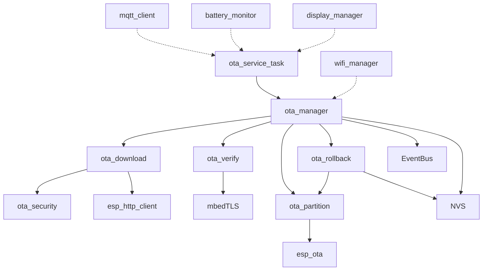
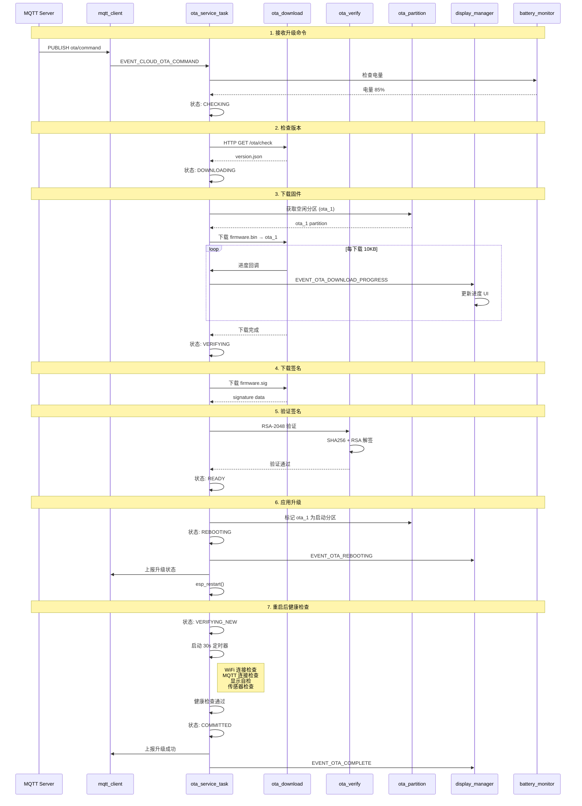
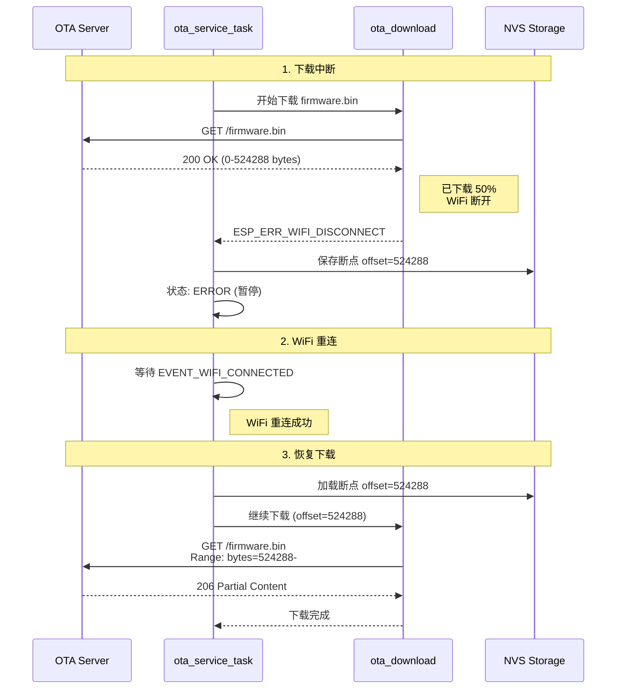
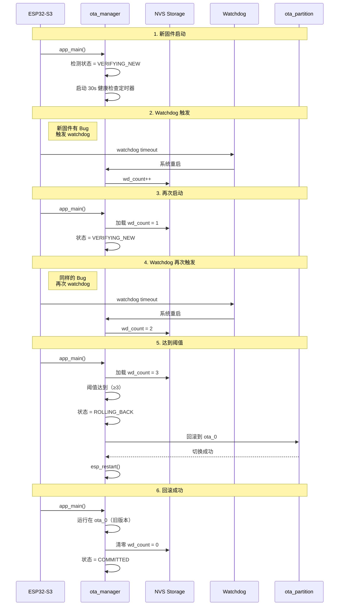
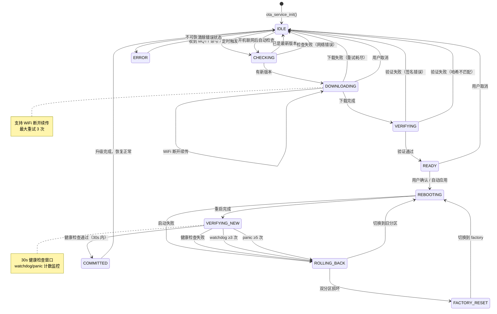
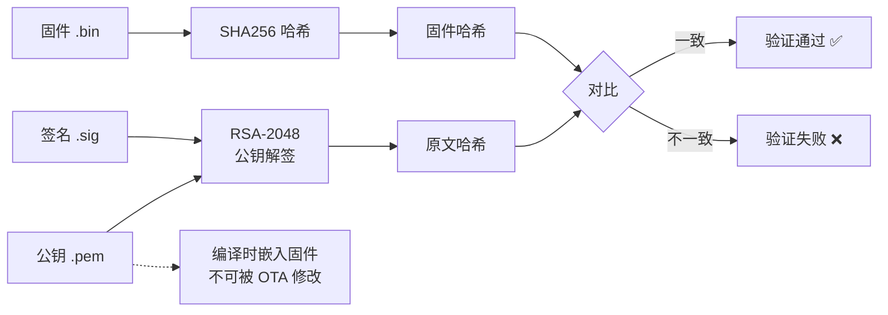

# RobotBuddy OTA 升级功能架构设计

> **版本:** 1.0
> **日期:** 2026-07-19
> **基于:** docs/requirement/ota-upgrade-requirements.md
> **状态:** 架构设计完成

---

## 目录

1. [概述](#1-概述)
2. [分层架构](#2-分层架构)
3. [组件设计](#3-组件设计)
4. [FreeRTOS 任务设计](#4-freertos-任务设计)
5. [事件总线设计](#5-事件总线设计)
6. [模块接口设计](#6-模块接口设计)
7. [数据流与时序](#7-数据流与时序)
8. [状态机设计](#8-状态机设计)
9. [内存预算](#9-内存预算)
10. [安全架构](#10-安全架构)
11. [错误处理与降级](#11-错误处理与降级)
12. [架构检查清单](#12-架构检查清单)

---

## 1. 概述

### 1.1 架构目标

设计一个**安全、可靠、可扩展**的 OTA 升级系统，满足以下目标：

| 目标 | 描述 |
|------|------|
| **安全性** | RSA-2048 签名验证 + TLS 证书锁定 + SHA256 完整性校验 |
| **可靠性** | AB 分区滚动升级 + 自动回滚 + factory 保底恢复 |
| **可扩展性** | 支持差分升级、资源升级（V2.0） |
| **实时性** | 低优先级后台任务，不影响关键功能 |
| **可观测性** | 进度上报、状态监控、错误日志 |

### 1.2 架构原则

| # | 原则 | 说明 |
|---|------|------|
| A1 | **永不覆盖 factory** | factory 分区是最后保底，OTA 仅写入 ota_0/ota_1 |
| A2 | **先验证后切换** | 下载完成后必须验证签名，通过后才标记启动分区 |
| A3 | **健康检查必过关** | 新固件启动后 30s 内必须通过健康检查，否则回滚 |
| A4 | **低电量拒绝 OTA** | 电量 <20% 时拒绝升级，保护刷写安全 |
| A5 | **事件驱动解耦** | 通过事件总线通知其他模块，不直接调用 |
| A6 | **流式处理** | 边下载边刷写，不缓冲完整固件到 RAM |

---

## 2. 分层架构

### 2.1 OTA 系统分层

```
┌─────────────────────────────────────────────────────────┐
│                 Application Layer                        │
│                                                          │
│  ┌─────────────────────────────────────────────────┐   │
│  │           OTA Service (ota_service_task)         │   │
│  │  • 状态机驱动 OTA 流程                            │   │
│  │  • 接收 MQTT 命令 / 定时检查                       │   │
│  │  • 协调各子模块                                   │   │
│  └─────────────────────────────────────────────────┘   │
│                                                          │
├─────────────────────────────────────────────────────────┤
│                   Service Layer                          │
│                                                          │
│  ┌─────────────┐ ┌─────────────┐ ┌─────────────┐       │
│  │ ota_manager │ │ ota_download│ │  ota_verify │       │
│  │  状态管理    │ │  下载管理    │ │  签名验证   │       │
│  └─────────────┘ └─────────────┘ └─────────────┘       │
│                                                          │
│  ┌─────────────┐ ┌─────────────┐ ┌─────────────┐       │
│  │ota_partition│ │ota_rollback │ │ota_security │       │
│  │  分区管理    │ │  回滚管理    │ │  安全管理   │       │
│  └─────────────┘ └─────────────┘ └─────────────┘       │
│                                                          │
├─────────────────────────────────────────────────────────┤
│                   Framework Layer                        │
│                                                          │
│  ┌──────────┐ ┌──────────┐ ┌──────────┐               │
│  │Event Bus │ │  NVS     │ │  Logger  │               │
│  └──────────┘ └──────────┘ └──────────┘               │
│                                                          │
├─────────────────────────────────────────────────────────┤
│                    Driver Layer                          │
│                                                          │
│  ┌──────────┐ ┌──────────┐ ┌──────────┐               │
│  │esp_http  │ │ esp_ota  │ │ mbedTLS  │               │
│  │ _client  │ │   API    │ │ (RSA)    │               │
│  └──────────┘ └──────────┘ └──────────┘               │
│                                                          │
├─────────────────────────────────────────────────────────┤
│                      BSP Layer                           │
│                                                          │
│  ┌──────────┐ ┌──────────┐ ┌──────────┐               │
│  │   WiFi   │ │  Flash   │ │  Watchdog│               │
│  │  Stack   │ │ Partition│ │   Timer  │               │
│  └──────────┘ └──────────┘ └──────────┘               │
└─────────────────────────────────────────────────────────┘
```

### 2.2 模块职责

| 模块 | 层级 | 职责 | 依赖 |
|------|------|------|------|
| **ota_service** | Application | OTA 流程编排、状态机、事件处理 | WiFi, MQTT, Battery |
| **ota_manager** | Service | OTA 状态管理、进度追踪、NVS 持久化 | EventBus, NVS |
| **ota_download** | Service | HTTPS 下载、断点续传、进度回调 | esp_http_client |
| **ota_verify** | Service | RSA-2048 签名验证、SHA256 校验 | mbedTLS, esp_ota |
| **ota_partition** | Service | 分区查询、切换、标记 | esp_ota |
| **ota_rollback** | Service | 自动回滚、健康检查、计数管理 | esp_ota, NVS |
| **ota_security** | Service | TLS 证书锁定、URL 签名验证 | mbedTLS |

---

## 3. 组件设计

### 3.1 目录结构

```
firmware/components/services/ota_service/
├── include/
│   ├── ota_service.h              # OTA 服务主接口
│   ├── ota_manager.h              # OTA 状态管理
│   ├── ota_download.h             # 下载管理
│   ├── ota_verify.h               # 签名验证
│   ├── ota_partition.h            # 分区管理
│   ├── ota_rollback.h             # 回滚管理
│   ├── ota_security.h             # 安全管理
│   └── ota_types.h                # 类型定义
│
├── ota_service.c                  # OTA 服务主任务
├── ota_manager.c                  # 状态管理实现
├── ota_download.c                 # 下载实现
├── ota_verify.c                   # 验证实现
├── ota_partition.c                # 分区管理实现
├── ota_rollback.c                 # 回滚实现
├── ota_security.c                 # 安全实现
│
├── ota_public_key.pem             # RSA-2048 公钥（编译嵌入）
├── ota_server_cert.h              # OTA 服务器证书指纹
│
└── CMakeLists.txt
```

### 3.2 组件依赖图



---

## 4. FreeRTOS 任务设计

### 4.1 OTA Service Task 配置

```c
// ota_service.h

#define OTA_SERVICE_TASK_NAME       "ota_svc"
#define OTA_SERVICE_TASK_STACK      8192    // 8 KB
#define OTA_SERVICE_TASK_PRIORITY   1       // 低优先级（后台任务）
#define OTA_SERVICE_TASK_CORE       0       // Core 0 (与 WiFi 共享)
#define OTA_SERVICE_TASK_PERIOD     0       // 事件驱动

// 任务句柄
extern TaskHandle_t g_ota_service_task_handle;

// 输入队列（接收命令）
#define OTA_CMD_QUEUE_DEPTH  5
extern QueueHandle_t g_ota_cmd_queue;
```

### 4.2 任务注册表更新

```c
// task_registry.h — 新增 OTA 任务

static const task_config_t g_task_registry[] = {
    // ... 已有任务 ...
    { "ota_svc",    ota_service_task,     2048, 1, 0, 0,    &h_ota_svc },
};

// 任务总数：10 → 11（新增 OTA 任务）
```

### 4.3 任务初始化顺序

```c
// main.c

void app_main(void)
{
    // Phase 1-4: 已有模块初始化
    // ...

    // Phase 5: 新增 OTA 服务初始化
    ESP_LOGI(TAG, "Initializing OTA service...");
    ota_service_init();

    // Phase 6: 启动任务
    xTaskCreatePinnedToCore(ota_service_task, "ota_svc", 8192, NULL, 1, &h_ota_svc, 0);
}
```

### 4.4 任务主循环

```c
// ota_service.c

void ota_service_task(void *arg)
{
    ESP_LOGI(TAG, "OTA service task started");

    // 初始化
    ota_manager_init();

    // 注册事件订阅
    event_bus_subscribe(EVENT_CLOUD_OTA_COMMAND, on_ota_command);
    event_bus_subscribe(EVENT_SYS_WIFI_CONNECTED, on_wifi_connected);
    event_bus_subscribe(EVENT_SYS_WIFI_DISCONNECTED, on_wifi_disconnected);

    // 主循环
    ota_cmd_msg_t cmd;
    while (1) {
        // 等待命令（阻塞）
        if (xQueueReceive(g_ota_cmd_queue, &cmd, pdMS_TO_TICKS(1000))) {
            process_ota_command(&cmd);
        }

        // 定期检查（每日固定时间）
        if (should_check_update()) {
            ota_check_and_update();
        }

        // 喂看门狗
        esp_task_wdt_reset();
    }
}
```

### 4.5 CPU 和内存负载分析

**CPU 占用（峰值）：**
- 空闲：0%（事件等待）
- 版本检查：~5%（<1s）
- 下载：~10%（持续 20-60s）
- 验证：~30%（~2s）
- Flash 写入：~5%（持续 20-60s）

**内存占用：**
- 任务栈：8 KB（SRAM）
- HTTP 缓冲：~4 KB（SRAM，临时）
- TLS 上下文：~16 KB（SRAM，esp_http_client 内部）
- 签名验证：~1 KB（SRAM，临时）

**总内存影响：**
- SRAM: ~29 KB（栈 8KB + TLS 16KB + 缓冲 4KB + 其他 1KB）
- PSRAM: 0 KB

---

## 5. 事件总线设计

### 5.1 OTA 事件 ID 定义

```c
// robot_events.h — 新增 OTA 事件

typedef enum {
    // ===== OTA 事件 (0x0700-0x07FF) =====

    // 检查更新
    EVENT_OTA_CHECK_UPDATE      = 0x0700,   // 请求检查更新
    EVENT_OTA_UPDATE_AVAILABLE  = 0x0701,   // 有新版本可用
    EVENT_OTA_NO_UPDATE         = 0x0702,   // 无新版本

    // 下载
    EVENT_OTA_DOWNLOAD_START    = 0x0703,   // 开始下载
    EVENT_OTA_DOWNLOAD_PROGRESS = 0x0704,   // 下载进度更新
    EVENT_OTA_DOWNLOAD_COMPLETE = 0x0705,   // 下载完成
    EVENT_OTA_DOWNLOAD_FAILED   = 0x0706,   // 下载失败

    // 验证
    EVENT_OTA_VERIFY_START      = 0x0707,   // 开始验证
    EVENT_OTA_VERIFY_SUCCESS    = 0x0708,   // 验证通过
    EVENT_OTA_VERIFY_FAILED     = 0x0709,   // 验证失败

    // 应用
    EVENT_OTA_APPLY_START       = 0x070A,   // 开始应用
    EVENT_OTA_REBOOTING         = 0x070B,   // 准备重启

    // 完成/回滚
    EVENT_OTA_COMPLETE          = 0x070C,   // 升级完成
    EVENT_OTA_ROLLBACK          = 0x070D,   // 自动回滚
    EVENT_OTA_ROLLBACK_COMPLETE = 0x070E,   // 回滚完成
    EVENT_OTA_FACTORY_RESET     = 0x070F,   // 回退到出厂固件

    // 错误
    EVENT_OTA_ERROR             = 0x0710,   // OTA 错误
    EVENT_OTA_LOW_BATTERY       = 0x0711,   // 电量不足拒绝升级

} robot_event_id_t;
```

### 5.2 事件数据结构

```c
// ota_types.h

// OTA 更新信息
typedef struct {
    char firmware_url[256];         // 固件下载 URL
    char signature_url[256];        // 签名文件 URL
    char version[32];               // 固件版本号 x.y.z
    size_t firmware_size;           // 固件大小 (bytes)
    char sha256[65];                // SHA256 校验和 (hex string)
    ota_update_level_t level;       // 升级级别
    uint32_t release_timestamp;     // 发布时间戳
    char changelog[512];            // 更新日志
} ota_update_info_t;

// OTA 进度
typedef struct {
    ota_state_t state;              // 当前状态
    int progress_percent;           // 进度百分比 (0-100)
    size_t bytes_downloaded;        // 已下载字节数
    size_t bytes_total;             // 总字节数
    uint32_t elapsed_ms;            // 已耗时
    uint32_t estimated_remaining_ms;// 预估剩余时间
} ota_progress_t;

// OTA 错误信息
typedef struct {
    ota_error_code_t code;          // 错误码
    char message[256];              // 错误描述
    ota_state_t failed_state;       // 失败时的状态
    uint32_t timestamp;             // 错误时间戳
} ota_error_t;

// OTA 命令
typedef struct {
    ota_cmd_type_t type;            // 命令类型
    ota_update_info_t info;         // 更新信息（可选）
} ota_cmd_msg_t;
```

### 5.3 事件路由表

| 事件 | 发布者 | 订阅者 | 通信方式 |
|------|--------|--------|---------|
| `EVENT_CLOUD_OTA_COMMAND` | mqtt_client | ota_service_task | Queue |
| `EVENT_OTA_DOWNLOAD_PROGRESS` | ota_service_task | display_manager | Event Bus |
| `EVENT_OTA_STATE_CHANGE` | ota_service_task | behavior_task, display_manager | Event Bus |
| `EVENT_OTA_COMPLETE` | ota_service_task | behavior_task, cloud_manager | Event Bus |
| `EVENT_OTA_ERROR` | ota_service_task | behavior_task, display_manager | Event Bus |
| `EVENT_SYS_WIFI_CONNECTED` | wifi_manager | ota_service_task | Event Bus |
| `EVENT_SYS_WIFI_DISCONNECTED` | wifi_manager | ota_service_task | Event Bus |

### 5.4 事件发布示例

```c
// 发布进度事件
static void publish_ota_progress(int percent, size_t downloaded, size_t total)
{
    robot_event_t event = {
        .id = EVENT_OTA_DOWNLOAD_PROGRESS,
        .timestamp = xTaskGetTickCount() * portTICK_PERIOD_MS,
        .payload_len = sizeof(ota_progress_t),
    };

    ota_progress_t *progress = malloc(sizeof(ota_progress_t));
    if (progress) {
        progress->state = g_ota_state;
        progress->progress_percent = percent;
        progress->bytes_downloaded = downloaded;
        progress->bytes_total = total;
        progress->elapsed_ms = get_elapsed_time_ms();

        event.payload = progress;
        event_bus_publish(&event);
    }
}
```

---

## 6. 模块接口设计

### 6.1 OTA Service 主接口

```c
// ota_service.h

/**
 * @brief 初始化 OTA 服务
 * @return ESP_OK 成功
 */
esp_err_t ota_service_init(void);

/**
 * @brief 检查是否有新版本
 * @param[out] info 更新信息（如果有）
 * @return ESP_OK 检查成功
 */
esp_err_t ota_service_check_update(ota_update_info_t *info);

/**
 * @brief 开始 OTA 升级
 * @param[in] info 更新信息
 * @return ESP_OK 开始成功
 */
esp_err_t ota_service_start_upgrade(const ota_update_info_t *info);

/**
 * @brief 获取 OTA 当前状态
 * @return OTA 状态
 */
ota_state_t ota_service_get_state(void);

/**
 * @brief 获取 OTA 进度
 * @param[out] progress 进度信息
 * @return ESP_OK 成功
 */
esp_err_t ota_service_get_progress(ota_progress_t *progress);

/**
 * @brief 取消 OTA 升级
 * @return ESP_OK 取消成功
 */
esp_err_t ota_service_cancel(void);

/**
 * @brief 手动触发回滚
 * @return ESP_OK 成功
 */
esp_err_t ota_service_rollback(void);

/**
 * @brief 回退到出厂固件
 * @return ESP_OK 成功
 */
esp_err_t ota_service_factory_reset(void);
```

### 6.2 OTA Manager 接口

```c
// ota_manager.h

/**
 * @brief 初始化 OTA 管理器
 */
esp_err_t ota_manager_init(void);

/**
 * @brief 设置 OTA 状态
 */
esp_err_t ota_manager_set_state(ota_state_t new_state);

/**
 * @brief 获取 OTA 状态
 */
ota_state_t ota_manager_get_state(void);

/**
 * @brief 保存进度到 NVS
 */
esp_err_t ota_manager_save_progress(const ota_progress_t *progress);

/**
 * @brief 加载进度从 NVS
 */
esp_err_t ota_manager_load_progress(ota_progress_t *progress);

/**
 * @brief 持久化回滚计数
 */
esp_err_t ota_manager_save_rollback_count(uint8_t wd_count, uint8_t panic_count);

/**
 * @brief 加载回滚计数
 */
esp_err_t ota_manager_load_rollback_count(uint8_t *wd_count, uint8_t *panic_count);
```

### 6.3 OTA Download 接口

```c
// ota_download.h

/**
 * @brief 下载固件到指定分区
 * @param[in] url 固件 URL
 * @param[in] target_partition 目标分区
 * @param[in] progress_cb 进度回调
 * @return ESP_OK 成功
 */
esp_err_t ota_download_firmware(const char *url,
                                 const esp_partition_t *target_partition,
                                 ota_progress_callback_t progress_cb);

/**
 * @brief 断点续传下载
 * @param[in] url 固件 URL
 * @param[in] offset 已下载偏移量
 * @param[in] target_partition 目标分区
 * @param[in] progress_cb 进度回调
 * @return ESP_OK 成功
 */
esp_err_t ota_download_resume(const char *url,
                               size_t offset,
                               const esp_partition_t *target_partition,
                               ota_progress_callback_t progress_cb);

/**
 * @brief 下载签名文件
 * @param[in] url 签名文件 URL
 * @param[out] signature 签名数据
 * @param[out] sig_len 签名长度
 * @return ESP_OK 成功
 */
esp_err_t ota_download_signature(const char *url,
                                   uint8_t *signature,
                                   size_t *sig_len);
```

### 6.4 OTA Verify 接口

```c
// ota_verify.h

/**
 * @brief 验证固件 RSA-2048 签名
 * @param[in] partition 固件所在分区
 * @param[in] signature 签名数据
 * @param[in] sig_len 签名长度
 * @return ESP_OK 验证通过
 */
esp_err_t ota_verify_rsa_signature(const esp_partition_t *partition,
                                     const uint8_t *signature,
                                     size_t sig_len);

/**
 * @brief 验证固件 SHA256 哈希
 * @param[in] partition 固件所在分区
 * @param[in] expected_sha256 预期的 SHA256 (hex string)
 * @return ESP_OK 验证通过
 */
esp_err_t ota_verify_sha256(const esp_partition_t *partition,
                              const char *expected_sha256);

/**
 * @brief 综合验证（签名 + SHA256）
 * @param[in] partition 固件所在分区
 * @param[in] signature 签名数据
 * @param[in] sig_len 签名长度
 * @param[in] expected_sha256 预期的 SHA256
 * @return ESP_OK 验证通过
 */
esp_err_t ota_verify_full(const esp_partition_t *partition,
                           const uint8_t *signature,
                           size_t sig_len,
                           const char *expected_sha256);
```

### 6.5 OTA Partition 接口

```c
// ota_partition.h

/**
 * @brief 获取空闲的 OTA 分区
 * @return 空闲分区指针（ota_0 或 ota_1），NULL 表示无空闲分区
 */
const esp_partition_t* ota_partition_get_idle(void);

/**
 * @brief 获取当前运行的分区
 * @return 当前分区指针
 */
const esp_partition_t* ota_partition_get_running(void);

/**
 * @brief 标记启动分区
 * @param[in] partition 目标分区
 * @return ESP_OK 成功
 */
esp_err_t ota_partition_mark_bootable(const esp_partition_t *partition);

/**
 * @brief 切换到指定分区并重启
 * @param[in] partition 目标分区
 * @return ESP_OK 成功（不会返回，直接重启）
 */
esp_err_t ota_partition_switch_and_reboot(const esp_partition_t *partition);

/**
 * @brief 获取所有有效分区数量
 * @return 有效分区数量
 */
int ota_partition_get_valid_count(void);
```

### 6.6 OTA Rollback 接口

```c
// ota_rollback.h

/**
 * @brief 执行健康检查
 * @return 健康检查结果
 */
health_check_result_t ota_rollback_health_check(void);

/**
 * @brief 检查是否需要自动回滚
 * @return true 需要回滚
 */
bool ota_rollback_check_needed(void);

/**
 * @brief 执行自动回滚
 * @return ESP_OK 成功
 */
esp_err_t ota_rollback_auto(void);

/**
 * @brief 手动回滚到上一版本
 * @return ESP_OK 成功
 */
esp_err_t ota_rollback_manual(void);

/**
 * @brief 回退到出厂固件
 * @return ESP_OK 成功
 */
esp_err_t ota_rollback_to_factory(void);

/**
 * @brief 增加看门狗计数
 */
void ota_rollback_increment_watchdog_count(void);

/**
 * @brief 增加恐慌计数
 */
void ota_rollback_increment_panic_count(void);

/**
 * @brief 清零回滚计数
 */
void ota_rollback_reset_counts(void);
```

---

## 7. 数据流与时序

### 7.1 正常 OTA 升级流程



### 7.2 断点续传流程



### 7.3 自动回滚流程



---

## 8. 状态机设计

### 8.1 OTA 状态机



### 8.2 状态详细说明

| 状态 | 描述 | 持续时间 | 超时处理 |
|------|------|---------|---------|
| **IDLE** | 空闲，等待升级命令 | - | - |
| **CHECKING** | 检查服务器是否有新版本 | <1s | 超时 10s → IDLE |
| **DOWNLOADING** | 下载固件到备用分区 | 20-60s | WiFi 断开续传 |
| **VERIFYING** | RSA 签名 + SHA256 校验 | ~2s | 超时 5s → IDLE |
| **READY** | 校验通过，等待应用 | 用户确认或自动 | 10s 自动应用 |
| **REBOOTING** | 设置启动分区，准备重启 | <1s | - |
| **VERIFYING_NEW** | 新固件运行中，健康检查 | 30s 窗口 | 超时 → ROLLING_BACK |
| **COMMITTED** | 健康检查通过，确认生效 | - | → IDLE |
| **ROLLING_BACK** | 自动回滚到上一版本 | <1s | 失败 → FACTORY_RESET |
| **FACTORY_RESET** | 回退到出厂固件 | <1s | - |
| **ERROR** | 不可恢复错误 | - | 手动清除 |

### 8.3 状态转换表

```c
// ota_manager.c

static const struct {
    ota_state_t from;
    ota_state_t to;
    const char *condition;
} state_transitions[] = {
    {OTA_STATE_IDLE,        OTA_STATE_CHECKING,      "MQTT command"},
    {OTA_STATE_IDLE,        OTA_STATE_CHECKING,      "Timer trigger"},
    {OTA_STATE_CHECKING,    OTA_STATE_DOWNLOADING,   "New version available"},
    {OTA_STATE_CHECKING,    OTA_STATE_IDLE,          "Already latest"},
    {OTA_STATE_DOWNLOADING, OTA_STATE_VERIFYING,     "Download complete"},
    {OTA_STATE_DOWNLOADING, OTA_STATE_IDLING,        "Download failed"},
    {OTA_STATE_VERIFYING,   OTA_STATE_READY,         "Verify success"},
    {OTA_STATE_VERIFYING,   OTA_STATE_IDLING,        "Verify failed"},
    {OTA_STATE_READY,       OTA_STATE_REBOOTING,     "User confirm"},
    {OTA_STATE_REBOOTING,   OTA_STATE_VERIFYING_NEW, "Reboot complete"},
    {OTA_STATE_VERIFYING_NEW, OTA_STATE_COMMITTED,   "Health check pass"},
    {OTA_STATE_VERIFYING_NEW, OTA_STATE_ROLLING_BACK, "Health check fail"},
    {OTA_STATE_ROLLING_BACK, OTA_STATE_REBOOTING,    "Rollback to old"},
    // ...
};
```

---

## 9. 内存预算

### 9.1 SRAM 分配

| 用途 | 大小 | 说明 |
|------|------|------|
| ota_service_task 栈 | 8 KB | HTTP 缓冲 + JSON 解析 |
| TLS 上下文（内部） | ~16 KB | esp_http_client 内部管理 |
| HTTP 临时缓冲 | ~4 KB | 流式下载缓冲 |
| 签名验证临时 | ~1 KB | mbedTLS RSA 运算 |
| **总 SRAM 占用** | **~29 KB** | |

### 9.2 PSRAM 分配

| 用途 | 大小 | 说明 |
|------|------|------|
| **无需 PSRAM** | 0 KB | OTA 采用流式处理 |

### 9.3 Flash 空间

| 分区 | 大小 | 状态 |
|------|------|------|
| factory | 2 MB | 永不覆盖 |
| ota_0 | 2 MB | OTA 目标 |
| ota_1 | 2 MB | OTA 目标 |
| **总 Flash 占用** | **6 MB** | 3 个分区 |

### 9.4 内存安全余量

```
SRAM 总可用：~460 KB
已占用（现有任务）：~101 KB
OTA 新增：~29 KB
剩余可用：~330 KB
余量比例：71.7%

结论：✅ SRAM 充足
```

---

## 10. 安全架构

### 10.1 安全层次模型

```
┌─────────────────────────────────────────────────────┐
│                    应用层安全                         │
│  ├── 用户授权升级（降级需确认）                       │
│  ├── 签名 URL（防重放攻击）                          │
│  └── 电量检查（防刷写中断）                          │
├─────────────────────────────────────────────────────┤
│                    传输层安全                         │
│  ├── HTTPS (TLS 1.2+)                              │
│  ├── 证书锁定（Certificate Pinning）                 │
│  └── 加密传输（防中间人攻击）                        │
├─────────────────────────────────────────────────────┤
│                    固件层安全                         │
│  ├── RSA-2048 签名验证                              │
│  ├── SHA256 完整性校验                              │
│  └── Secure Boot V2（可选，硬件信任根）              │
├─────────────────────────────────────────────────────┤
│                    分区层安全                         │
│  ├── factory 分区永不覆盖                            │
│  ├── AB 分区滚动升级                                 │
│  └── 回滚保护（防止降级攻击）                        │
└─────────────────────────────────────────────────────┘
```

### 10.2 证书锁定实现

```c
// ota_security.c

// OTA 服务器证书 SHA256 指纹
static const uint8_t OTA_SERVER_CERT_SHA256[] = {
    0xA1, 0xB2, 0xC3, 0xD4, 0xE5, 0xF6, 0x78, 0x90,
    0xAB, 0xCD, 0xEF, 0x12, 0x34, 0x56, 0x78, 0x90,
    0xAB, 0xCD, 0xEF, 0x12, 0x34, 0x56, 0x78, 0x90,
    0xAB, 0xCD, 0xEF, 0x12, 0x34, 0x56, 0x78, 0x90,
};

// 验证服务器证书指纹
esp_err_t verify_server_cert_fingerprint(const char *cert_pem)
{
    uint8_t cert_sha256[32];
    mbedtls_sha256((const unsigned char *)cert_pem, strlen(cert_pem),
                   cert_sha256, 0);

    if (memcmp(cert_sha256, OTA_SERVER_CERT_SHA256, 32) != 0) {
        ESP_LOGE(TAG, "Server certificate fingerprint mismatch!");
        return ESP_ERR_INVALID_STATE;
    }

    return ESP_OK;
}
```

### 10.3 RSA 签名验证流程



### 10.4 Secure Boot V2 集成（可选）

```
启用 Secure Boot V2 后的安全流程：

1. Bootloader 验证：
   └── ESP32 eFuse 存储 RSA-3072 公钥摘要
   └── Bootloader 校验 app 分区的 Secure Boot 签名

2. OTA 固件双重签名：
   └── 第一重：OTA 服务器 RSA-2048 签名（应用层验证）
   └── 第二重：Secure Boot RSA-3072 签名（硬件层验证）

3. 安全启动链：
   ROM → Bootloader (验证) → App (验证) → 安全运行
```

---

## 11. 错误处理与降级

### 11.1 错误码定义

```c
// ota_types.h

typedef enum {
    OTA_ERR_NONE                  = 0x0000,

    // 网络错误 (0x0100-0x01FF)
    OTA_ERR_WIFI_DISCONNECT       = 0x0100,   // WiFi 断开
    OTA_ERR_HTTP_TIMEOUT          = 0x0101,   // HTTP 超时
    OTA_ERR_HTTP_ERROR            = 0x0102,   // HTTP 错误 (4xx/5xx)
    OTA_ERR_DNS_FAILED            = 0x0103,   // DNS 解析失败
    OTA_ERR_CONNECTION_REFUSED    = 0x0104,   // 连接被拒绝

    // 下载错误 (0x0200-0x02FF)
    OTA_ERR_DOWNLOAD_INCOMPLETE   = 0x0200,   // 下载不完整
    OTA_ERR_SIZE_MISMATCH         = 0x0201,   // 大小不匹配
    OTA_ERR_WRITE_FAILED          = 0x0202,   // Flash 写入失败
    OTA_ERR_NO_SPACE              = 0x0203,   // 分区空间不足

    // 验证错误 (0x0300-0x03FF)
    OTA_ERR_RSA_VERIFY_FAILED     = 0x0300,   // RSA 签名验证失败
    OTA_ERR_SHA256_MISMATCH       = 0x0301,   // SHA256 不匹配
    OTA_ERR_INVALID_SIGNATURE     = 0x0302,   // 无效签名

    // 分区错误 (0x0400-0x04FF)
    OTA_ERR_NO_IDLE_PARTITION     = 0x0400,   // 无空闲分区
    OTA_ERR_PARTITION_CORRUPT     = 0x0401,   // 分区损坏
    OTA_ERR_BOOT_SET_FAILED       = 0x0402,   // 启动分区设置失败

    // 回滚错误 (0x0500-0x05FF)
    OTA_ERR_ROLLBACK_FAILED       = 0x0500,   // 回滚失败
    OTA_ERR_NO_VALID_PARTITION    = 0x0501,   // 无有效分区

    // 系统错误 (0x0600-0x06FF)
    OTA_ERR_LOW_BATTERY           = 0x0600,   // 电量不足
    OTA_ERR_ALREADY_UPDATING      = 0x0601,   // 已在升级中
    OTA_ERR_USER_CANCEL           = 0x0602,   // 用户取消
    OTA_ERR_INTERNAL              = 0x0603,   // 内部错误

} ota_error_code_t;
```

### 11.2 降级策略矩阵

| 错误场景 | 错误码 | 降级策略 | 恢复路径 |
|---------|--------|---------|---------|
| WiFi 断开（下载中） | OTA_ERR_WIFI_DISCONNECT | 暂停下载，重连后续传 | WiFi 重连后继续 |
| HTTP 4xx | OTA_ERR_HTTP_ERROR | 立即失败，记录日志 | 等待服务器修复 |
| HTTP 5xx | OTA_ERR_HTTP_ERROR | 重试 3 次（5s/15s/30s） | 第 4 次失败后放弃 |
| 签名验证失败 | OTA_ERR_RSA_VERIFY_FAILED | 拒绝升级，不上报云端 | 等待正确签名的固件 |
| SHA256 不匹配 | OTA_ERR_SHA256_MISMATCH | 重新下载完整固件 | 下载新固件 |
| Flash 写入失败 | OTA_ERR_WRITE_FAILED | 标记分区损坏，切换分区 | 使用另一个 OTA 分区 |
| 双分区损坏 | OTA_ERR_NO_VALID_PARTITION | 回退 factory 分区 | 回到出厂固件 |
| 电量不足 | OTA_ERR_LOW_BATTERY | 拒绝升级 | 等待充电 |

### 11.3 回滚计数持久化

```c
// NVS 存储结构
// namespace: "ota_boot"
// 键值:
//   "wd_count"    uint8   watchdog 重启计数
//   "panic_count" uint8   panic 重启计数
//   "boot_time"   uint32  启动时间戳
//   "resume_offset" uint32 断点续传偏移量

esp_err_t ota_manager_save_rollback_count(uint8_t wd_count, uint8_t panic_count)
{
    nvs_handle_t handle;
    esp_err_t ret = nvs_open("ota_boot", NVS_READWRITE, &handle);
    if (ret != ESP_OK) return ret;

    nvs_set_u8(handle, "wd_count", wd_count);
    nvs_set_u8(handle, "panic_count", panic_count);
    nvs_set_u32(handle, "boot_time", xTaskGetTickCount());

    nvs_commit(handle);
    nvs_close(handle);

    return ESP_OK;
}
```

---

## 12. 架构检查清单

### 12.1 Architecture Skill Checklist

- [x] **层间依赖是否单向？**
  - Application → Service → Framework → Driver → BSP
  - 无循环依赖
  - ✅ 满足

- [x] **Task 优先级是否合理？**
  - OTA 任务优先级 1（低优先级），不抢占关键任务
  - 音频（8/7）> 显示（6）> 云端（4）> OTA（1）
  - ✅ 满足

- [x] **Queue 深度是否足够？**
  - OTA 命令队列深度 5，足够缓存多个命令
  - ✅ 满足

- [x] **内存分配策略明确？**
  - 任务栈：SRAM（8KB）
  - TLS 上下文：SRAM（~16KB，内部管理）
  - 临时缓冲：SRAM（~4KB，临时）
  - 流式下载：不缓冲完整固件
  - ✅ 满足

- [x] **错误恢复路径完整？**
  - WiFi 断开：断点续传
  - 签名失败：拒绝升级
  - Flash 写入失败：切换分区
  - 双分区损坏：回退 factory
  - 新固件异常：自动回滚
  - ✅ 满足

- [x] **电源状态切换安全？**
  - OTA 前检查电量 ≥20%
  - OTA 过程中监控电量
  - ✅ 满足

- [x] **双核负载均衡？**
  - OTA 任务运行在 Core 0（与 WiFi 共享）
  - 不抢占 Core 1 的显示/运动任务
  - ✅ 满足

### 12.2 FreeRTOS System Skill Checklist

- [x] **Task 使用统一注册**
  - 新增 ota_service_task 到 task_registry
  - ✅ 满足

- [x] **栈水位 ≥ 512 bytes**
  - OTA 任务栈 8192 bytes，测量后调整
  - ✅ 满足

- [x] **堆空间充足**
  - SRAM 剩余 ~330 KB
  - ✅ 满足

- [x] **事件总线无泄漏**
  - payload 由订阅方负责释放
  - ✅ 满足

- [x] **看门狗正确配置**
  - OTA 任务主循环喂狗
  - ✅ 满足

- [x] **CPU 使用率 ≤ 80%**
  - OTA 峰值占用 ~30%（验证阶段，<3s）
  - 平均占用 ~10%（下载阶段）
  - ✅ 满足

- [x] **无优先级反转**
  - OTA 不使用互斥量，仅用 Queue 和事件
  - ✅ 满足

### 12.3 OTA 安全检查清单

- [x] **RSA-2048 签名验证** — 所有固件必须验证
- [x] **SHA256 完整性校验** — 双重校验
- [x] **TLS 证书锁定** — 防中间人攻击
- [x] **签名 URL** — 防重放攻击
- [x] **factory 分区保护** — 永不 OTA 覆盖
- [x] **低电量保护** — 电量 <20% 拒绝升级
- [x] **健康检查** — 新固件 30s 内必须通过
- [x] **自动回滚** — 异常时自动恢复
- [x] **公钥保护** — 编译时嵌入，不可 OTA 修改

---

## 附录

### A. 关键数据结构

```c
// ota_types.h — 完整类型定义

typedef enum {
    OTA_STATE_IDLE,
    OTA_STATE_CHECKING,
    OTA_STATE_DOWNLOADING,
    OTA_STATE_VERIFYING,
    OTA_STATE_READY,
    OTA_STATE_REBOOTING,
    OTA_STATE_VERIFYING_NEW,
    OTA_STATE_COMMITTED,
    OTA_STATE_ROLLING_BACK,
    OTA_STATE_FACTORY_RESET,
    OTA_STATE_ERROR,
} ota_state_t;

typedef enum {
    OTA_UPDATE_NONE,
    OTA_UPDATE_AVAILABLE,
    OTA_UPDATE_MANDATORY,
} ota_update_level_t;

typedef enum {
    OTA_CMD_CHECK,
    OTA_CMD_UPGRADE,
    OTA_CMD_ROLLBACK,
    OTA_CMD_FACTORY_RESET,
    OTA_CMD_CANCEL,
} ota_cmd_type_t;

typedef enum {
    HEALTH_CHECK_PASS,
    HEALTH_CHECK_WIFI_FAIL,
    HEALTH_CHECK_MQTT_FAIL,
    HEALTH_CHECK_DISPLAY_FAIL,
    HEALTH_CHECK_SENSOR_FAIL,
    HEALTH_CHECK_WATCHDOG,
    HEALTH_CHECK_PANIC,
} health_check_result_t;
```

### B. 配置参数

```c
// ota_config.h

// 健康检查超时
#define OTA_HEALTH_CHECK_TIMEOUT_MS   30000

// 回滚阈值
#define OTA_WATCHDOG_THRESHOLD        3
#define OTA_PANIC_THRESHOLD           5

// 下载重试
#define OTA_MAX_RETRIES               3
#define OTA_RETRY_DELAY_MS            {5000, 15000, 30000}

// 断点续传
#define OTA_RESUME_CHUNK_SIZE         10240  // 10KB

// 进度回调频率
#define OTA_PROGRESS_INTERVAL_MS      500
```

### C. 相关文档链接

- [OTA 需求分析](../requirement/ota-upgrade-requirements.md)
- [系统架构设计](../architecture/v1.0-mvp-architecture.md)
- [OTA Skill 文档](../../.claude/skills/ota/SKILL.md)
- [嵌入式编码规范](../../.claude/standards/embedded-coding.md)

---

> **文档版本:** 1.0
> **下次审查:** 编码实现完成后更新接口契约
> **变更记录:**
> - 2026-07-19: 初始版本，完成架构设计
