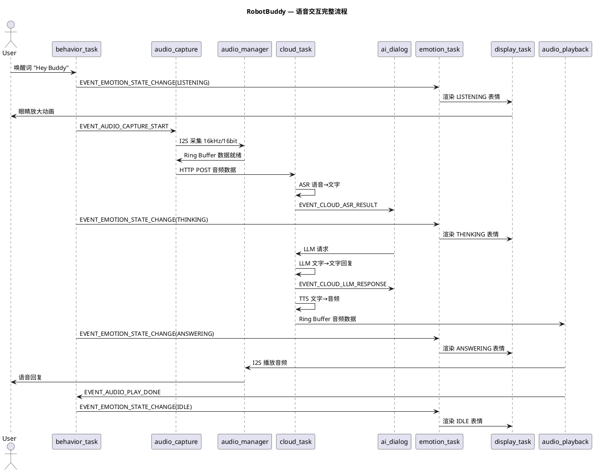
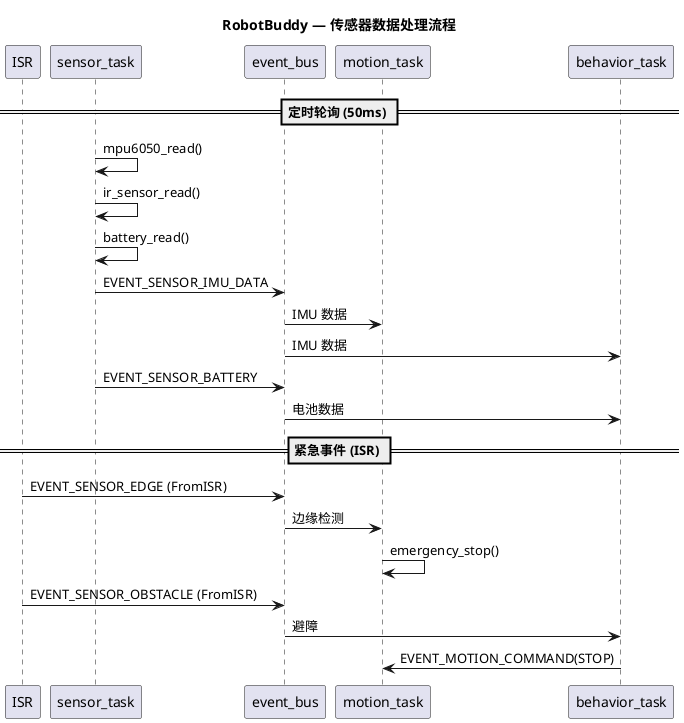
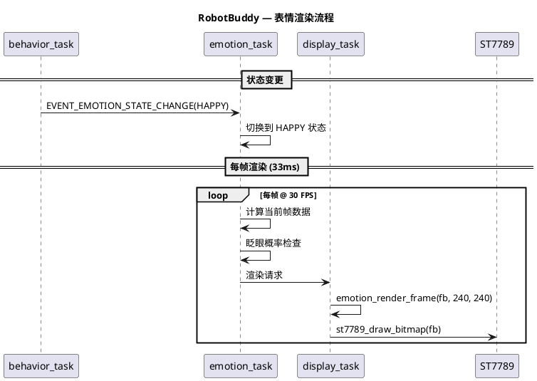
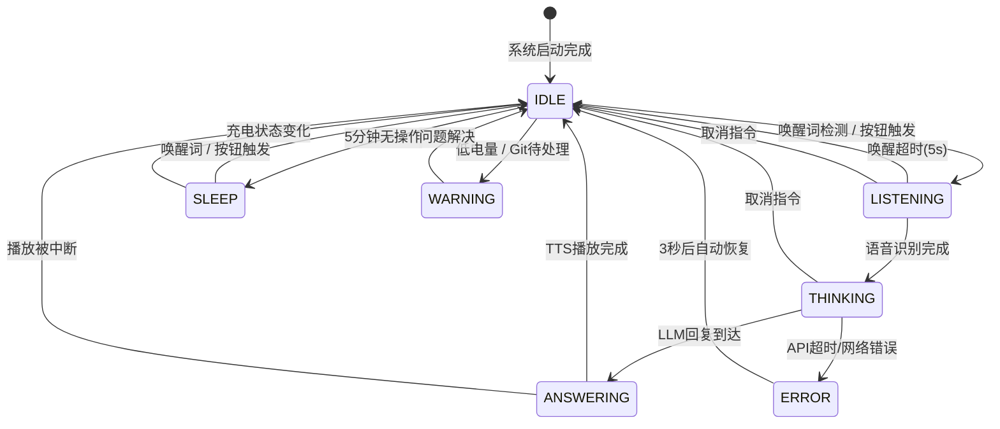
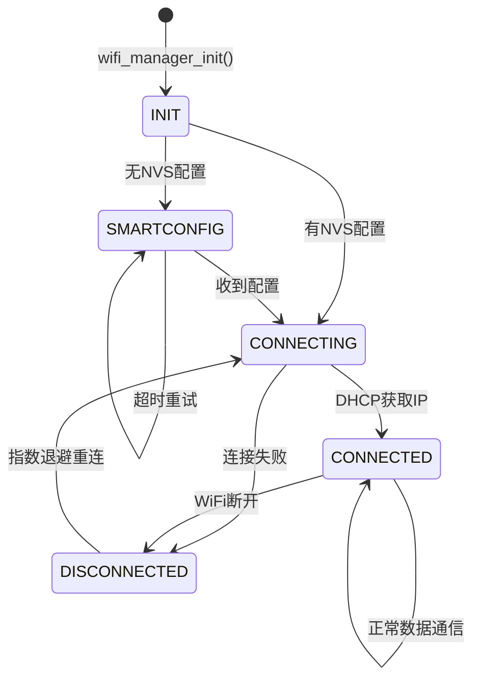
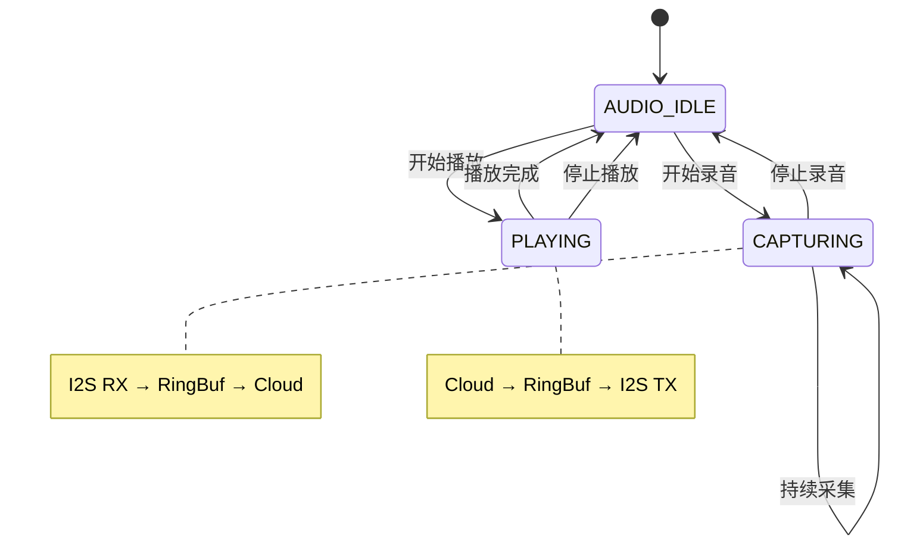

# RobotBuddy V1.0 MVP — 系统架构设计

> **版本:** 1.0  
> **日期:** 2026-07-11  
> **基于:** docs/requirement/v1.0-mvp-requirements.md  
> **目标:** "先跑起来，能聊代码" — MVP 完整软件架构  
> **状态:** 架构设计完成

---

## 目录

1. [概述](#1-概述)
2. [分层架构](#2-分层架构)
3. [组件划分与目录结构](#3-组件划分与目录结构)
4. [FreeRTOS 任务设计](#4-freertos-任务设计)
5. [事件总线设计](#5-事件总线设计)
6. [模块接口设计](#6-模块接口设计)
7. [数据流与时序](#7-数据流与时序)
8. [状态机设计](#8-状态机设计)
9. [内存预算](#9-内存预算)
10. [错误处理与降级](#10-错误处理与降级)
11. [架构检查清单](#11-架构检查清单)

---

## 1. 概述

| 项目 | 值 |
|------|-----|
| **芯片** | ESP32-S3-WROOM-1-N16R8 |
| **Flash** | 16 MB |
| **PSRAM** | 8 MB (OCTAL) |
| **CPU** | 双核 LX7 @ 240 MHz |
| **框架** | ESP-IDF v5.x + FreeRTOS SMP |
| **语言** | C99 (ESP-IDF 风格) |

### 1.1 设计原则

| # | 原则 | 说明 |
|---|------|------|
| P1 | **分层解耦** | 驱动层→服务层→应用层，单向依赖，无循环引用 |
| P2 | **事件驱动** | 模块间通过事件总线通信，不直接调用 |
| P3 | **无共享** | 模块间避免共享全局变量，通过 Queue/EventGroup 传递 |
| P4 | **防御编程** | 所有公共 API 返回 `esp_err_t`，校验所有参数 |
| P5 | **PSRAM 策略** | 大缓冲(帧/音频)放 PSRAM，栈/控制结构放 SRAM |
| P6 | **双核分离** | Core0: WiFi+音频, Core1: 显示+运动+行为 |
| P7 | **优雅降级** | 每个模块都有离线/错误降级路径 |

### 1.2 MVP 功能范围

```
V1.0 MVP 包含:
├── 显示系统 — 6种表情 + 眨眼动画 (ST7789 240×240)
├── 语音交互 — 麦克风采集 → 云端ASR → LLM → TTS → 扬声器播放
├── 移动控制 — 前进/后退/转向/旋转 (DRV8833 + N20)
├── 传感器   — IMU姿态 + 红外避障 + 边缘检测 + 电池电压
├── AI对话   — Claude/GPT/DeepSeek API 编程问答
├── WiFi联网 — SmartConfig配网 + 自动重连
├── 行为决策 — 状态机驱动表情/语音/运动联动
└── 电源管理 — 电池监测 + 低电量保护
```

---

## 2. 分层架构

```
┌─────────────────────────────────────────────────────────────────────┐
│                     Application Layer (Tasks)                       │
│                                                                     │
│  ┌─────────────┐ ┌──────────────┐ ┌──────────────┐              │
│  │ behavior_task│ │ ai_dialog_task│ │   (未来扩展)   │              │
│  │  行为决策     │ │  AI对话编排    │ │              │              │
│  └──────┬───────┘ └──────┬───────┘ └──────────────┘              │
│         │                │                                          │
├─────────┼────────────────┼──────────────────────────────────────────┤
│         │     Service Layer (Managers)        │                   │
│         │                │                     │                   │
│  ┌──────▼───────┐ ┌─────▼────────┐ ┌────────▼────────┐           │
│  │emotion_engine │ │ cloud_manager│ │ audio_manager   │           │
│  │ 表情动画引擎  │ │ HTTP/WS/MQTT │ │ 采集/播放/缓冲  │           │
│  └──────┬───────┘ └─────┬────────┘ └────────┬────────┘           │
│         │                │                     │                   │
│  ┌──────▼───────┐ ┌─────▼────────┐ ┌────────▼────────┐           │
│  │display_manager│ │wifi_manager  │ │  motion_manager │           │
│  │ 帧缓冲+刷新   │ │ 配网+重连     │ │  PID+运动规划   │           │
│  └──────┬───────┘ └─────┬────────┘ └────────┬────────┘           │
│         │                │                     │                   │
│  ┌──────▼───────┐ ┌─────▼────────┐ ┌────────▼────────┐           │
│  │sensor_manager│ │  nvs_store   │ │ battery_monitor │           │
│  │ IMU+IR+ADC   │ │ 配置持久化    │ │  电压+充电检测   │           │
│  └──────┬───────┘ └─────┬────────┘ └────────┬────────┘           │
│         │                │                     │                   │
├─────────┼────────────────┼─────────────────────┼───────────────────┤
│         │    Framework Layer                     │                   │
│         │                                          │                   │
│  ┌──────▼─────────────────────────────────────────▼───────────┐   │
│  │                    event_bus (事件总线)                      │   │
│  ├──────────────────┬──────────────────┬───────────────────────┤   │
│  │  cmd_parser      │  state_machine   │  sysmon              │   │
│  │  命令解析        │  通用状态机       │  系统监控             │   │
│  └──────────────────┴──────────────────┴───────────────────────┘   │
│                                                                     │
├─────────────────────────────────────────────────────────────────────┤
│                      Driver Layer (HAL)                             │
│                                                                     │
│  ┌──────────┐ ┌──────────┐ ┌──────────┐ ┌──────────┐           │
│  │ st7789   │ │ drv8833  │ │ mpu6050  │ │ inmp441  │           │
│  │ LCD驱动  │ │ 电机驱动  │ │ IMU驱动   │ │ 麦克风驱动 │           │
│  └──────────┘ └──────────┘ └──────────┘ └──────────┘           │
│  ┌──────────┐ ┌──────────┐ ┌──────────┐ ┌──────────┐           │
│  │max98357a │ │ ir_sensor│ │ battery  │ │ esp_wifi │           │
│  │ 功放驱动  │ │ 红外驱动  │ │ ADC驱动   │ │ WiFi驱动  │           │
│  └──────────┘ └──────────┘ └──────────┘ └──────────┘           │
│                                                                     │
├─────────────────────────────────────────────────────────────────────┤
│                    BSP (Board Support Package)                      │
│         GPIO / SPI / I2C / I2S / PWM / ADC 初始化                   │
│                    bsp_board.h / bsp_pinmap.h                       │
└─────────────────────────────────────────────────────────────────────┘
```

### 2.1 依赖规则

| 层 | 允许依赖 | 禁止依赖 |
|----|---------|---------|
| **Application** | Service, Framework | Driver, BSP |
| **Service** | Framework, Driver | Application |
| **Framework** | FreeRTOS, ESP-IDF | Service, Application |
| **Driver** | BSP, ESP-IDF Drivers | Service, Application |
| **BSP** | ESP-IDF Drivers | Driver, Service, Application |

**依赖方向：上层 → 下层，禁止反向依赖。**

---

## 3. 组件划分与目录结构

```
firmware/
├── main/
│   ├── main.c                      # app_main() 入口
│   ├── CMakeLists.txt
│   └── Kconfig.projbuild
│
├── components/
│   ├── bsp/                          # ✅ 已实现
│   │   ├── include/
│   │   │   ├── bsp_board.h
│   │   │   └── bsp_pinmap.h
│   │   ├── bsp_board.c
│   │   └── CMakeLists.txt
│   │
│   ├── framework/                    # 新增: 框架层
│   │   ├── include/
│   │   │   ├── event_bus.h           # 事件总线
│   │   │   ├── robot_events.h        # 事件ID定义
│   │   │   ├── cmd_parser.h          # 命令解析
│   │   │   ├── state_machine.h       # 通用状态机
│   │   │   └── sysmon.h              # 系统监控
│   │   ├── event_bus.c
│   │   ├── cmd_parser.c
│   │   ├── state_machine.c
│   │   ├── sysmon.c
│   │   └── CMakeLists.txt
│   │
│   ├── drivers/                      # 新增: 驱动层
│   │   ├── st7789/                    # LCD 显示驱动
│   │   │   ├── include/st7789.h
│   │   │   ├── st7789.c
│   │   │   └── CMakeLists.txt
│   │   ├── drv8833/                   # 电机驱动
│   │   │   ├── include/drv8833.h
│   │   │   ├── drv8833.c
│   │   │   └── CMakeLists.txt
│   │   ├── mpu6050/                   # IMU 驱动
│   │   │   ├── include/mpu6050.h
│   │   │   ├── mpu6050.c
│   │   │   └── CMakeLists.txt
│   │   ├── inmp441/                   # 麦克风驱动
│   │   │   ├── include/inmp441.h
│   │   │   ├── inmp441.c
│   │   │   └── CMakeLists.txt
│   │   ├── max98357a/                 # 功放驱动
│   │   │   ├── include/max98357a.h
│   │   │   ├── max98357a.c
│   │   │   └── CMakeLists.txt
│   │   ├── ir_sensor/                 # 红外传感器驱动
│   │   │   ├── include/ir_sensor.h
│   │   │   ├── ir_sensor.c
│   │   │   └── CMakeLists.txt
│   │   └── battery/                   # 电池监测驱动
│   │       ├── include/battery.h
│   │       ├── battery.c
│   │       └── CMakeLists.txt
│   │
│   ├── services/                      # 新增: 服务层
│   │   ├── wifi_manager/              # WiFi 管理
│   │   │   ├── include/wifi_manager.h
│   │   │   ├── wifi_manager.c
│   │   │   └── CMakeLists.txt
│   │   ├── display_manager/            # 显示管理
│   │   │   ├── include/display_manager.h
│   │   │   ├── display_manager.c
│   │   │   └── CMakeLists.txt
│   │   ├── emotion_engine/            # 表情引擎
│   │   │   ├── include/emotion_engine.h
│   │   │   ├── emotion_engine.c
│   │   │   ├── expressions/           # 表情数据
│   │   │   │   ├── expr_idle.h
│   │   │   │   ├── expr_listening.h
│   │   │   │   ├── expr_thinking.h
│   │   │   │   ├── expr_happy.h
│   │   │   │   ├── expr_error.h
│   │   │   │   └── expr_sleep.h
│   │   │   └── CMakeLists.txt
│   │   ├── audio_manager/             # 音频管理
│   │   │   ├── include/audio_manager.h
│   │   │   ├── audio_manager.c
│   │   │   └── CMakeLists.txt
│   │   ├── cloud_manager/             # 云端通信
│   │   │   ├── include/cloud_manager.h
│   │   │   ├── cloud_manager.c
│   │   │   ├── ai_provider.h          # AI Provider 抽象
│   │   │   ├── ai_claude.c            # Claude API
│   │   │   ├── ai_openai.c            # OpenAI API
│   │   │   ├── ai_deepseek.c          # DeepSeek API
│   │   │   └── CMakeLists.txt
│   │   ├── motion_manager/             # 运动管理
│   │   │   ├── include/motion_manager.h
│   │   │   ├── motion_manager.c
│   │   │   └── CMakeLists.txt
│   │   ├── sensor_manager/            # 传感器管理
│   │   │   ├── include/sensor_manager.h
│   │   │   ├── sensor_manager.c
│   │   │   └── CMakeLists.txt
│   │   └── battery_monitor/           # 电池监测
│   │       ├── include/battery_monitor.h
│   │       ├── battery_monitor.c
│   │       └── CMakeLists.txt
│   │
│   └── app/                           # 新增: 应用层
│       ├── behavior_system/            # 行为决策
│       │   ├── include/behavior_system.h
│       │   ├── behavior_system.c
│       │   └── CMakeLists.txt
│       └── ai_dialog/                 # AI 对话编排
│           ├── include/ai_dialog.h
│           ├── ai_dialog.c
│           └── CMakeLists.txt
│
└── tests/                             # 测试
    ├── unit/
    │   ├── test_event_bus.c
    │   ├── test_state_machine.c
    │   ├── test_emotion_engine.c
    │   ├── test_motion_manager.c
    │   ├── test_behavior_system.c
    │   └── ...
    └── integration/
        ├── test_audio_pipeline.c
        ├── test_wifi_connect.c
        └── test_full_system.c
```

---

## 4. FreeRTOS 任务设计

### 4.1 任务总览

| # | 任务名 | 优先级 | 栈大小 | 核心 | 周期 | 职责 |
|---|--------|--------|--------|------|------|------|
| 1 | `audio_capture_task` | 8 (最高) | 8 KB | Core 0 | 事件驱动 | I2S 麦克风采集 |
| 2 | `audio_playback_task` | 7 | 8 KB | Core 0 | 事件驱动 | I2S 扬声器播放 |
| 3 | `display_task` | 6 | 4 KB | Core 1 | 33ms (30FPS) | SPI 屏幕刷新 |
| 4 | `emotion_task` | 5 | 4 KB | Core 1 | 50ms | 表情动画计算 |
| 5 | `cloud_task` | 4 | 12 KB | Core 0 | 事件驱动 | WiFi/HTTP/WS 通信 |
| 6 | `motion_task` | 3 | 2 KB | Core 1 | 10ms (100Hz) | 电机 PID 控制 |
| 7 | `sensor_task` | 2 | 2 KB | Core 1 | 50ms (20Hz) | 传感器轮询 |
| 8 | `behavior_task` | 1 | 4 KB | Core 1 | 100ms (10Hz) | 行为决策 |
| 9 | `sysmon_task` | 0 (最低) | 1 KB | Core 1 | 1000ms (1Hz) | 系统监控/看门狗 |

**总栈: SRAM ~45 KB + PSRAM ~0 KB (任务栈均从 SRAM 分配)**

### 4.2 Core 分配图

```
┌─────────────────────────────────────────────────────┐
│                   ESP32-S3 Dual Core                │
│                                                     │
│   Core 0 (PRO_CPU)              Core 1 (APP_CPU)    │
│   ┌───────────────────┐        ┌──────────────────┐ │
│   │ WiFi/BT Stack     │        │ display_task     │ │
│   │ (ESP-IDF 管理)     │        │ (P6, 4KB)       │ │
│   │                    │        ├──────────────────┤ │
│   │ audio_capture_task │        │ emotion_task     │ │
│   │ (P8, 8KB)         │        │ (P5, 4KB)       │ │
│   ├───────────────────┤        ├──────────────────┤ │
│   │ audio_playback_task│        │ motion_task      │ │
│   │ (P7, 8KB)         │        │ (P3, 2KB)       │ │
│   ├───────────────────┤        ├──────────────────┤ │
│   │ cloud_task         │        │ sensor_task      │ │
│   │ (P4, 12KB)        │        │ (P2, 2KB)       │ │
│   └───────────────────┘        ├──────────────────┤ │
│                                │ behavior_task     │ │
│                                │ (P1, 4KB)       │ │
│                                ├──────────────────┤ │
│                                │ sysmon_task       │ │
│                                │ (P0, 1KB)       │ │
│                                └──────────────────┘ │
└─────────────────────────────────────────────────────┘

Core 0 总栈: ~28 KB (WiFi协议栈 ~8KB + audio_capture + audio_playback + cloud)
Core 1 总栈: ~17 KB (display + emotion + motion + sensor + behavior + sysmon)
```

### 4.3 任务启动顺序

```c
// app_main() 中的初始化和启动顺序
void app_main(void)
{
    // Phase 1: 基础设施 (同步, 无任务)
    print_system_info();
    nvs_flash_init();
    bsp_board_init();
    
    // Phase 2: 框架层
    event_bus_init();
    
    // Phase 3: 驱动层初始化 (同步)
    st7789_init();       // LCD
    drv8833_init();      // 电机
    mpu6050_init();      // IMU
    ir_sensor_init();    // 红外
    battery_init();      // ADC
    
    // Phase 4: 服务层初始化 (同步)
    wifi_manager_init();
    display_manager_init();
    emotion_engine_init();
    audio_manager_init();
    cloud_manager_init();
    motion_manager_init();
    sensor_manager_init();
    battery_monitor_init();
    
    // Phase 5: 应用层初始化 (同步)
    behavior_system_init();
    ai_dialog_init();
    
    // Phase 6: 启动任务 (异步, 按优先级)
    xTaskCreatePinnedToCore(audio_capture_task,  "audio_cap",  8192, NULL, 8, NULL, 0);
    xTaskCreatePinnedToCore(audio_playback_task,  "audio_play", 8192, NULL, 7, NULL, 0);
    xTaskCreatePinnedToCore(display_task,         "display",    4096, NULL, 6, NULL, 1);
    xTaskCreatePinnedToCore(emotion_task,         "emotion",    4096, NULL, 5, NULL, 1);
    xTaskCreatePinnedToCore(cloud_task,           "cloud",     12288, NULL, 4, NULL, 0);
    xTaskCreatePinnedToCore(motion_task,          "motion",    2048, NULL, 3, NULL, 1);
    xTaskCreatePinnedToCore(sensor_task,          "sensor",    2048, NULL, 2, NULL, 1);
    xTaskCreatePinnedToCore(behavior_task,        "behavior",   4096, NULL, 1, NULL, 1);
    xTaskCreatePinnedToCore(sysmon_task,          "sysmon",    1024, NULL, 0, NULL, 1);
}
```

---

## 5. 事件总线设计

### 5.1 事件 ID 定义

```c
// robot_events.h — 事件 ID 枚举

typedef enum {
    // ===== 系统事件 (0x0000-0x00FF) =====
    EVENT_SYS_BOOT_COMPLETE      = 0x0001,   // 系统启动完成
    EVENT_SYS_WIFI_CONNECTED     = 0x0002,   // WiFi 连接成功
    EVENT_SYS_WIFI_DISCONNECTED  = 0x0003,   // WiFi 断开
    EVENT_SYS_LOW_BATTERY        = 0x0004,   // 低电量警告
    EVENT_SYS_CRITICAL_BATTERY   = 0x0005,   // 电量严重不足
    EVENT_SYS_CHARGING           = 0x0006,   // 开始充电
    EVENT_SYS_CHARGE_COMPLETE    = 0x0007,   // 充电完成

    // ===== 表情事件 (0x0100-0x01FF) =====
    EVENT_EMOTION_STATE_CHANGE   = 0x0100,   // 表情状态变更
    EVENT_EMOTION_BLINK          = 0x0101,   // 眨眼动画
    EVENT_EMOTION_ANIMATION_DONE = 0x0102,   // 动画播放完成

    // ===== 音频事件 (0x0200-0x02FF) =====
    EVENT_AUDIO_CAPTURE_START    = 0x0200,   // 开始录音
    EVENT_AUDIO_CAPTURE_STOP     = 0x0201,   // 停止录音
    EVENT_AUDIO_CAPTURE_DATA     = 0x0202,   // 录音数据就绪
    EVENT_AUDIO_PLAY_START       = 0x0210,   // 开始播放
    EVENT_AUDIO_PLAY_STOP        = 0x0211,   // 停止播放
    EVENT_AUDIO_PLAY_DONE        = 0x0212,   // 播放完成
    EVENT_AUDIO_PLAY_ERROR       = 0x0213,   // 播放错误

    // ===== 云端事件 (0x0300-0x03FF) =====
    EVENT_CLOUD_CONNECTED        = 0x0300,   // 云端连接成功
    EVENT_CLOUD_DISCONNECTED     = 0x0301,   // 云端断开
    EVENT_CLOUD_ASR_RESULT       = 0x0302,   // ASR 识别结果
    EVENT_CLOUD_LLM_RESPONSE    = 0x0303,   // LLM 回复
    EVENT_CLOUD_TTS_DATA         = 0x0304,   // TTS 音频数据
    EVENT_CLOUD_ERROR            = 0x0310,   // 云端错误

    // ===== 传感器事件 (0x0400-0x04FF) =====
    EVENT_SENSOR_IMU_DATA        = 0x0400,   // IMU 数据更新
    EVENT_SENSOR_OBSTACLE        = 0x0401,   // 障碍物检测
    EVENT_SENSOR_EDGE            = 0x0402,   // 边缘检测
    EVENT_SENSOR_FALL_DETECTED    = 0x0403,   // 跌落检测
    EVENT_SENSOR_BATTERY          = 0x0404,   // 电池电压更新

    // ===== 运动事件 (0x0500-0x05FF) =====
    EVENT_MOTION_COMMAND         = 0x0500,   // 运动命令
    EVENT_MOTION_COMPLETE        = 0x0501,   // 运动完成
    EVENT_MOTION_EMERGENCY_STOP  = 0x0502,   // 紧急停止

    // ===== 行为事件 (0x0600-0x06FF) =====
    EVENT_BEHAVIOR_STATE_CHANGE  = 0x0600,   // 行为状态变更
    EVENT_BEHAVIOR_COMMAND       = 0x0601,   // 行为命令

} robot_event_id_t;
```

### 5.2 事件数据结构

```c
// robot_events.h — 事件数据结构

typedef struct {
    robot_event_id_t id;           ///< 事件 ID
    uint32_t timestamp;            ///< 时间戳 (ms)
    void *payload;                 ///< 事件数据 (动态分配, 消费方释放)
    size_t payload_len;            ///< 数据长度
} robot_event_t;

// 表情状态变更 payload
typedef struct {
    uint8_t emotion_id;            ///< 表情 ID (IDLE/LISTENING/THINKING/...)
    uint16_t duration_ms;          ///< 持续时间 (0=持续到下一个状态)
    uint8_t intensity;             ///< 强度 (0-255)
} emotion_event_t;

// 传感器数据 payload
typedef struct {
    float accel_x, accel_y, accel_z;   ///< 加速度 (m/s²)
    float gyro_x, gyro_y, gyro_z;      ///< 角速度 (°/s)
    bool obstacle_left, obstacle_right; ///< 避障
    bool edge_left, edge_right;         ///< 边缘
    float battery_voltage;              ///< 电池电压 (V)
    uint8_t battery_percent;            ///< 电量百分比
} sensor_data_t;

// 运动命令 payload
typedef struct {
    uint8_t command;               ///< 运动命令 (MOVE_FORWARD/TURN_LEFT/...)
    int16_t speed;                 ///< 速度 (0-255)
    int16_t angle;                 ///< 角度 (用于旋转)
    uint16_t duration_ms;          ///< 持续时间
} motion_cmd_t;

// 云端响应 payload
typedef struct {
    char text[512];                ///< LLM 回复文本
    uint8_t provider;              ///< AI Provider (0=Claude, 1=OpenAI, 2=DeepSeek)
    uint16_t latency_ms;           ///< 响应延迟 (ms)
} cloud_response_t;
```

### 5.3 事件路由表

| 事件 | 发布者 | 订阅者 | 通信方式 |
|------|--------|--------|---------|
| `EVENT_SYS_WIFI_CONNECTED` | wifi_manager | cloud_task, behavior_task, emotion_task | Event Bus |
| `EVENT_SYS_WIFI_DISCONNECTED` | wifi_manager | cloud_task, behavior_task | Event Bus |
| `EVENT_EMOTION_STATE_CHANGE` | behavior_task | emotion_task | Queue (5 slots) |
| `EVENT_AUDIO_CAPTURE_START` | behavior_task | audio_capture_task | Task Notification |
| `EVENT_AUDIO_CAPTURE_STOP` | behavior_task | audio_capture_task | Task Notification |
| `EVENT_AUDIO_CAPTURE_DATA` | audio_capture_task | cloud_task | Ring Buffer (32KB) |
| `EVENT_CLOUD_ASR_RESULT` | cloud_task | ai_dialog | Queue (5 slots) |
| `EVENT_CLOUD_LLM_RESPONSE` | cloud_task | ai_dialog, behavior_task | Event Bus |
| `EVENT_CLOUD_TTS_DATA` | cloud_task | audio_playback_task | Ring Buffer (64KB) |
| `EVENT_SENSOR_IMU_DATA` | sensor_task | motion_task | Queue (2 slots) |
| `EVENT_SENSOR_OBSTACLE` | sensor_task (ISR) | motion_task, behavior_task | Task Notification |
| `EVENT_SENSOR_EDGE` | sensor_task (ISR) | motion_task | Task Notification (高优先级) |
| `EVENT_MOTION_COMMAND` | behavior_task | motion_task | Queue (10 slots) |
| `EVENT_MOTION_EMERGENCY_STOP` | sensor_task (ISR) | motion_task | Task Notification |
| `EVENT_BEHAVIOR_STATE_CHANGE` | behavior_task | emotion_task, display_task | Event Bus |

### 5.4 事件总线实现

```c
// event_bus.h — 中心化事件分发

#define EVENT_BUS_MAX_SUBSCRIBERS  8    ///< 每个事件类型最大订阅者数
#define EVENT_BUS_MAX_EVENT_TYPES  64   ///< 最大事件类型数
#define EVENT_BUS_QUEUE_DEPTH       32   ///< 事件队列深度

typedef void (*event_handler_t)(const robot_event_t *event);

/**
 * @brief 初始化事件总线
 */
esp_err_t event_bus_init(void);

/**
 * @brief 订阅事件
 * @param event_id 事件 ID
 * @param handler 事件处理回调
 * @return ESP_OK on success
 */
esp_err_t event_bus_subscribe(robot_event_id_t event_id, event_handler_t handler);

/**
 * @brief 发布事件 (任务上下文)
 * @param event 事件数据 (会被拷贝到内部队列)
 * @return ESP_OK on success, ESP_ERR_NO_MEM if queue full
 */
esp_err_t event_bus_publish(const robot_event_t *event);

/**
 * @brief 发布事件 (ISR 上下文)
 * @param event 事件数据
 * @return ESP_OK on success
 */
esp_err_t event_bus_publish_from_isr(const robot_event_t *event);

/**
 * @brief 取消订阅
 */
esp_err_t event_bus_unsubscribe(robot_event_id_t event_id, event_handler_t handler);
```

---

## 6. 模块接口设计

### 6.1 Driver Layer 接口

#### 6.1.1 ST7789 LCD 驱动

```c
// st7789.h

typedef struct {
    spi_host_device_t spi_host;       ///< SPI 主机号
    int pin_cs;                        ///< CS 引脚
    int pin_dc;                        ///< DC 引脚
    int pin_rst;                       ///< RST 引脚
    int pin_bl;                        ///< 背光引脚
    uint32_t spi_freq_hz;              ///< SPI 时钟频率
    uint16_t width;                    ///< 屏幕宽度
    uint16_t height;                   ///< 屏幕高度
} st7789_config_t;

esp_err_t st7789_init(const st7789_config_t *config);
esp_err_t st7789_deinit(void);
esp_err_t st7789_draw_pixel(uint16_t x, uint16_t y, uint16_t color);
esp_err_t st7789_fill_rect(uint16_t x, uint16_t y, uint16_t w, uint16_t h, uint16_t color);
esp_err_t st7789_draw_bitmap(uint16_t x, uint16_t y, uint16_t w, uint16_t h,
                               const uint16_t *bitmap);
esp_err_t st7789_set_backlight(uint8_t brightness);  // 0-255
esp_err_t st7789_sleep(bool sleep);
```

#### 6.1.2 DRV8833 电机驱动

```c
// drv8833.h

typedef struct {
    int pin_ain1;                      ///< 左电机 IN1
    int pin_ain2;                      ///< 左电机 IN2
    int pin_bin1;                      ///< 右电机 IN1
    int pin_bin2;                      ///< 右电机 IN2
    uint32_t pwm_freq;                 ///< PWM 频率 (Hz)
    ledc_timer_t pwm_timer;            ///< LEDC 定时器
} drv8833_config_t;

esp_err_t drv8833_init(const drv8833_config_t *config);
esp_err_t drv8833_deinit(void);
esp_err_t drv8833_set_speed(int motor, int speed);  // motor: 0=left, 1=right; speed: -255~255
esp_err_t drv8833_brake(int motor);                   // 刹车
esp_err_t drv8833_coast(int motor);                   // 滑行
esp_err_t drv8833_stop_all(void);                     // 急停
```

#### 6.1.3 MPU6050 IMU 驱动

```c
// mpu6050.h

typedef struct {
    float accel_x, accel_y, accel_z;   ///< 加速度 (m/s²)
    float gyro_x, gyro_y, gyro_z;      ///< 角速度 (°/s)
    float temperature;                  ///< 温度 (°C)
} mpu6050_data_t;

typedef struct {
    i2c_port_t i2c_port;
    uint8_t addr;                       ///< I2C 地址 (0x68 or 0x69)
    uint16_t accel_range;               ///< 加速度量程 (±2g/4g/8g/16g)
    uint16_t gyro_range;                ///< 角速度量程 (±250/500/1000/2000°/s)
} mpu6050_config_t;

esp_err_t mpu6050_init(const mpu6050_config_t *config);
esp_err_t mpu6050_deinit(void);
esp_err_t mpu6050_read(mpu6050_data_t *data);
esp_err_t mpu6050_sleep(void);
esp_err_t mpu6050_wakeup(void);
bool mpu6050_is_present(void);          ///< 检测设备是否存在
```

### 6.2 Service Layer 接口

#### 6.2.1 WiFi Manager

```c
// wifi_manager.h

typedef enum {
    WIFI_STATE_IDLE,
    WIFI_STATE_CONNECTING,
    WIFI_STATE_CONNECTED,
    WIFI_STATE_DISCONNECTED,
    WIFI_STATE_SMARTCONFIG,
} wifi_state_t;

typedef void (*wifi_event_cb_t)(wifi_state_t state, void *arg);

esp_err_t wifi_manager_init(void);
esp_err_t wifi_manager_start(void);
esp_err_t wifi_manager_stop(void);
wifi_state_t wifi_manager_get_state(void);
esp_err_t wifi_manager_start_smartconfig(void);
esp_err_t wifi_manager_register_callback(wifi_event_cb_t cb, void *arg);
bool wifi_manager_is_connected(void);
```

#### 6.2.2 Display Manager

```c
// display_manager.h

typedef enum {
    DISPLAY_FMT_RGB565,                 ///< 16-bit RGB565
} display_format_t;

esp_err_t display_manager_init(void);

// 获取帧缓冲 (PSRAM 分配)
uint16_t *display_get_framebuffer(void);

// 提交帧缓冲到屏幕
esp_err_t display_commit_frame(void);

// 基础绘图 (由 emotion_engine 调用)
esp_err_t display_clear(uint16_t bg_color);
esp_err_t display_draw_circle(uint16_t cx, uint16_t cy, uint16_t r, uint16_t color);
esp_err_t display_fill_circle(uint16_t cx, uint16_t cy, uint16_t r, uint16_t color);
esp_err_t display_draw_ellipse(uint16_t cx, uint16_t cy, uint16_t rx, uint16_t ry, uint16_t color);
esp_err_t display_fill_ellipse(uint16_t cx, uint16_t cy, uint16_t rx, uint16_t ry, uint16_t color);

// FPS 统计
float display_get_fps(void);
```

#### 6.2.3 Emotion Engine

```c
// emotion_engine.h

typedef enum {
    EMOTION_IDLE = 0,
    EMOTION_LISTENING,
    EMOTION_THINKING,
    EMOTION_ANSWERING,
    EMOTION_HAPPY,
    EMOTION_CONFUSED,
    EMOTION_WARNING,
    EMOTION_ERROR,
    EMOTION_FOCUS,
    EMOTION_SLEEP,
    EMOTION_EXCITED,
    EMOTION_COUNT,
} emotion_id_t;

typedef struct {
    emotion_id_t id;
    const char *name;
    uint16_t eye_color;                ///< 默认虹膜颜色 (RGB565)
    uint16_t bg_color;                 ///< 默认背景颜色
    uint8_t blink_probability;         ///< 眨眼概率 (0-255, per frame)
    uint16_t animation_interval_ms;   ///< 动画帧间隔
} emotion_config_t;

esp_err_t emotion_engine_init(void);
esp_err_t emotion_set_state(emotion_id_t emotion);
emotion_id_t emotion_get_state(void);

// 由 display_task 调用: 渲染当前帧
esp_err_t emotion_render_frame(uint16_t *fb, uint16_t width, uint16_t height);
```

#### 6.2.4 Audio Manager

```c
// audio_manager.h

typedef enum {
    AUDIO_STATE_IDLE,
    AUDIO_STATE_CAPTURING,            ///< 录音中
    AUDIO_STATE_PLAYING,               ///< 播放中
} audio_state_t;

esp_err_t audio_manager_init(void);

// 录音控制
esp_err_t audio_capture_start(void);     ///< 开始采集
esp_err_t audio_capture_stop(void);      ///< 停止采集
size_t audio_capture_read(void *buf, size_t len, TickType_t timeout);  ///< 读取音频数据

// 播放控制
esp_err_t audio_play_start(void);        ///< 开始播放
esp_err_t audio_play_stop(void);         ///< 停止播放
esp_err_t audio_play_data(const void *data, size_t len);  ///< 写入播放数据
esp_err_t audio_play_tone(uint16_t freq, uint16_t duration_ms);  ///< 播放提示音

// 状态
audio_state_t audio_get_state(void);
```

#### 6.2.5 Cloud Manager

```c
// cloud_manager.h

typedef enum {
    CLOUD_PROVIDER_CLAUDE,
    CLOUD_PROVIDER_OPENAI,
    CLOUD_PROVIDER_DEEPSEEK,
} cloud_provider_t;

typedef struct {
    cloud_provider_t provider;          ///< 当前 Provider
    char api_key[128];                 ///< API Key (NVS 存储)
    char endpoint[256];                ///< API Endpoint
    uint16_t timeout_ms;               ///< 请求超时
} cloud_config_t;

esp_err_t cloud_manager_init(const cloud_config_t *config);

// ASR: 音频 → 文字
esp_err_t cloud_asr_send(const void *audio_data, size_t len, char *text_out, size_t text_max);

// LLM: 文字 → 文字回复
esp_err_t cloud_llm_chat(const char *prompt, const char *history, char *response, size_t resp_max);

// TTS: 文字 → 音频
esp_err_t cloud_tts_synthesize(const char *text, void *audio_out, size_t *audio_len);

// Provider 切换
esp_err_t cloud_set_provider(cloud_provider_t provider);
cloud_provider_t cloud_get_provider(void);
```

#### 6.2.6 Motion Manager

```c
// motion_manager.h

typedef enum {
    MOTION_CMD_STOP,
    MOTION_CMD_FORWARD,
    MOTION_CMD_BACKWARD,
    MOTION_CMD_TURN_LEFT,
    MOTION_CMD_TURN_RIGHT,
    MOTION_CMD_ROTATE,                   ///< 原地旋转
} motion_cmd_t;

typedef struct {
    uint8_t speed;                       ///< 速度 (0-255)
    int16_t angle;                       ///< 旋转角度 (±360°)
    uint16_t duration_ms;               ///< 持续时间
} motion_params_t;

esp_err_t motion_manager_init(void);
esp_err_t motion_execute(motion_cmd_t cmd, const motion_params_t *params);
esp_err_t motion_emergency_stop(void);  ///< 紧急停止

// 运动状态
bool motion_is_moving(void);
```

#### 6.2.7 Sensor Manager

```c
// sensor_manager.h

esp_err_t sensor_manager_init(void);
const sensor_data_t *sensor_get_data(void);  ///< 获取最新传感器数据

// 注册回调 (由 behavior_task 使用)
typedef void (*sensor_event_cb_t)(robot_event_id_t event, const sensor_data_t *data);
esp_err_t sensor_register_callback(sensor_event_cb_t cb);
```

### 6.3 Application Layer 接口

#### 6.3.1 Behavior System

```c
// behavior_system.h

typedef enum {
    BEHAVIOR_STATE_IDLE,
    BEHAVIOR_STATE_LISTENING,
    BEHAVIOR_STATE_THINKING,
    BEHAVIOR_STATE_ANSWERING,
    BEHAVIOR_STATE_HAPPY,
    BEHAVIOR_STATE_WARNING,
    BEHAVIOR_STATE_ERROR,
    BEHAVIOR_STATE_SLEEP,
} behavior_state_t;

esp_err_t behavior_system_init(void);
behavior_state_t behavior_get_state(void);

// 事件输入 (由各模块调用)
esp_err_t behavior_on_event(const robot_event_t *event);
```

#### 6.3.2 AI Dialog

```c
// ai_dialog.h

typedef enum {
    AI_DIALOG_IDLE,
    AI_DIALOG_LISTENING,
    AI_DIALOG_PROCESSING,
    AI_DIALOG_SPEAKING,
} ai_dialog_state_t;

esp_err_t ai_dialog_init(void);

// 对话流程控制
esp_err_t ai_dialog_start_listening(void);  ///< 开始录音
esp_err_t ai_dialog_stop_listening(void);    ///< 停止录音, 发送 ASR
esp_err_t ai_dialog_cancel(void);           ///< 取消当前对话

ai_dialog_state_t ai_dialog_get_state(void);

// 对话历史管理
esp_err_t ai_dialog_clear_history(void);
uint8_t ai_dialog_get_round_count(void);     ///< 当前对话轮数
```

---

## 7. 数据流与时序

### 7.1 语音交互时序图



### 7.2 传感器数据流



### 7.3 表情渲染数据流



---

## 8. 状态机设计

### 8.1 行为系统状态机



| 状态 | 表情 | 运动 | 语音 | 超时 |
|------|------|------|------|------|
| IDLE | 眨眼微动 | 静止 | 无 | — |
| LISTENING | 眼睛放大 | 静止 | 录音中 | 5s |
| THINKING | 眼睛转动 | 原地微动 | 无 | 30s |
| ANSWERING | 语音同步 | 微动 | TTS播放 | — |
| HAPPY | 弯月笑眼 | 旋转庆祝 | 成功音效 | 3s |
| WARNING | 黄色闪烁 | 后退一步 | 提示音 | 3s |
| ERROR | 红色怒眼 | 后退一步 | 错误音 | 3s |
| SLEEP | 闭眼呼吸 | 静止 | 无 | — |

### 8.2 WiFi 状态机



### 8.3 音频管道状态机



---

## 9. 内存预算

### 9.1 SRAM 分配 (约 460 KB 可用)

| 用途 | 大小 | 说明 |
|------|------|------|
| FreeRTOS 内核 + IDL 栈 | 8 KB | 系统 |
| audio_capture_task 栈 | 8 KB | I2S 采集 + HTTP 缓冲 |
| audio_playback_task 栈 | 8 KB | I2S 播放 |
| display_task 栈 | 4 KB | SPI 传输 |
| emotion_task 栈 | 4 KB | 帧计算 |
| cloud_task 栈 | 12 KB | TLS + HTTP 解析 |
| motion_task 栈 | 2 KB | PID 计算 |
| sensor_task 栈 | 2 KB | I2C + ADC |
| behavior_task 栈 | 4 KB | 状态机 |
| sysmon_task 栈 | 1 KB | 监控 |
| WiFi/TLS 栈 | 40 KB | esp-tls |
| 事件总线 Queue | 8 KB | 32 × 256B |
| **总栈+系统** | **~101 KB** | |
| **剩余可用** | **~359 KB** | 全局变量+缓冲 |

### 9.2 PSRAM 分配 (8 MB 可用)

| 用途 | 大小 | 说明 |
|------|------|------|
| 帧缓冲 | 115 KB | 240×240×2B |
| 音频采集缓冲 | 32 KB | 2 秒 @ 16kHz/16bit |
| 音频播放缓冲 | 64 KB | TTS 流缓冲 |
| HTTP 响应缓冲 | 16 KB | JSON 响应 |
| 对话历史缓冲 | 8 KB | 5 轮对话上下文 |
| SPIFFS/资源 | 512 KB | 表情数据、音效文件 |
| **总已分配** | **~747 KB** | |
| **剩余可用** | **~7.3 MB** | 未来扩展 |

### 9.3 Flash 分配 (16 MB)

| 分区 | 大小 | 说明 |
|------|------|------|
| Bootloader | 32 KB | ESP-IDF 默认 |
| Partition Table | 4 KB | |
| OTA Data | 8 KB | 双 OTA 分区 |
| PHY/NVS | 24 KB | WiFi 校准+配置 |
| Factory App | 1.5 MB | 当前固件 |
| OTA_0 | 1.8 MB | OTA 分区 1 |
| OTA_1 | 1.8 MB | OTA 分区 2 |
| SPIFFS | 512 KB | 表情/音效资源 |
| **总使用** | ~5.7 MB | |
| **剩余** | ~10.3 MB | 未来扩展 |

---

## 10. 错误处理与降级

### 10.1 错误码体系

```c
// robot_errors.h

// 显示系统错误 (0x01xx)
#define ROBOT_ERR_DISPLAY_INIT     0x0101   // ST7789 初始化失败
#define ROBOT_ERR_DISPLAY_SPI      0x0102   // SPI 传输失败
#define ROBOT_ERR_DISPLAY_NO_MEM   0x0103   // 帧缓冲分配失败

// 音频系统错误 (0x02xx)
#define ROBOT_ERR_AUDIO_INIT       0x0201   // I2S 初始化失败
#define ROBOT_ERR_AUDIO_CAPTURE    0x0202   // 录音失败
#define ROBOT_ERR_AUDIO_PLAYBACK   0x0203   // 播放失败
#define ROBOT_ERR_AUDIO_NO_MEM     0x0204   // 音频缓冲分配失败

// 云端通信错误 (0x03xx)
#define ROBOT_ERR_WIFI_CONN        0x0301   // WiFi 连接失败
#define ROBOT_ERR_HTTP_TIMEOUT     0x0302   // HTTP 请求超时
#define ROBOT_ERR_HTTP_ERROR       0x0303   // HTTP 错误 (4xx/5xx)
#define ROBOT_ERR_ASR_FAIL         0x0304   // ASR 识别失败
#define ROBOT_ERR_LLM_FAIL         0x0305   // LLM 调用失败
#define ROBOT_ERR_TTS_FAIL         0x0306   // TTS 合成失败

// 传感器错误 (0x04xx)
#define ROBOT_ERR_IMU_COMM         0x0401   // MPU6050 I2C 通信失败
#define ROBOT_ERR_IMU_DATA         0x0402   // IMU 数据异常
#define ROBOT_ERR_IR_SENSOR        0x0403   // 红外传感器故障
#define ROBOT_ERR_BATTERY_ADC      0x0404   // ADC 读取异常

// 运动系统错误 (0x05xx)
#define ROBOT_ERR_MOTOR_INIT       0x0501   // DRV8833 初始化失败
#define ROBOT_ERR_MOTOR_STALL      0x0502   // 电机堵转
#define ROBOT_ERR_EMERGENCY_STOP   0x0503   // 紧急停止触发

// 系统错误 (0x00xx)
#define ROBOT_ERR_NO_MEM           0x0001   // 内存不足
#define ROBOT_ERR_QUEUE_FULL       0x0002   // 队列满
#define ROBOT_ERR_TIMEOUT          0x0003   // 超时
#define ROBOT_ERR_NOT_INITIALIZED  0x0004   // 模块未初始化
```

### 10.2 降级策略矩阵

| 模块 | 正常模式 | 降级模式 | 触发条件 |
|------|---------|---------|---------|
| 显示 | 全帧 240×240@30FPS | 低分辨率 120×120@15FPS | PSRAM 不足 |
| 音频 | 16kHz/16bit 全双工 | 8kHz 单工 | WiFi 断开/内存不足 |
| 云端 | Claude/GPT 完整对话 | 本地预设回复 | WiFi 断开/API 全失败 |
| 运动 | 完整 PID 控制 | 基础开环控制 | IMU 故障 |
| 传感器 | 全传感器数据 | 部分传感器禁用 | 传感器故障 |
| 表情 | 6 种表情 + 动画 | 仅 IDLE + ERROR | 内存不足 |
| WiFi | SmartConfig + 自动重连 | 离线模式 | 连续重连失败 5 次 |
| 电源 | 全功能 | 低功耗(关WiFi+降亮度+禁运动) | 电池 < 3.4V |

### 10.3 看门狗策略

| 任务 | 看门狗超时 | 超时处理 |
|------|----------|---------|
| audio_capture | 5s | 重启 I2S 通道 |
| audio_playback | 5s | 重启 I2S 通道 |
| display | 3s | 重置 SPI，重绘当前帧 |
| cloud | 30s | 取消 HTTP 请求，重试 |
| motion | 1s | 紧急停止电机 |
| sensor | 2s | 标记传感器离线 |
| behavior | 10s | 重置状态机到 IDLE |
| sysmon | 5s | 系统重启 |

---

## 11. 架构检查清单

### Requirement Skill Checklist

- [x] **层间依赖单向** — Application → Service → Framework → Driver → BSP，无循环依赖
- [x] **Task 优先级合理** — 音频(8/7) > 显示(6) > 表情(5) > 云端(4) > 运动(3) > 传感器(2) > 行为(1) > 监控(0)
- [x] **Queue 深度足够** — 高频 Queue 10-32 槽，低频 Queue 2-5 槽
- [x] **Ring Buffer 大小** — 音频采集 32KB，播放 64KB，足够 2 秒缓冲
- [x] **ISR 精简** — 红外中断仅置标志，sensor_task 处理逻辑
- [x] **内存分配明确** — 栈/控制结构 SRAM，帧/音频 PSRAM
- [x] **错误恢复完整** — 每个模块有降级路径，见 10.2 降级矩阵
- [x] **电源状态安全** — Active/Light-Sleep/Deep-Sleep 三级，见 FR-08
- [x] **双核负载均衡** — Core0: WiFi+音频(28KB栈), Core1: 显示+运动+行为(17KB栈)
- [x] **时序图已绘制** — 语音交互、传感器、表情渲染三组时序图

### FreeRTOS System Skill Checklist

- [x] **Task 统一注册** — 定义了 task_config_t 注册表
- [x] **栈水位 ≥ 512B** — 最小任务(sysmon) 1KB，留有足够余量
- [x] **堆空间充足** — SRAM ~359KB 可用，PSRAM ~7.3MB 可用
- [x] **事件总线无泄漏** — payload 由消费方 free，发布方 malloc
- [x] **系统监控正常运行** — sysmon_task 1Hz 采样，报告栈水位+堆+CPU
- [x] **看门狗正确配置** — 每个任务定义了 WDT 超时
- [x] **电源模式切换无竞态** — 由 behavior_task 统一决策，互斥量保护
- [x] **CPU 使用率 ≤ 80%** — 音频峰值 40%，显示 30%，其他 10%，留 20% 余量
- [x] **无优先级反转** — 高优先级任务用 Queue，互斥量仅 cloud_task 内部

---

> **文档版本:** 1.0  
> **下次审查:** 编码实现完成后更新接口契约  
> **相关文档:**
> - `docs/requirement/v1.0-mvp-requirements.md` (功能需求)
> - `docs/桌面机器人设计需求.md` (PRD V2.0)
> - `firmware/components/bsp/` (当前 BSP 实现)