# RobotBuddy V2.0 增强版 — 系统架构设计

> **版本:** 2.0
> **日期:** 2026-07-18
> **基于:** docs/requirement/v2-requirement-analysis.md
> **前置:** V1.0 MVP 架构 (docs/architecture/v1.0-mvp-architecture.md)
> **状态:** 架构设计完成

---

## 目录

1. [V2.0 架构概述](#1-v20-架构概述)
2. [分层架构演进](#2-分层架构演进)
3. [新增模块设计](#3-新增模块设计)
4. [FreeRTOS 任务设计](#4-freertos-任务设计)
5. [事件总线扩展](#5-事件总线扩展)
6. [模块接口契约](#6-模块接口契约)
7. [数据流与时序](#7-数据流与时序)
8. [状态机设计](#8-状态机设计)
9. [内存预算](#9-内存预算)
10. [V1.0 问题修复方案](#10-v10-问题修复方案)

---

## 1. V2.0 架构概述

### 1.1 V1.0 → V2.0 架构演进

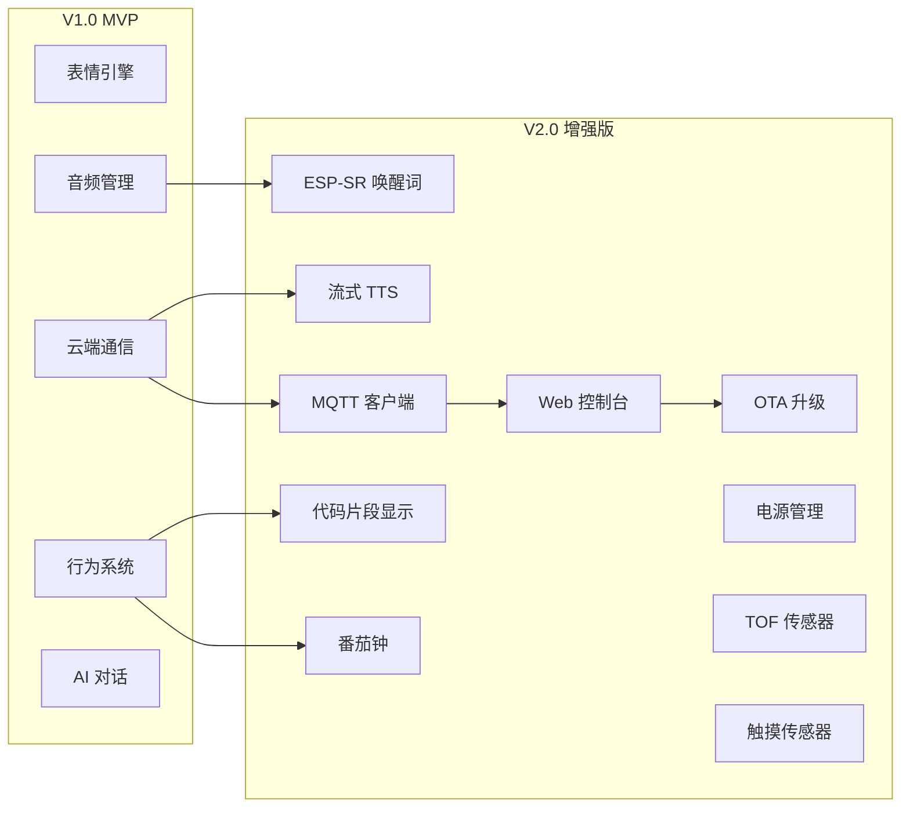

### 1.2 设计原则（延续 V1.0 + 新增）

| # | 原则 | 说明 |
|---|------|------|
| P1~P7 | V1.0 原则 | 分层解耦、事件驱动、无共享、防御编程、PSRAM策略、双核分离、优雅降级 |
| P8 | **渐进增强** | V2.0 模块可独立禁用，不影响 V1.0 核心功能 |
| P9 | **资源隔离** | ESP-SR 独占 Core0 时段，不抢占显示/运动实时性 |
| P10 | **配置驱动** | 新模块通过 menuconfig Kconfig 可选启用 |

---

## 2. 分层架构演进

### 2.1 V2.0 完整分层图

```
┌──────────────────────────────────────────────────────────────────────┐
│                    Application Layer (Tasks)                         │
│                                                                      │
│  ┌──────────┐ ┌──────────┐ ┌──────────┐ ┌──────────┐             │
│  │ behavior  │ │ ai_dialog │ │ pomodoro │ │  (扩展)   │             │
│  │ _task     │ │ _task     │ │ _task    │ │          │             │
│  └──────────┘ └──────────┘ └──────────┘ └──────────┘             │
├──────────────────────────────────────────────────────────────────────┤
│                    Service Layer (Managers)                          │
│                                                                      │
│  ┌──────────┐ ┌──────────┐ ┌──────────┐ ┌──────────┐             │
│  │ emotion   │ │ cloud    │ │ audio    │ │ display  │             │
│  │ _engine   │ │ _manager │ │ _manager │ │ _manager │             │
│  └──────────┘ └──────────┘ └──────────┘ └──────────┘             │
│  ┌──────────┐ ┌──────────┐ ┌──────────┐ ┌──────────┐             │
│  │ wifi     │ │ motion   │ │ sensor   │ │ battery  │             │
│  │ _manager │ │ _manager │ │ _manager │ │ _monitor │             │
│  └──────────┘ └──────────┘ └──────────┘ └──────────┘             │
│  ┌──────────┐ ┌──────────┐ ┌──────────┐ ┌──────────┐             │
│  │ mqtt     │ │ web      │ │ ota      │ │ power    │  ← V2.0新增 │
│  │ _client  │ │ _server  │ │ _service │ │ _manager │             │
│  └──────────┘ └──────────┘ └──────────┘ └──────────┘             │
│  ┌──────────┐ ┌──────────┐                                          │
│  │ wake     │ │ text     │                           ← V2.0新增 │
│  │ _word    │ │ _display │                                        │
│  └──────────┘ └──────────┘                                          │
├──────────────────────────────────────────────────────────────────────┤
│                    Framework Layer                                   │
│                                                                      │
│  ┌──────────────────┐ ┌──────────┐ ┌──────────┐                   │
│  │ event_bus        │ │ sysmon   │ │ config   │  ← V2.0新增      │
│  │ 事件总线          │ │ 系统监控  │ │ 运行时配置│                   │
│  └──────────────────┘ └──────────┘ └──────────┘                   │
├──────────────────────────────────────────────────────────────────────┤
│                    Driver Layer                                      │
│                                                                      │
│  ┌────┐ ┌────┐ ┌────┐ ┌────┐ ┌────┐ ┌────┐ ┌────┐ ┌────┐       │
│  │SPI │ │I2S │ │PWM │ │I2C │ │GPIO│ │ADC │ │TOF │ │TOUCH│ ← V2新增│
│  └────┘ └────┘ └────┘ └────┘ └────┘ └────┘ └────┘ └────┘       │
├──────────────────────────────────────────────────────────────────────┤
│                    BSP Layer                                         │
│  ┌──────────────────────────────────────────────────────────────┐  │
│  │ bsp_board  ·  bsp_pinmap  ·  bsp_config (V2新增)            │  │
│  └──────────────────────────────────────────────────────────────┘  │
└──────────────────────────────────────────────────────────────────────┘
```

### 2.2 V2.0 新增组件目录结构

```
firmware/components/
├── drivers/
│   ├── vl53l0x/              ← V2.0 新增
│   │   ├── vl53l0x.c
│   │   └── include/
│   │       └── vl53l0x.h
│   └── touch_sensor/         ← V2.0 新增
│       ├── touch_sensor.c
│       └── include/
│           └── touch_sensor.h
├── services/
│   ├── mqtt_client/          ← V2.0 新增
│   │   ├── mqtt_client.c
│   │   └── include/
│   │       └── mqtt_client.h
│   ├── web_server/           ← V2.0 新增
│   │   ├── web_server.c
│   │   └── include/
│   │       └── web_server.h
│   ├── ota_service/          ← V2.0 新增
│   │   ├── ota_service.c
│   │   └── include/
│   │       └── ota_service.h
│   ├── power_manager/        ← V2.0 新增
│   │   ├── power_manager.c
│   │   └── include/
│   │       └── power_manager.h
│   ├── wake_word/            ← V2.0 新增
│   │   ├── wake_word.c
│   │   └── include/
│   │       └── wake_word.h
│   └── text_display/         ← V2.0 新增
│       ├── text_display.c
│       ├── font_5x7.c        ← 位图字体数据
│       └── include/
│           └── text_display.h
├── app/
│   └── pomodoro/             ← V2.0 新增
│       ├── pomodoro.c
│       └── include/
│           └── pomodoro.h
└── framework/
    └── include/
        └── robot_events.h    ← 扩展新事件ID
```

---

## 3. 新增模块设计

### 3.1 ESP-SR 唤醒词模块 (wake_word)

#### 架构

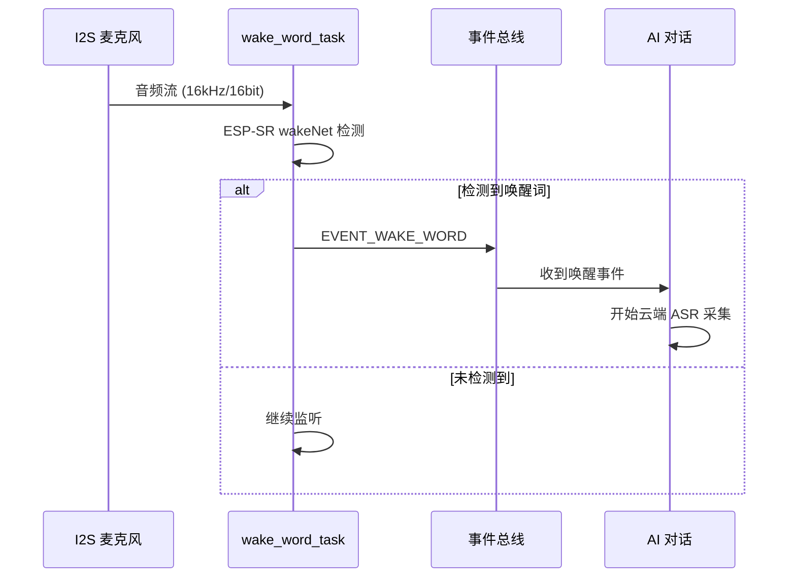

#### 关键设计决策

| 决策 | 选择 | 理由 |
|------|------|------|
| 唤醒词引擎 | ESP-SR wakeNet | Espressif 官方，ESP32-S3 优化，低资源占用 |
| 音频源 | 共享 I2S RX 通道 | 避免双麦克风/双 I2S，节省 GPIO 和功耗 |
| 运行模式 | 常驻后台，优先级低于音频播放 | 播放 TTS 时暂停检测，避免回声误触发 |
| 模型 | wakeNet "hilexin" 或自定义 | "Hi Buddy" 需训练自定义模型，先用 "hilexin" 验证流程 |

#### 接口

```c
typedef struct {
    const char *model_name;       /**< ESP-SR 模型名 */
    float detection_threshold;    /**< 检测阈值 (0.0-1.0, 默认 0.5) */
    uint8_t channel;              /**< I2S 通道号 */
} wake_word_config_t;

esp_err_t wake_word_init(const wake_word_config_t *config);
esp_err_t wake_word_start(void);    /* 开始监听 */
esp_err_t wake_word_stop(void);     /* 停止监听（TTS播放时） */
bool wake_word_is_listening(void);
```

### 3.2 流式 TTS 增强

#### 架构

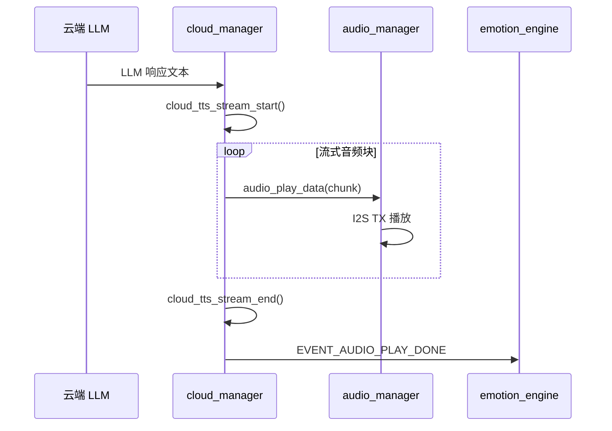

#### 关键设计

- **WebSocket TTS**: 使用 WebSocket 连接云端 TTS，边收音频边播放
- **双缓冲**: 播放缓冲区 64KB，预缓冲 4KB 后开始播放
- **Barge-in**: 唤醒词检测到时，立即停止播放，开始新对话
- **cloud_manager 扩展**: 新增 `cloud_tts_stream_start/data/end` 流式 API

### 3.3 MQTT 客户端

#### 架构

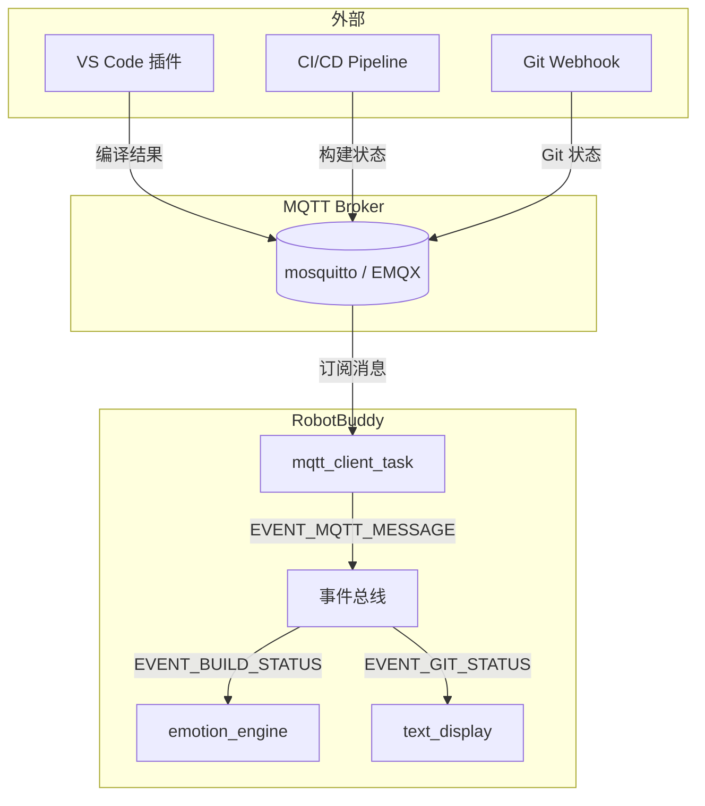

#### Topic 设计

| Topic | 方向 | Payload |
|-------|------|---------|
| `robotbuddy/{id}/cmd/build` | 下行 | `{"status":"success/fail","msg":"3 errors"}` |
| `robotbuddy/{id}/cmd/git` | 下行 | `{"uncommitted":3,"conflicts":0}` |
| `robotbuddy/{id}/cmd/text` | 下行 | `{"text":"Hello","priority":1}` |
| `robotbuddy/{id}/cmd/motion` | 下行 | `{"cmd":"forward","speed":150,"duration":500}` |
| `robotbuddy/{id}/cmd/emotion` | 下行 | `{"emotion":"happy","duration":3000}` |
| `robotbuddy/{id}/status/battery` | 上行 | `{"voltage":3.85,"percent":75,"charging":false}` |
| `robotbuddy/{id}/status/wifi` | 上行 | `{"ssid":"...","rssi":-45,"ip":"..."}` |
| `robotbuddy/{id}/status/emotion` | 上行 | `{"emotion":"idle"}` |

#### 接口

```c
typedef struct {
    const char *broker_url;       /**< mqtt://host:port */
    const char *client_id;        /**< 设备唯一 ID */
    const char *username;         /**< 认证用户名 (可NULL) */
    const char *password;         /**< 认证密码 (可NULL) */
    uint16_t keepalive_sec;       /**< 心跳间隔 (默认60) */
    uint8_t qos;                  /**< QoS 级别 (默认1) */
} mqtt_config_t;

esp_err_t mqtt_client_init(const mqtt_config_t *config);
esp_err_t mqtt_client_start(void);
esp_err_t mqtt_client_stop(void);
esp_err_t mqtt_client_publish(const char *topic, const void *data, size_t len);
bool mqtt_client_is_connected(void);
```

### 3.4 Web 控制台

#### 架构

```
浏览器 ──HTTP──► esp_http_server
                    │
                    ├── GET  /              → 状态仪表盘 HTML
                    ├── GET  /api/status    → JSON 状态数据
                    ├── GET  /api/config    → JSON 当前配置
                    ├── POST /api/wifi      → WiFi 配置
                    ├── POST /api/ai-key    → AI API Key 设置
                    ├── POST /api/ota       → 触发 OTA 升级
                    ├── POST /api/emotion   → 切换表情
                    ├── POST /api/motion    → 发送运动命令
                    └── GET  /api/ota-progress → OTA 进度查询
```

#### 嵌入式 HTML 策略

- 使用 C 嵌入字符串宏 `#define HTML_DASHBOARD "..."`
- 最小化 HTML/CSS/JS，无外部依赖
- 响应式设计，适配手机和桌面浏览器
- 预估 HTML 总大小 < 8KB（gzip 后 < 3KB）

#### 接口

```c
typedef struct {
    uint16_t port;                /**< 监听端口 (默认80) */
    uint8_t max_connections;      /**< 最大并发连接 (默认4) */
    bool auth_enabled;            /**< 是否启用 Basic Auth */
    char username[32];            /**< Auth 用户名 */
    char password[32];            /**< Auth 密码 */
} web_server_config_t;

esp_err_t web_server_init(const web_server_config_t *config);
esp_err_t web_server_start(void);
esp_err_t web_server_stop(void);
```

### 3.5 OTA 升级服务

#### 架构

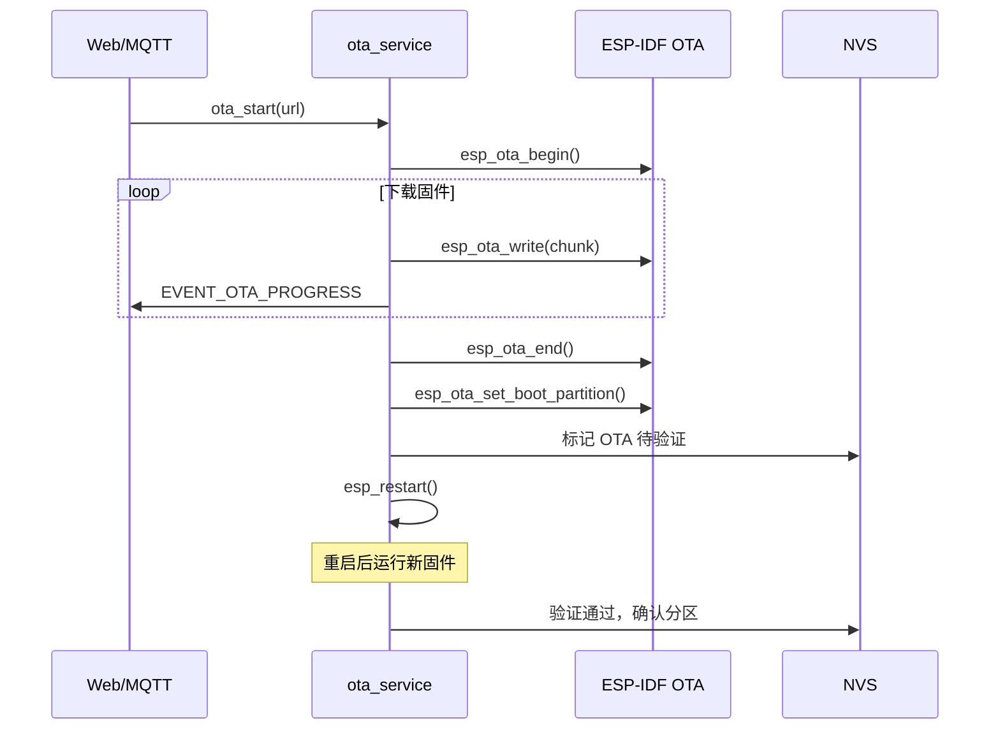

#### 接口

```c
typedef struct {
    char firmware_url[256];       /**< 固件下载 URL */
    uint32_t expected_size;       /**< 预期固件大小 (0=不校验) */
    char expected_sha256[65];     /**< 预期 SHA256 (空=不校验) */
} ota_config_t;

esp_err_t ota_service_init(void);
esp_err_t ota_start(const char *url, const char *sha256);
esp_err_t ota_cancel(void);
uint8_t ota_get_progress(void);   /* 0-100 */
ota_state_t ota_get_state(void);
```

### 3.6 文本显示模块 (text_display)

#### 架构

```
┌────────────────────────────────────────┐
│  240 × 240 屏幕                         │
│                                        │
│  ┌────────────────────────────────┐    │
│  │                                │    │
│  │     表情区域 (240 × 180)       │    │ ← emotion_engine 渲染
│  │     ●‿●                       │    │
│  │                                │    │
│  ├────────────────────────────────┤    │
│  │  状态图标区 (24×24)  │  WiFi 🔋 │    │ ← 右上角
│  │────────────────────────────────│    │
│  │  文本滚动区 (240 × 60)         │    │ ← text_display 渲染
│  │  > npm run build: 3 errors... │    │
│  └────────────────────────────────┘    │
└────────────────────────────────────────┘
```

#### 渲染策略

- **分区渲染**: 表情区域和文本区域独立渲染，避免全屏重绘
- **字体**: 5×7 位图字体，ASCII 0x20-0x7E，每字符 5 字节
- **滚动**: 横向逐像素滚动，2px/帧 @ 30FPS = 60px/s
- **消息队列**: 最多 5 条消息，FIFO，每条最长 200 字符
- **超时**: 消息显示 10 秒后自动清除

#### 接口

```c
typedef struct {
    uint16_t y_start;             /**< 文本区域起始 Y (默认180) */
    uint16_t height;              /**< 文本区域高度 (默认60) */
    uint8_t scroll_speed;         /**< 滚动速度 px/帧 (默认2) */
    uint16_t display_timeout_ms;  /**< 消息超时 (默认10000) */
    uint8_t max_messages;         /**< 最大缓存消息数 (默认5) */
} text_display_config_t;

esp_err_t text_display_init(const text_display_config_t *config);
esp_err_t text_display_show_message(const char *text, uint8_t priority);
esp_err_t text_display_clear(void);
void text_display_render(uint16_t *fb, uint16_t width, uint16_t height);
```

### 3.7 番茄钟模块 (pomodoro)

#### 接口

```c
typedef struct {
    uint16_t work_duration_min;   /**< 工作时长 (默认25) */
    uint16_t break_duration_min;  /**< 休息时长 (默认5) */
    uint8_t max_rounds;           /**< 最大轮数 (默认4) */
} pomodoro_config_t;

esp_err_t pomodoro_init(const pomodoro_config_t *config);
esp_err_t pomodoro_start(void);
esp_err_t pomodoro_pause(void);
esp_err_t pomodoro_stop(void);
pomodoro_state_t pomodoro_get_state(void);
uint16_t pomodoro_get_remaining_sec(void);
```

### 3.8 电源管理模块 (power_manager)

#### 状态机

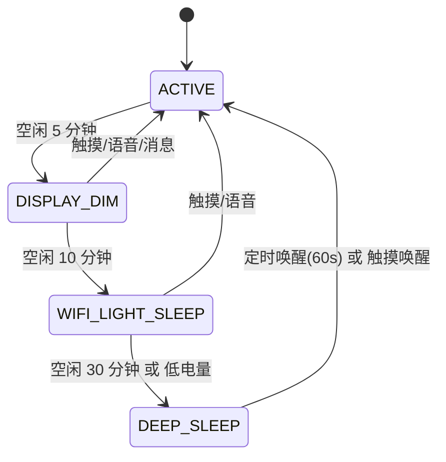

#### 接口

```c
typedef enum {
    POWER_STATE_ACTIVE = 0,
    POWER_STATE_DISPLAY_DIM,
    POWER_STATE_WIFI_LIGHT_SLEEP,
    POWER_STATE_DEEP_SLEEP,
} power_state_t;

typedef struct {
    uint32_t dim_timeout_ms;           /**< 降亮度超时 (默认300000) */
    uint32_t light_sleep_timeout_ms;   /**< WiFi Light Sleep 超时 (默认600000) */
    uint32_t deep_sleep_timeout_ms;    /**< 深睡眠超时 (默认1800000) */
    uint8_t dim_brightness;            /**< 降亮度值 (默认32) */
    uint8_t active_brightness;         /**< 活跃亮度值 (默认128) */
} power_config_t;

esp_err_t power_manager_init(const power_config_t *config);
power_state_t power_manager_get_state(void);
void power_manager_notify_activity(void);  /* 重置空闲计时器 */
```

### 3.9 TOF 传感器驱动 (vl53l0x)

#### 接口

```c
typedef struct {
    i2c_port_t i2c_port;          /**< I2C 端口号 */
    uint8_t i2c_addr;             /**< I2C 地址 (默认0x29) */
    uint16_t timeout_ms;          /**< 测距超时 (默认30) */
} vl53l0x_config_t;

esp_err_t vl53l0x_init(const vl53l0x_config_t *config);
esp_err_t vl53l0x_start_ranging(void);
esp_err_t vl53l0x_stop_ranging(void);
esp_err_t vl53l0x_get_distance_mm(uint16_t *distance_mm);
```

### 3.10 触摸传感器驱动 (touch_sensor)

#### 接口

```c
typedef enum {
    TOUCH_GESTURE_NONE = 0,
    TOUCH_GESTURE_SINGLE_TAP,
    TOUCH_GESTURE_DOUBLE_TAP,
    TOUCH_GESTURE_LONG_PRESS,
} touch_gesture_t;

typedef struct {
    gpio_num_t pin;               /**< 触摸 GPIO */
    uint16_t threshold;           /**< 触发阈值 */
    uint16_t debounce_ms;         /**< 防抖时间 (默认50) */
    uint16_t double_tap_ms;       /**< 双击间隔 (默认300) */
    uint16_t long_press_ms;       /**< 长按阈值 (默认1000) */
} touch_sensor_config_t;

esp_err_t touch_sensor_init(const touch_sensor_config_t *config);
touch_gesture_t touch_sensor_get_gesture(void);
```

---

## 4. FreeRTOS 任务设计

### 4.1 V2.0 完整任务表

| 任务名 | 优先级 | 栈大小 | 核心 | 周期 | 职责 | 版本 |
|--------|--------|--------|------|------|------|------|
| audio_capture | 8 | 8KB | 0 | 事件 | I2S 麦克风采集 | V1 |
| audio_playback | 7 | 8KB | 0 | 事件 | I2S 扬声器播放 | V1 |
| wake_net | 7 | 20KB | 0 | 持续 | ESP-SR 唤醒词检测 | **V2** |
| display_refresh | 6 | 4KB | 1 | 33ms | SPI 屏幕刷新 | V1 |
| emotion_engine | 5 | 4KB | 1 | 50ms | 表情动画+文本渲染 | V1→V2 |
| cloud_comm | 4 | 12KB | 0 | 事件 | HTTP/WS 云端通信 | V1→V2 |
| mqtt_client | 4 | 8KB | 0 | 事件 | MQTT 收发 | **V2** |
| motion_ctrl | 3 | 2KB | 1 | 10ms | 电机 PID 控制 | V1 |
| sensor_poll | 2 | 2KB | 1 | 50ms | IMU/IR/TOF 传感器 | V1→V2 |
| web_server | 2 | 8KB | 0 | 事件 | HTTP 请求处理 | **V2** |
| behavior_mgr | 1 | 4KB | 1 | 100ms | 行为决策 | V1→V2 |
| pomodoro | 1 | 2KB | 1 | 1s | 番茄钟计时 | **V2** |
| ota_service | 1 | 12KB | 0 | 按需 | OTA 固件下载 | **V2** |
| idle_monitor | 0 | 1KB | 1 | 1s | 空闲检测→电源管理 | V1→V2 |

### 4.2 双核任务分配

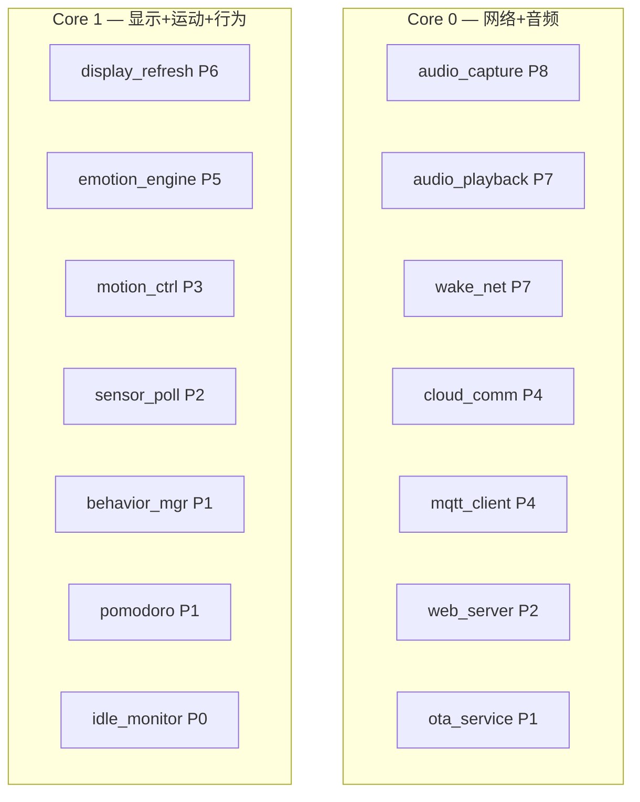

### 4.3 任务间互斥

| 场景 | 互斥策略 |
|------|-----|
| TTS 播放时 | wake_net 暂停（避免回声误触发） |
| OTA 下载时 | cloud_comm 互斥（共享 HTTP 客户端） |
| WiFi Light Sleep | mqtt_client/web_server 暂停 |
| 唤醒词触发 | audio_capture 切换到 ASR 模式 |

---

## 5. 事件总线扩展

### 5.1 V2.0 新增事件 ID

```c
/* Display events (0x07xx) — V2.0 */
EVENT_DISPLAY_TEXT_MSG       = 0x0700,
EVENT_DISPLAY_CLEAR_TEXT     = 0x0701,
EVENT_DISPLAY_STATUS_ICON    = 0x0702,

/* Touch events (0x08xx) — V2.0 */
EVENT_TOUCH_SINGLE          = 0x0800,
EVENT_TOUCH_DOUBLE          = 0x0801,
EVENT_TOUCH_LONG            = 0x0802,

/* Wake word events (0x09xx) — V2.0 */
EVENT_WAKE_WORD_DETECTED    = 0x0900,

/* MQTT events (0x0Axx) — V2.0 */
EVENT_MQTT_CONNECTED        = 0x0A00,
EVENT_MQTT_DISCONNECTED     = 0x0A01,
EVENT_MQTT_MESSAGE          = 0x0A02,

/* OTA events (0x0Bxx) — V2.0 */
EVENT_OTA_START             = 0x0B00,
EVENT_OTA_PROGRESS          = 0x0B01,
EVENT_OTA_COMPLETE          = 0x0B02,
EVENT_OTA_ERROR             = 0x0B03,

/* Pomodoro events (0x0Cxx) — V2.0 */
EVENT_POMODORO_START        = 0x0C00,
EVENT_POMODORO_TICK         = 0x0C01,
EVENT_POMODORO_DONE         = 0x0C02,
EVENT_POMODORO_BREAK_DONE   = 0x0C03,

/* Dev tool events (0x0Dxx) — V2.0 */
EVENT_BUILD_STATUS          = 0x0D00,
EVENT_GIT_STATUS            = 0x0D01,

/* Power events (0x0Exx) — V2.0 */
EVENT_POWER_STATE_CHANGE    = 0x0E00,
EVENT_POWER_ENTER_SLEEP     = 0x0E01,
EVENT_POWER_WAKEUP          = 0x0E02,
```

### 5.2 新增 Payload 结构

```c
/* 文本消息 */
typedef struct {
    char text[200];              /**< 消息文本 */
    uint8_t priority;            /**< 优先级 (0=低, 1=中, 2=高) */
    uint16_t duration_ms;        /**< 显示时长 (0=默认10s) */
} text_msg_event_t;

/* 唤醒词 */
typedef struct {
    char keyword[32];            /**< 识别到的关键词 */
    float confidence;            /**< 置信度 */
} wake_word_event_t;

/* MQTT 消息 */
typedef struct {
    char topic[128];             /**< Topic 路径 */
    char payload[512];           /**< 消息内容 */
    size_t payload_len;          /**< 内容长度 */
} mqtt_message_event_t;

/* OTA 进度 */
typedef struct {
    uint8_t percent;             /**< 进度百分比 (0-100) */
    uint32_t downloaded;         /**< 已下载字节 */
    uint32_t total;              /**< 总字节 */
} ota_progress_event_t;

/* 编译状态 */
typedef struct {
    uint8_t status;              /**< 0=running, 1=success, 2=fail, 3=warning */
    char msg[64];                /**< 状态消息 */
} build_status_event_t;

/* Git 状态 */
typedef struct {
    uint8_t uncommitted;         /**< 未提交文件数 */
    uint8_t conflicts;           /**< 冲突文件数 */
} git_status_event_t;

/* 番茄钟 */
typedef struct {
    uint16_t remaining_sec;      /**< 剩余秒数 */
    uint8_t round;               /**< 当前轮数 */
    bool is_break;               /**< 是否休息中 */
} pomodoro_event_t;

/* 电源状态 */
typedef struct {
    power_state_t state;         /**< 电源状态 */
    uint32_t idle_ms;            /**< 空闲时长 */
} power_event_t;
```

---

## 6. 模块接口契约

### 6.1 事件订阅关系（V2.0 完整）

| 订阅者 | 订阅事件 |
|--------|---------|
| behavior_system | WIFI_CONNECTED/DISCONNECTED, LOW_BATTERY, CRITICAL_BATTERY, AUDIO_CAPTURE_START/STOP, AUDIO_PLAY_START/DONE/STOP/ERROR, CLOUD_LLM_RESPONSE, CLOUD_ERROR, SENSOR_OBSTACLE/EDGE/FALL_DETECTED, EMOTION_STATE_CHANGE, **WAKE_WORD_DETECTED, TOUCH_SINGLE/DOUBLE/LONG, BUILD_STATUS, GIT_STATUS, POMODORO_DONE, POWER_STATE_CHANGE** |
| emotion_engine | EMOTION_STATE_CHANGE, **BUILD_STATUS, GIT_STATUS, POMODORO_TICK** |
| text_display | **DISPLAY_TEXT_MSG, DISPLAY_CLEAR_TEXT, BUILD_STATUS, GIT_STATUS, MQTT_MESSAGE** |
| wake_word | **AUDIO_PLAY_START(暂停), AUDIO_PLAY_DONE(恢复)** |
| mqtt_client | **SENSOR_BATTERY, WIFI_CONNECTED/DISCONNECTED, EMOTION_STATE_CHANGE, POWER_STATE_CHANGE** |
| power_manager | **TOUCH_SINGLE/DOUBLE/LONG, WAKE_WORD_DETECTED, AUDIO_CAPTURE_START, MQTT_MESSAGE** |
| pomodoro | **POMODORO_START, TOUCH_SINGLE(暂停/恢复)** |

### 6.2 模块初始化顺序（V2.0）

```
Phase 1: Infrastructure
  ├── nvs_flash_init()
  ├── event_bus_init()
  └── sysmon_init()

Phase 2: Board & Drivers
  └── bsp_board_init()

Phase 3: V1 Services
  ├── wifi_manager_init() + start()
  ├── display_manager_init()
  ├── emotion_engine_init()
  ├── audio_manager_init()
  ├── motion_manager_init()
  ├── sensor_manager_init()
  └── battery_monitor_init()

Phase 4: V2 Services (新增)
  ├── wake_word_init()           ← 依赖 audio_manager
  ├── text_display_init()        ← 依赖 display_manager
  ├── mqtt_client_init()         ← 依赖 wifi_manager
  ├── web_server_init()          ← 依赖 wifi_manager
  ├── ota_service_init()         ← 依赖 wifi_manager
  └── power_manager_init()       ← 依赖 battery_monitor

Phase 5: Application
  ├── behavior_system_init()     ← V1 (扩展订阅)
  ├── ai_dialog_init()           ← V1 (增强流式TTS)
  └── pomodoro_init()            ← V2 新增

Phase 6: Start Tasks
  ├── display_task (Core 1, P6)
  ├── wake_word_start()          ← 启动唤醒词监听
  ├── mqtt_client_start()        ← 启动 MQTT 连接
  ├── web_server_start()         ← 启动 HTTP 服务器
  └── sysmon_register_task() × N
```

---

## 7. 数据流与时序

### 7.1 唤醒词 → AI 对话完整流程

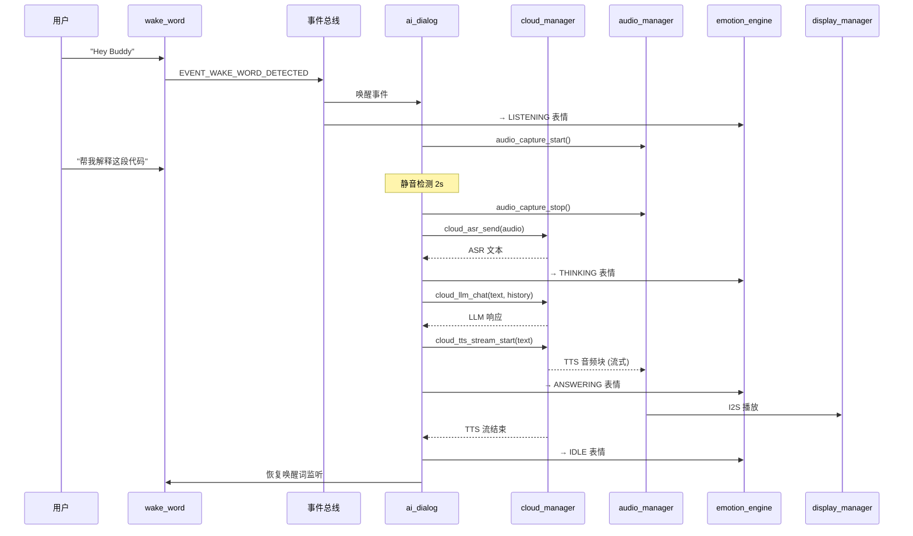

### 7.2 编译结果推送流程

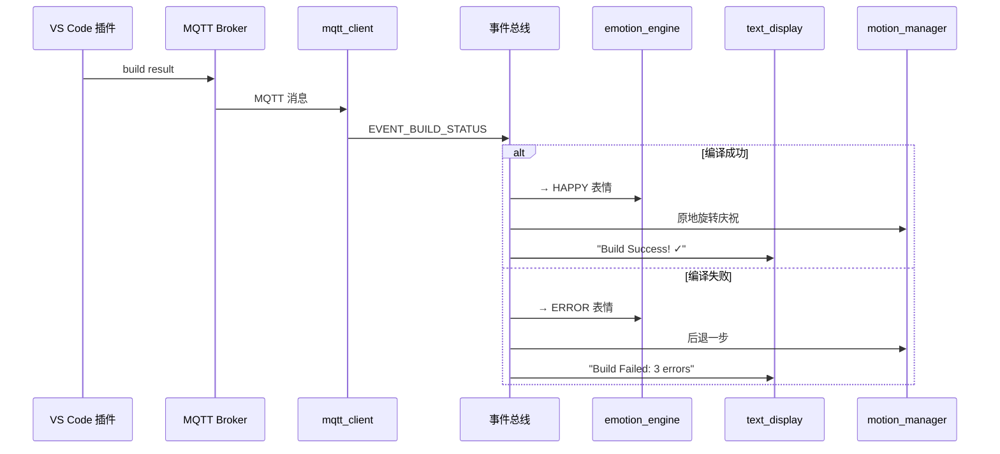

### 7.3 番茄钟流程

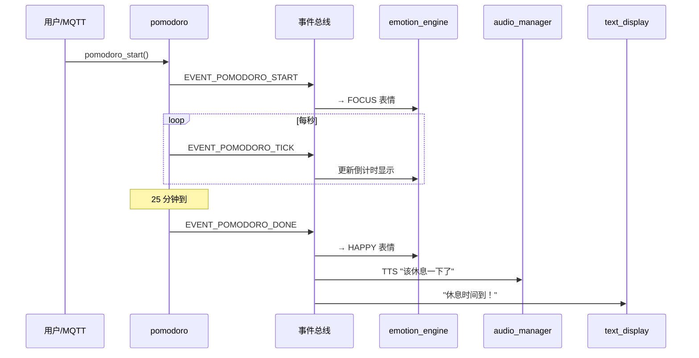

---

## 8. 状态机设计

### 8.1 行为系统 V2.0 扩展

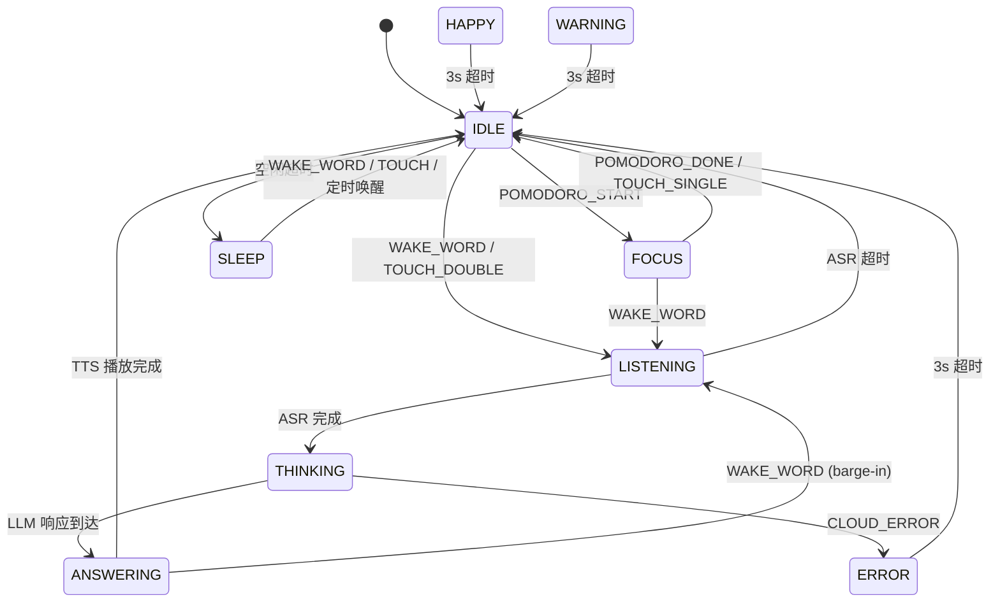

### 8.2 电源管理状态机

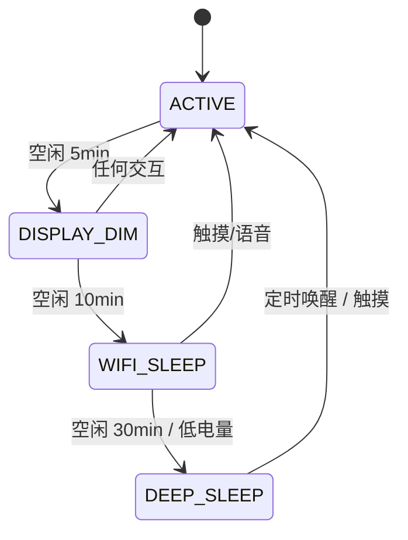

---

## 9. 内存预算

### 9.1 V2.0 内存占用估算

| 类别 | V1.0 占用 | V2.0 新增 | 总计 | 限制 |
|------|----------|----------|------|------|
| **SRAM (栈)** | ~50KB | ~50KB | ~100KB | ~460KB |
| **PSRAM (缓冲)** | ~750KB | ~350KB | ~1100KB | 8192KB |
| Flash (代码) | ~1.5MB | ~500KB | ~2MB | 16384KB |

### 9.2 V2.0 新增 PSRAM 占用明细

| 缓冲 | 大小 | 说明 |
|------|------|------|
| ESP-SR 模型 | ~100KB | wakeNet 神经网络权重 |
| ESP-SR 工作缓冲 | ~50KB | 特征提取+推理中间缓冲 |
| MQTT 接收缓冲 | ~2KB | 消息解析 |
| Web Server 缓冲 | ~8KB | HTTP 请求/响应 |
| OTA 下载缓冲 | ~4KB | 固件分块下载 |
| 文本显示字体 | ~0.5KB | 5×7 位图字体 (95字符) |
| **合计** | **~165KB** | PSRAM 充足 |

### 9.3 栈使用估算

| 任务 | 栈大小 | 预估峰值 | 安全裕量 |
|------|--------|---------|---------|
| wake_net | 20KB | ~15KB | 33% |
| mqtt_client | 8KB | ~5KB | 60% |
| web_server | 8KB | ~6KB | 33% |
| ota_service | 12KB | ~8KB | 50% |
| pomodoro | 2KB | ~0.5KB | 300% |

---

## 10. V1.0 问题修复方案

### 10.1 必须在 V2.0 修复的问题

| # | 问题 | 修复方案 | 影响模块 |
|---|------|---------|---------|
| 1 | I2C 句柄泄漏 | `bsp_board_deinit()` 中正确释放 I2C 总线句柄 | bsp_board.c |
| 2 | I2S 死代码 | 删除 `bsp_board.c` 中未使用的 I2S 初始化代码 | bsp_board.c |
| 3 | TTS 占位延迟 | 实现流式 TTS：WebSocket + 边收边播 | ai_dialog.c, cloud_manager.c |
| 4 | MPU6050 旧 I2C API | 迁移到 `driver/i2c_master.h` 新 API | mpu6050.c |
| 5 | TLS 未验证 | 添加 CA 证书包，启用证书校验 | cloud_manager.c |

### 10.2 建议在 V2.0 修复的问题

| # | 问题 | 修复方案 | 影响模块 |
|---|------|---------|---------|
| 6 | audio_play_tone 未实现 | 实现正弦波音调生成 | audio_manager.c |
| 7 | PSRAM 缓存一致性 | 添加 `esp_cache_msync()` 调用 | display_manager.c |
| 8 | 事件总线竞态 | 添加 RCU 或读写锁保护订阅列表 | event_bus.c |

---

> **下一步：** 基于此架构设计，进入第3阶段——编码实现
