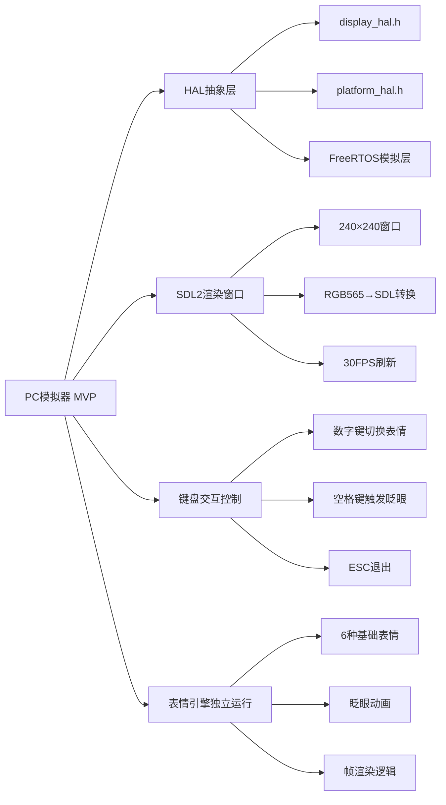
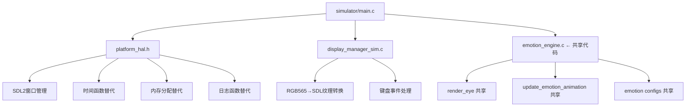

# FR-01 显示系统 — PC模拟器需求规格

> **版本:** 1.0  
> **日期:** 2026-07-11  
> **功能编号:** FR-01  
> **需求标题:** 显示系统 — 支持在PC上不依赖硬件执行Demo调试  
> **状态:** 需求分析完成  

---

## 目录

1. [需求概览](#1-需求概览)
2. [功能描述](#2-功能描述)
3. [硬件依赖与PC适配](#3-硬件依赖与pc适配)
4. [FreeRTOS任务影响](#4-freertos任务影响)
5. [云/网络依赖](#5-云网络依赖)
6. [异常处理](#6-异常处理)
7. [验收条件](#7-验收条件)
8. [模块依赖关系](#8-模块依赖关系)

---

## 1. 需求概览

### 1.1 一句话定义

> 在PC（Windows/macOS/Linux）上运行RobotBuddy表情引擎和显示系统，无需ESP32硬件即可调试和预览表情动画。

### 1.2 为什么要做

| 痛点 | 说明 |
|------|------|
| 硬件依赖 | 当前表情引擎只能在ESP32-S3上运行，开发调试需要烧录固件 |
| 迭代慢 | 每次修改表情参数都需要编译→烧录→重启，一次迭代3-5分钟 |
| 无可视化 | 无法在开发时直观看到表情渲染效果，只能靠目视LCD |
| 资源有限 | ESP32调试输出受限（UART日志），难以分析帧率/渲染性能 |

### 1.3 核心价值

| 价值 | 说明 |
|------|------|
| **快速迭代** | 修改表情参数后1秒内看到效果（编译+运行） |
| **可视化调试** | PC窗口实时显示240×240渲染结果，支持截图/录屏 |
| **性能分析** | 显示FPS、帧渲染时间、内存使用等指标 |
| **交互控制** | 键盘切换11种表情，验证状态切换和动画 |
| **CI/CD友好** | 可在CI中运行单元测试，验证渲染逻辑正确性 |

### 1.4 MVP范围



---

## 2. 功能描述

### 2.1 做什么

| 项 | 说明 |
|----|------|
| **做什么** | 在PC上运行RobotBuddy的表情引擎和显示管线，通过SDL2窗口模拟ST7789 LCD |
| **触发条件** | 开发者在PC上编译运行 `simulator/` 目录下的模拟器可执行文件 |
| **期望结果** | 弹出240×240（可缩放）的窗口，实时渲染机器人眼睛表情动画，≥30FPS |

### 2.2 功能清单

| # | 功能 | 描述 | 优先级 |
|---|------|------|--------|
| F1 | HAL抽象层 | 将ESP32硬件依赖（SPI/PSRAM/定时器）抽象为可替换接口 | P0 |
| F2 | SDL2渲染后端 | 用SDL2窗口替代ST7789 SPI输出，显示帧缓冲内容 | P0 |
| F3 | FreeRTOS模拟 | 提供任务创建、延时、队列等基本模拟 | P0 |
| F4 | 键盘交互 | 数字键1-0切换11种表情，空格触发眨眼 | P0 |
| F5 | 表情引擎移植 | emotion_engine.c在PC上无修改运行 | P0 |
| F6 | FPS显示 | 窗口标题栏显示当前FPS和表情名称 | P1 |
| F7 | 帧缓冲导出 | 支持将当前帧保存为PNG | P2 |
| F8 | 窗口缩放 | 支持2×、3×放大显示（480×480, 720×720） | P1 |

### 2.3 表情切换映射

| 按键 | 表情 | 说明 |
|------|------|------|
| `1` | IDLE | 待机 — 微动眨眼 |
| `2` | LISTENING | 聆听 — 放大眼睛 |
| `3` | THINKING | 思考 — 眼睛左右移动 |
| `4` | ANSWERING | 说话 — 眼睛微动 |
| `5` | HAPPY | 开心 — 弯月笑眼 |
| `6` | CONFUSED | 困惑 — 歪头 |
| `7` | WARNING | 警告 — 黄色闪烁 |
| `8` | ERROR | 错误 — 红色怒眼 |
| `9` | FOCUS | 专注 — 半闭眼 |
| `0` | SLEEP | 睡眠 — 闭眼呼吸 |
| `Q` / `q` | EXCITED | 兴奋 — 跳动 |
| `Space` | 眨眼 | 手动触发一次眨眼 |
| `ESC` | 退出 | 关闭模拟器 |
| `+` / `-` | 缩放 | 调整窗口大小倍率 |
| `S` / `s` | 截图 | 保存当前帧为PNG |

---

## 3. 硬件依赖与PC适配

### 3.1 需要抽象的硬件依赖

| ESP32硬件 | 当前代码位置 | PC替代方案 |
|-----------|-------------|-----------|
| SPI总线 (ST7789) | `st7789.c` → `spi_device_queue_transaction()` | SDL2纹理渲染 |
| PSRAM帧缓冲 | `display_manager.c` → `heap_caps_malloc(MALLOC_CAP_SPIRAM)` | 标准`malloc()` |
| ESP-IDF定时器 | `esp_timer_get_time()` | `clock_gettime()` / `SDL_GetTicks()` |
| LEDC PWM背光 | `st7789.c` → `ledc_set_duty()` | 忽略（PC始终全亮度） |
| GPIO控制 | `bsp_board.c` → GPIO初始化 | 忽略 |
| FreeRTOS任务 | `xTaskCreatePinnedToCore()` | `SDL_CreateThread()` 或POSIX线程 |
| FreeRTOS延时 | `vTaskDelay()` / `pdMS_TO_TICKS()` | `SDL_Delay()` / `usleep()` |
| ESP日志 | `ESP_LOGI/W/E/D` | `printf()` 带TAG前缀 |
| `esp_err_t` | ESP-IDF错误码 | 自定义`esp_err_t`头文件 |
| `esp_random()` | 硬件随机数 | `rand()` |

### 3.2 内存对比

| 资源 | ESP32-S3 | PC模拟器 | 说明 |
|------|----------|---------|------|
| 帧缓冲 | 115 KB (PSRAM) | 115 KB (堆) | 大小相同，来源不同 |
| SRAM | ~460 KB 可用 | 充足 | PC不受限 |
| 栈 | 各任务4-12 KB | 不限 | 模拟器单线程即可 |
| CPU | 240 MHz 双核 | 多核 GHz | 性能充裕 |

### 3.3 跨平台构建

| 平台 | 编译器 | 依赖 |
|------|--------|------|
| Windows | MSVC / MinGW | SDL2-devel |
| macOS | Clang | SDL2 (brew install sdl2) |
| Linux | GCC | libsdl2-dev |

---

## 4. FreeRTOS任务影响

### 4.1 模拟器任务模型

| ESP32任务 | 模拟器处理 | 说明 |
|-----------|-----------|------|
| `display_task` | 主循环 `while(1)` + `SDL_Delay(33)` | 渲染30FPS |
| `emotion_task` | 主循环内调用 `emotion_render_frame()` | 合并到显示循环 |
| `behavior_task` | 键盘事件驱动 | SDL键盘事件替代 |
| `sysmon_task` | 省略 | PC不需要看门狗 |

### 4.2 通信机制映射

| FreeRTOS机制 | PC模拟器替代 | 说明 |
|-------------|-------------|------|
| `xQueueCreate` / `xQueueSend` | 直接函数调用 | 单线程无需队列 |
| `xEventGroupCreate` | 全局变量 | 模拟器简化 |
| `vTaskDelay` | `SDL_Delay` | 平台延时 |
| `esp_timer_get_time` | `SDL_GetTicks` | 毫秒级时间戳 |

---

## 5. 云/网络依赖

**无依赖。** 模拟器仅运行显示系统，不涉及WiFi、ASR、LLM、TTS等云端功能。

---

## 6. 异常处理

| 异常 | 处理策略 |
|------|---------|
| SDL2初始化失败 | 打印错误信息，退出程序（exit 1） |
| 帧缓冲分配失败 | 打印错误信息，退出程序 |
| 窗口创建失败 | 打印错误信息，退出程序 |
| 表情ID越界 | 忽略按键，保持当前表情 |
| 截图目录不存在 | 自动创建 `screenshots/` 目录 |

---

## 7. 验收条件

| # | 条件 | 测试方法 |
|---|------|---------|
| AC-01 | 模拟器在PC上成功启动，显示240×240窗口 | 运行 `./robotbuddy_sim`，确认窗口出现 |
| AC-02 | 11种表情均能正确显示 | 按数字键1-0和Q切换，目视确认每种表情特征 |
| AC-03 | 表情切换动画流畅，无撕裂 | 快速切换表情，观察过渡效果 |
| AC-04 | 帧率 ≥ 30 FPS | 窗口标题栏显示FPS值 |
| AC-05 | 眨眼动画自然（2-5秒随机间隔） | IDLE表情下等待，观察眨眼频率 |
| AC-06 | 键盘交互响应正确 | 按每个键验证对应功能 |
| AC-07 | 窗口缩放功能正常 | 按+/-键调整倍率，确认渲染正确 |
| AC-08 | 截图功能正常 | 按S键，确认PNG文件生成 |
| AC-09 | 表情引擎代码与ESP32版本100%共享 | diff比较，零差异 |
| AC-10 | 三平台编译通过 | Windows/macOS/Linux均编译成功 |

---

## 8. 模块依赖关系



### 8.1 文件结构

```
firmware/
├── components/
│   ├── services/
│   │   ├── emotion_engine/
│   │   │   ├── emotion_engine.c          # ← 共享，不修改
│   │   │   └── include/
│   │   │       └── emotion_engine.h      # ← 共享，不修改
│   │   └── display_manager/
│   │       ├── display_manager.c          # ← ESP32版本（PSRAM/SPI）
│   │       └── include/
│   │           └── display_manager.h      # ← 共享接口
│
simulator/                                 # ← 新增：PC模拟器
├── CMakeLists.txt                        # 模拟器构建脚本
├── main.c                                # 模拟器入口（SDL主循环）
├── platform/
│   ├── platform_hal.h                    # 硬件抽象接口
│   ├── platform_sdl.c                    # SDL2实现
│   ├── esp_compat.h                      # ESP-IDF类型兼容
│   └── freertos_sim.h                    # FreeRTOS模拟
├── drivers/
│   └── display_sim.c                     # 显示管理器PC实现
├── assets/                               # 资源文件
│   └── icon.bmp                          # 窗口图标
└── screenshots/                           # 截图输出目录
```

### 8.2 关键设计原则

| # | 原则 | 说明 |
|---|------|------|
| P1 | **共享代码零修改** | `emotion_engine.c` 和 `emotion_engine.h` 必须与ESP32版本完全相同 |
| P2 | **接口不变** | `display_manager.h` 的API在PC版中保持相同签名 |
| P3 | **条件编译最小化** | 不用 `#ifdef SIMULATOR` 污染共享代码 |
| P4 | **单CMakeLists** | 模拟器有独立CMakeLists.txt，不依赖ESP-IDF构建系统 |
| P5 | **三平台支持** | Windows/macOS/Linux均能编译运行 |

---

## Requirement Skill Checklist

- [x] **硬件能力是否满足需求？** — PC性能远超ESP32，SDL2跨平台成熟
- [x] **实时性是否能保证？** — PC多核GHz级CPU，30FPS毫无压力
- [x] **功耗影响是否可接受？** — N/A（PC桌面环境）
- [x] **是否有离线降级方案？** — 模拟器本身就是离线方案，无需网络
- [x] **边界条件是否覆盖？** — SDL初始化失败、帧缓冲分配失败均已处理
- [x] **安全风险是否考虑？** — 无安全风险（纯本地运行）
- [x] **依赖是否明确？** — SDL2是唯一外部依赖，成熟稳定
- [x] **验收条件是否明确可测？** — 10条AC均有具体测试方法

---

> **文档版本:** 1.0  
> **下次审查:** 架构设计完成后更新接口契约  
> **相关文档:**
> - `docs/requirement/v1.0-mvp-requirements.md` (FR-01显示系统)
> - `docs/桌面机器人设计需求.md` (PRD V2.0)
> - `firmware/components/services/emotion_engine/` (现有表情引擎代码)