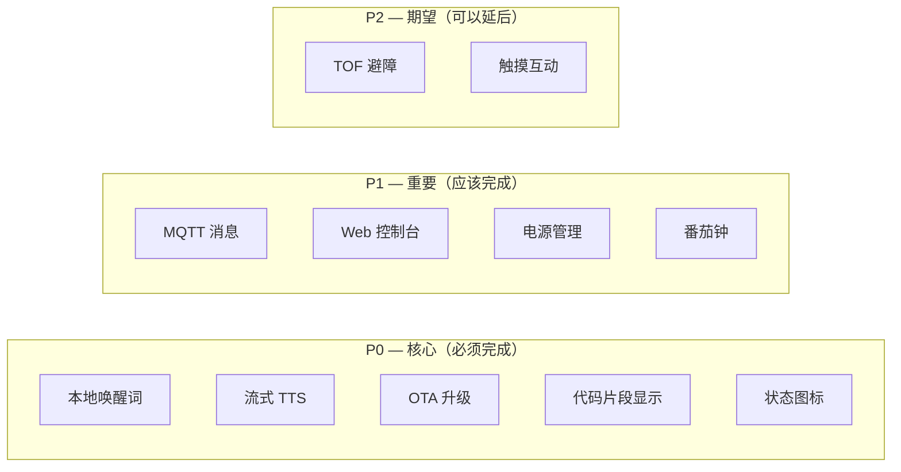
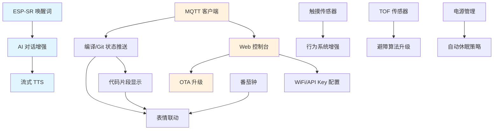

# RobotBuddy V2.0 增强版 — 功能需求分析

> **版本：** V2.0
> **日期：** 2026-07-18
> **基于：** `docs/桌面机器人设计需求.md` PRD V2.0
> **前置：** V1.0 MVP (固件 v0.2.0) 已完成

---

## 1. V1.0 已实现功能回顾

| 模块 | 已实现 | 实现深度 |
|------|--------|---------|
| BSP 板级支持包 | ✅ 引脚定义、SPI/I2C/I2S/PWM/ADC 初始化 | 完整 |
| ST7789 显示驱动 | ✅ SPI 驱动、帧缓冲 | 完整 |
| 显示管理器 | ✅ 帧缓冲分配、基本绘图原语 | 完整 |
| 情绪引擎 | ✅ 11种表情状态、眨眼动画、眼睛渲染 | 完整 |
| DRV8833 电机驱动 | ✅ PWM 双路 H 桥控制 | 完整 |
| MPU6050 IMU | ✅ I2C 读取加速度/陀螺仪 | 完整 |
| 红外传感器 | ✅ 避障/防跌落 GPIO 读取 | 完整 |
| 电池检测 | ✅ ADC 分压读电压 | 完整 |
| WiFi 管理器 | ✅ STA/SmartConfig/自动重连/NVS存储 | 完整 |
| 音频管理器 | ✅ I2S 采集/播放、Ring Buffer | 完整 |
| 云端管理器 | ✅ ASR/LLM/TTS HTTP请求、重试+故障转移、NVS API Key | 完整 |
| 行为系统 | ✅ 状态机驱动、事件总线订阅 | 完整 |
| AI 对话 | ✅ ASR→LLM→TTS 流水线、多轮历史 | 基本框架（TTS 为占位延迟） |
| 事件总线 | ✅ 发布/订阅、多订阅者 | 完整 |
| 系统监控 | ✅ 任务注册、看门狗 | 完整 |
| OTA 升级 | ❌ 未实现 | — |
| 本地唤醒词 | ❌ 未实现 | — |
| MQTT 消息 | ❌ 未实现 | — |
| Web 控制台 | ❌ 未实现 | — |
| TOF 传感器 | ❌ 未实现 | — |
| 触摸传感器 | ❌ 未实现 | — |
| 代码片段显示 | ❌ 未实现 | — |
| 番茄钟 | ❌ 未实现 | — |

## 2. V2.0 新增功能需求

### 2.1 显示增强（P0）

#### 2.1.1 代码片段滚动显示

| 项目 | 描述 |
|------|------|
| **功能** | 在屏幕底部区域滚动显示代码片段、错误信息、Git 状态等文本 |
| **触发** | 收到 MQTT/WebSocket 推送的文本消息时自动显示 |
| **显示区域** | 屏幕 240×240 的底部 60px 区域（上方 180px 继续显示表情） |
| **字体** | 5×7 像素等宽位图字体，支持 ASCII 可打印字符 |
| **滚动** | 横向滚动，速度可调（默认 2px/帧） |
| **缓存** | 最多缓存 5 条消息，FIFO 滚动播放 |
| **验收条件** | ① 能在表情下方滚动显示 ≤200 字符文本 ② 滚动流畅 ≥30FPS ③ 不影响表情帧率 |

#### 2.1.2 状态图标

| 项目 | 描述 |
|------|------|
| **功能** | 在屏幕角落显示小型状态图标 |
| **图标列表** | WiFi 连接/断开、电池电量、编译中/成功/失败、Git 有未提交 |
| **位置** | 右上角 24×24 区域 |
| **更新** | 由事件总线驱动，状态变化时自动更新 |
| **验收条件** | ① 至少 4 种状态图标 ② 不遮挡主要表情区域 |

#### 2.1.3 番茄钟显示

| 项目 | 描述 |
|------|------|
| **功能** | 在 FOCUS 表情模式下，屏幕中央显示倒计时数字 |
| **时间格式** | MM:SS 大字体显示 |
| **默认时长** | 25 分钟（可配置 15/25/45 分钟） |
| **控制** | 通过 MQTT/Web 命令启动/暂停/停止 |
| **到期提醒** | 切换 HAPPY 表情 + 语音播报 |
| **验收条件** | ① 倒计时精度 ±1 秒/分钟 ② 到期自动切换表情和语音提醒 |

### 2.2 本地唤醒词（P0）

| 项目 | 描述 |
|------|------|
| **功能** | 使用 ESP-SR 实现离线唤醒词检测 |
| **唤醒词** | "Hi Buddy" / "嘿 巴迪"（可自定义） |
| **引擎** | ESP-SR wakeNet 模型 |
| **资源占用** | RAM ≤ 100KB，CPU ≤ 15% 单核 |
| **误唤醒率** | ≤ 1 次/小时 |
| **检测延迟** | ≤ 500ms |
| **流程** | 唤醒词 → 停止后台音频 → 开始云端 ASR 采集 |
| **验收条件** | ① 3 米内识别率 ≥ 90% ② 误唤醒 ≤ 1次/小时 ③ 不影响其他任务实时性 |

### 2.3 多轮对话增强（P0）

| 项目 | 描述 |
|------|------|
| **功能** | 增强现有 AI 对话模块，实现真正的流式 TTS 播放 |
| **流式 TTS** | WebSocket 连接云端 TTS，边收边播 |
| **对话中断** | 支持用户在播放中打断（barge-in） |
| **上下文窗口** | 保留最近 10 轮对话历史 |
| **超时处理** | ASR 静音检测 2 秒自动停止采集 |
| **验收条件** | ① TTS 端到端延迟 < 2 秒 ② 支持打断 ③ 对话上下文连贯 |

### 2.4 MQTT 消息推送（P1）

| 项目 | 描述 |
|------|------|
| **功能** | 通过 MQTT 接收外部推送消息 |
| **Broker** | 支持公共/私有 MQTT Broker |
| **Topic 设计** | `robotbuddy/{device_id}/cmd/#` 命令、`robotbuddy/{device_id}/status/#` 状态 |
| **消息类型** | 编译结果、Git 状态、文本消息、控制命令 |
| **QoS** | QoS 1（至少一次） |
| **认证** | 用户名/密码认证 |
| **断线重连** | 自动重连 + 离线消息缓存 |
| **验收条件** | ① 连接 Broker 成功 ② 收到编译结果后正确显示对应表情 ③ 断线后 5 秒内自动重连 |

### 2.5 Web 控制台（P1）

| 项目 | 描述 |
|------|------|
| **功能** | 局域网 HTTP 服务器，提供配置和状态页面 |
| **端口** | 80 |
| **页面** | 首页（状态仪表盘）、WiFi 配置、AI 设置、OTA 升级 |
| **API** | RESTful JSON API（GET /api/status, POST /api/config 等） |
| **安全** | 仅局域网访问，可选 Basic Auth |
| **技术栈** | ESP HTTP Server + 嵌入式 HTML/CSS/JS |
| **验收条件** | ① 浏览器访问显示状态页面 ② 可配置 WiFi/API Key ③ 可触发 OTA |

### 2.6 OTA 升级服务（P0）

| 项目 | 描述 |
|------|------|
| **功能** | 通过 WiFi 进行远程固件升级 |
| **方式** | HTTP OTA（从指定 URL 下载固件） |
| **分区** | 双 OTA 分区（A/B） |
| **回滚** | 升级失败自动回滚到上一版本 |
| **验证** | 固件 SHA256 校验 |
| **触发** | Web 控制台 / MQTT 命令 |
| **进度** | 通过 Web/MQTT 上报升级进度 |
| **验收条件** | ① 完整 OTA 流程成功 ② 失败后自动回滚 ③ 固件校验正确 |

### 2.7 TOF 精确避障（P2）

| 项目 | 描述 |
|------|------|
| **功能** | VL53L0X/VL53L1X TOF 激光测距，精确避障 |
| **接口** | I2C（与 MPU6050 共享总线） |
| **数量** | 前方 1~2 个 |
| **测距范围** | 30mm ~ 1200mm |
| **精度** | ±3mm（近距离） |
| **更新频率** | ≥ 20Hz |
| **集成** | 数据注入 sensor_manager，替换红外避障判断逻辑 |
| **验收条件** | ① 测距数据正确读取 ② 障碍物距离 < 100mm 触发避障 ③ 不影响 I2C 总线上其他设备 |

### 2.8 触摸传感器互动（P2）

| 项目 | 描述 |
|------|------|
| **功能** | 头顶电容触摸，支持单击/双击/长按 |
| **引脚** | ESP32-S3 内置触摸 GPIO（如 GPIO2/3/4） |
| **交互** | 单击=切换表情、双击=触发语音对话、长按=进入配网模式 |
| **防抖** | 50ms 软件防抖 |
| **事件** | 通过事件总线发布触摸事件 |
| **验收条件** | ① 触摸识别率 ≥ 95% ② 3 种手势区分正确 ③ 不误触发 |

### 2.9 电源管理优化（P1）

| 项目 | 描述 |
|------|------|
| **功能** | 动态频率调节、屏幕休眠、WiFi 省电模式 |
| **策略** | 空闲 5 分钟→屏幕降亮度；10 分钟→WiFi Light Sleep；30 分钟→深睡眠 |
| **唤醒** | 触摸/语音唤醒 |
| **目标** | 待机续航 ≥ 24 小时（当前估算约 1.7h 活跃） |
| **验收条件** | ① 待机功耗 < 50mA ② 空闲后自动进入低功耗 ③ 触摸/语音可唤醒 |

---

## 3. V2.0 功能优先级矩阵

## 4. V2.0 新增事件定义

| 事件 ID | 名称 | 数据结构 | 来源 |
|---------|------|---------|------|
| 0x0700 | EVENT_DISPLAY_TEXT_MSG | `{char text[200]; uint8_t priority; }` | MQTT/Web |
| 0x0701 | EVENT_DISPLAY_CLEAR_TEXT | 无 | 超时/手动 |
| 0x0800 | EVENT_TOUCH_SINGLE | 无 | 触摸驱动 |
| 0x0801 | EVENT_TOUCH_DOUBLE | 无 | 触摸驱动 |
| 0x0802 | EVENT_TOUCH_LONG | 无 | 触摸驱动 |
| 0x0900 | EVENT_WAKE_WORD | `{char keyword[32]; float confidence; }` | ESP-SR |
| 0x0A00 | EVENT_MQTT_CONNECTED | 无 | MQTT 客户端 |
| 0x0A01 | EVENT_MQTT_DISCONNECTED | 无 | MQTT 客户端 |
| 0x0A02 | EVENT_MQTT_MESSAGE | `{char topic[128]; char payload[512]; }` | MQTT 客户端 |
| 0x0B00 | EVENT_OTA_START | `{char url[256]; }` | Web/MQTT |
| 0x0B01 | EVENT_OTA_PROGRESS | `{uint8_t percent; }` | OTA 服务 |
| 0x0B02 | EVENT_OTA_COMPLETE | `{bool success; }` | OTA 服务 |
| 0x0C00 | EVENT_POMODORO_START | `{uint16_t duration_min; }` | 行为系统 |
| 0x0C01 | EVENT_POMODORO_TICK | `{uint16_t remaining_sec; }` | 番茄钟 |
| 0x0C02 | EVENT_POMODORO_DONE | 无 | 番茄钟 |
| 0x0D00 | EVENT_BUILD_STATUS | `{uint8_t status; char msg[64]; }` | MQTT |
| 0x0D01 | EVENT_GIT_STATUS | `{uint8_t uncommitted; uint8_t conflicts; }` | MQTT |

## 5. V2.0 新增 FreeRTOS 任务

| 任务名 | 优先级 | 栈大小 | 周期 | 职责 |
|--------|--------|--------|------|------|
| wake_net | 高 (7) | 20KB | 持续 | ESP-SR 唤醒词检测 |
| mqtt_client | 中 (4) | 8KB | 事件驱动 | MQTT 连接/订阅/发布 |
| web_server | 低 (2) | 8KB | 事件驱动 | HTTP 服务器请求处理 |
| ota_service | 低 (1) | 12KB | 按需 | OTA 固件下载和验证 |
| pomodoro | 低 (1) | 2KB | 1s | 番茄钟计时 |

> **内存预算：** 新增任务总栈 ~50KB，ESP32-S3 PSRAM 8MB，预算充足。但 ESP-SR 模型占用 ~100KB PSRAM，需关注峰值。

## 6. 已知 V1.0 问题需在 V2.0 修复

| 问题 | 描述 | 优先级 |
|------|------|--------|
| I2C 句柄泄漏 | `bsp_board.c` 中 I2C 总线句柄未正确释放 | P0 |
| I2S 死代码 | I2S 初始化函数未被调用，应清理 | P1 |
| TTS 占位延迟 | `ai_dialog.c` 使用 `vTaskDelay(2000)` 模拟 TTS | P0 |
| TLS 未验证 | `cloud_manager.c` 跳过证书校验 | P1 |
| 电源轨裕量 | 5V 轨可能超 2A，电机+功放同时运行有风险 | P1 |
| 活跃续航 | 估算 1.7h，远低于 PRD 的 4h 目标 | P1 |

## 7. V2.0 模块依赖关系

## 8. V2.0 开发里程碑

| 里程碑 | 内容 | 预估时间 |
|--------|------|---------|
| M1 — P0 核心功能 | 本地唤醒词 + 流式 TTS + OTA + 显示增强 | 2 周 |
| M2 — P1 重要功能 | MQTT + Web 控制台 + 电源管理 + 番茄钟 | 1.5 周 |
| M3 — P2 期望功能 | TOF + 触摸 + Bug 修复 | 1 周 |
| M4 — 集成测试 | 全系统联调 + 性能优化 + 文档 | 0.5 周 |

## 9. 风险与缓解

| 风险 | 影响 | 概率 | 缓解方案 |
|------|------|------|---------|
| ESP-SR 内存占用过高 | 影响其他模块运行 | 中 | 优化模型参数、减少唤醒词数量 |
| 流式 TTS 延迟不达标 | 用户体验差 | 中 | WebSocket + 音频预缓冲 + 边收边播 |
| MQTT Broker 不稳定 | 消息丢失 | 低 | 本地缓存 + QoS 1 + 重连重发 |
| Web 页面内存占用 | PSRAM 紧张 | 低 | 压缩 HTML、使用 gzip、最小化 JS |
| TOF I2C 地址冲突 | 传感器无法工作 | 低 | 使用 VL53L1X（不同地址）/ I2C MUX |

---

> **下一步：** 基于此需求分析，进入第2阶段——架构设计
